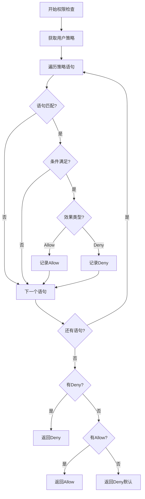

# 权限验证 API

权限验证API是VGO微服务的核心功能，提供了灵活强大的权限验证机制。支持基于策略的访问控制（PBAC），可以验证用户对特定资源的操作权限。

## 📋 API 概览

| 方法 | 描述 | 权限要求 |
|------|------|----------|
| `CheckPermission` | 检查单个权限 | `iam:CheckPermission` |
| `CheckPermissions` | 批量检查权限 | `iam:CheckPermissions` |
| `GetEffectivePermissions` | 获取有效权限 | `iam:GetEffectivePermissions` |
| `SimulatePermission` | 模拟权限检查 | `iam:SimulatePermission` |

## 🔧 API 详情

### CheckPermission - 检查单个权限

检查指定用户是否有权限执行特定操作。

#### 请求

```protobuf
message CheckPermissionRequest {
  string user_name = 1;         // 用户名（必需）
  string action = 2;            // 操作动作（必需）
  string resource = 3;          // 资源ARN（必需）
  map<string, string> context = 4;  // 上下文信息（可选）
}
```

#### 响应

```protobuf
message CheckPermissionResponse {
  bool allowed = 1;             // 是否允许
  string decision = 2;          // 决策结果（Allow/Deny/NotApplicable）
  repeated string matched_policies = 3;  // 匹配的策略列表
  string reason = 4;            // 决策原因
  map<string, string> context = 5;      // 评估上下文
}
```

#### 示例

```bash
# 检查用户读取文件权限
grpcurl -plaintext -d '{
  "user_name": "john_doe",
  "action": "s3:GetObject",
  "resource": "arn:aws:s3:::my-bucket/documents/file.txt"
}' localhost:50051 iam.v1.IAM/CheckPermission
```

```bash
# 带上下文的权限检查
grpcurl -plaintext -d '{
  "user_name": "john_doe",
  "action": "iam:UpdateUser",
  "resource": "arn:iam::user/jane_doe",
  "context": {
    "aws:RequestedRegion": "us-east-1",
    "aws:CurrentTime": "2024-01-15T10:30:00Z",
    "aws:SourceIp": "192.168.1.100"
  }
}' localhost:50051 iam.v1.IAM/CheckPermission
```

#### 响应示例

```json
{
  "allowed": true,
  "decision": "Allow",
  "matched_policies": [
    "S3ReadOnlyPolicy",
    "DocumentAccessPolicy"
  ],
  "reason": "用户具有S3读取权限，且资源匹配策略条件",
  "context": {
    "evaluated_at": "2024-01-15T10:30:00Z",
    "policy_version": "2025-01-01",
    "evaluation_time_ms": "15"
  }
}
```

#### 错误情况

| 错误码 | 说明 | 解决方案 |
|--------|------|----------|
| `NOT_FOUND` | 用户不存在 | 确认用户名正确 |
| `INVALID_ARGUMENT` | 无效的资源ARN | 检查ARN格式 |
| `INVALID_ARGUMENT` | 无效的操作动作 | 使用有效的操作名称 |
| `PERMISSION_DENIED` | 无权限验证权限 | 确保有`iam:CheckPermission`权限 |

---

### CheckPermissions - 批量检查权限

一次性检查多个权限，提高效率。

#### 请求

```protobuf
message CheckPermissionsRequest {
  string user_name = 1;         // 用户名（必需）
  repeated PermissionCheck checks = 2;  // 权限检查列表
  map<string, string> context = 3;      // 全局上下文信息（可选）
}

message PermissionCheck {
  string action = 1;            // 操作动作
  string resource = 2;          // 资源ARN
  map<string, string> context = 3;      // 特定上下文（可选）
}
```

#### 响应

```protobuf
message CheckPermissionsResponse {
  repeated PermissionResult results = 1;  // 权限检查结果列表
  map<string, string> context = 2;        // 评估上下文
}

message PermissionResult {
  string action = 1;            // 操作动作
  string resource = 2;          // 资源ARN
  bool allowed = 3;             // 是否允许
  string decision = 4;          // 决策结果
  repeated string matched_policies = 5;  // 匹配的策略
  string reason = 6;            // 决策原因
}
```

#### 示例

```bash
# 批量检查多个权限
grpcurl -plaintext -d '{
  "user_name": "john_doe",
  "checks": [
    {
      "action": "s3:GetObject",
      "resource": "arn:aws:s3:::my-bucket/file1.txt"
    },
    {
      "action": "s3:PutObject",
      "resource": "arn:aws:s3:::my-bucket/file2.txt"
    },
    {
      "action": "iam:ListUsers",
      "resource": "arn:iam::user/*"
    }
  ],
  "context": {
    "aws:RequestedRegion": "us-east-1",
    "aws:SourceIp": "192.168.1.100"
  }
}' localhost:50051 iam.v1.IAM/CheckPermissions
```

#### 响应示例

```json
{
  "results": [
    {
      "action": "s3:GetObject",
      "resource": "arn:aws:s3:::my-bucket/file1.txt",
      "allowed": true,
      "decision": "Allow",
      "matched_policies": ["S3ReadOnlyPolicy"],
      "reason": "用户具有S3读取权限"
    },
    {
      "action": "s3:PutObject",
      "resource": "arn:aws:s3:::my-bucket/file2.txt",
      "allowed": false,
      "decision": "Deny",
      "matched_policies": [],
      "reason": "用户没有S3写入权限"
    },
    {
      "action": "iam:ListUsers",
      "resource": "arn:iam::user/*",
      "allowed": true,
      "decision": "Allow",
      "matched_policies": ["IAMReadOnlyPolicy"],
      "reason": "用户具有IAM只读权限"
    }
  ],
  "context": {
    "evaluated_at": "2024-01-15T10:30:00Z",
    "total_checks": "3",
    "evaluation_time_ms": "25"
  }
}
```

#### 错误情况

| 错误码 | 说明 | 解决方案 |
|--------|------|----------|
| `NOT_FOUND` | 用户不存在 | 确认用户名正确 |
| `INVALID_ARGUMENT` | 检查列表为空 | 提供至少一个权限检查 |
| `INVALID_ARGUMENT` | 检查数量超限 | 减少单次检查的数量（最大100个） |
| `PERMISSION_DENIED` | 无权限验证权限 | 确保有`iam:CheckPermissions`权限 |

---

### GetEffectivePermissions - 获取有效权限

获取用户对特定资源的所有有效权限。

#### 请求

```protobuf
message GetEffectivePermissionsRequest {
  string user_name = 1;         // 用户名（必需）
  string resource_prefix = 2;   // 资源前缀（可选）
  repeated string actions = 3;  // 操作过滤（可选）
  map<string, string> context = 4;  // 上下文信息（可选）
}
```

#### 响应

```protobuf
message GetEffectivePermissionsResponse {
  repeated EffectivePermission permissions = 1;  // 有效权限列表
  repeated string policies = 2;                  // 相关策略列表
  map<string, string> context = 3;               // 评估上下文
}

message EffectivePermission {
  string action = 1;            // 操作动作
  string resource = 2;          // 资源ARN
  string effect = 3;            // 效果（Allow/Deny）
  string source_policy = 4;     // 来源策略
  repeated string conditions = 5;  // 条件列表
}
```

#### 示例

```bash
# 获取用户对S3的所有权限
grpcurl -plaintext -d '{
  "user_name": "john_doe",
  "resource_prefix": "arn:aws:s3:::",
  "actions": ["s3:GetObject", "s3:PutObject", "s3:DeleteObject"]
}' localhost:50051 iam.v1.IAM/GetEffectivePermissions
```

```bash
# 获取用户的所有IAM权限
grpcurl -plaintext -d '{
  "user_name": "admin_user",
  "resource_prefix": "arn:iam::"
}' localhost:50051 iam.v1.IAM/GetEffectivePermissions
```

#### 响应示例

```json
{
  "permissions": [
    {
      "action": "s3:GetObject",
      "resource": "arn:aws:s3:::my-bucket/*",
      "effect": "Allow",
      "source_policy": "S3ReadOnlyPolicy",
      "conditions": [
        "StringEquals: aws:RequestedRegion = us-east-1"
      ]
    },
    {
      "action": "s3:PutObject",
      "resource": "arn:aws:s3:::my-bucket/uploads/*",
      "effect": "Allow",
      "source_policy": "S3UploadPolicy",
      "conditions": [
        "StringLike: aws:userid = john_doe",
        "DateGreaterThan: aws:CurrentTime = 2024-01-01T00:00:00Z"
      ]
    },
    {
      "action": "s3:DeleteObject",
      "resource": "arn:aws:s3:::my-bucket/sensitive/*",
      "effect": "Deny",
      "source_policy": "S3ProtectionPolicy",
      "conditions": []
    }
  ],
  "policies": [
    "S3ReadOnlyPolicy",
    "S3UploadPolicy",
    "S3ProtectionPolicy"
  ],
  "context": {
    "evaluated_at": "2024-01-15T10:30:00Z",
    "total_permissions": "3",
    "evaluation_time_ms": "45"
  }
}
```

#### 错误情况

| 错误码 | 说明 | 解决方案 |
|--------|------|----------|
| `NOT_FOUND` | 用户不存在 | 确认用户名正确 |
| `INVALID_ARGUMENT` | 无效的资源前缀 | 检查ARN前缀格式 |
| `PERMISSION_DENIED` | 无获取权限权限 | 确保有`iam:GetEffectivePermissions`权限 |

---

### SimulatePermission - 模拟权限检查

模拟权限检查，用于测试和调试策略。

#### 请求

```protobuf
message SimulatePermissionRequest {
  string user_name = 1;         // 用户名（必需）
  repeated string policy_arns = 2;      // 策略ARN列表（可选）
  repeated PermissionCheck checks = 3;  // 权限检查列表
  map<string, string> context = 4;      // 上下文信息（可选）
  bool detailed_evaluation = 5;         // 详细评估信息（可选）
}
```

#### 响应

```protobuf
message SimulatePermissionResponse {
  repeated SimulationResult results = 1;  // 模拟结果列表
  repeated string evaluated_policies = 2; // 评估的策略列表
  map<string, string> context = 3;        // 评估上下文
}

message SimulationResult {
  string action = 1;            // 操作动作
  string resource = 2;          // 资源ARN
  bool allowed = 3;             // 是否允许
  string decision = 4;          // 决策结果
  repeated PolicyEvaluation policy_evaluations = 5;  // 策略评估详情
  string reason = 6;            // 决策原因
}

message PolicyEvaluation {
  string policy_name = 1;       // 策略名称
  string effect = 2;            // 效果（Allow/Deny/NotApplicable）
  bool matched = 3;             // 是否匹配
  repeated string matched_statements = 4;  // 匹配的语句
  repeated string condition_results = 5;   // 条件评估结果
}
```

#### 示例

```bash
# 模拟权限检查
grpcurl -plaintext -d '{
  "user_name": "john_doe",
  "policy_arns": [
    "arn:iam::policy/S3ReadOnlyPolicy",
    "arn:iam::policy/S3WritePolicy"
  ],
  "checks": [
    {
      "action": "s3:GetObject",
      "resource": "arn:aws:s3:::test-bucket/file.txt"
    },
    {
      "action": "s3:PutObject",
      "resource": "arn:aws:s3:::test-bucket/upload.txt"
    }
  ],
  "detailed_evaluation": true
}' localhost:50051 iam.v1.IAM/SimulatePermission
```

#### 响应示例

```json
{
  "results": [
    {
      "action": "s3:GetObject",
      "resource": "arn:aws:s3:::test-bucket/file.txt",
      "allowed": true,
      "decision": "Allow",
      "policy_evaluations": [
        {
          "policy_name": "S3ReadOnlyPolicy",
          "effect": "Allow",
          "matched": true,
          "matched_statements": ["Statement1"],
          "condition_results": [
            "StringEquals: s3:prefix = test-bucket/* -> true"
          ]
        },
        {
          "policy_name": "S3WritePolicy",
          "effect": "NotApplicable",
          "matched": false,
          "matched_statements": [],
          "condition_results": []
        }
      ],
      "reason": "S3ReadOnlyPolicy允许读取操作"
    },
    {
      "action": "s3:PutObject",
      "resource": "arn:aws:s3:::test-bucket/upload.txt",
      "allowed": false,
      "decision": "Deny",
      "policy_evaluations": [
        {
          "policy_name": "S3ReadOnlyPolicy",
          "effect": "NotApplicable",
          "matched": false,
          "matched_statements": [],
          "condition_results": []
        },
        {
          "policy_name": "S3WritePolicy",
          "effect": "Deny",
          "matched": true,
          "matched_statements": ["Statement2"],
          "condition_results": [
            "StringNotEquals: s3:prefix = uploads/* -> false"
          ]
        }
      ],
      "reason": "S3WritePolicy拒绝写入到非uploads目录"
    }
  ],
  "evaluated_policies": [
    "S3ReadOnlyPolicy",
    "S3WritePolicy"
  ],
  "context": {
    "simulation_time": "2024-01-15T10:30:00Z",
    "total_checks": "2",
    "evaluation_time_ms": "35"
  }
}
```

#### 错误情况

| 错误码 | 说明 | 解决方案 |
|--------|------|----------|
| `NOT_FOUND` | 用户或策略不存在 | 确认用户名和策略ARN正确 |
| `INVALID_ARGUMENT` | 检查列表为空 | 提供至少一个权限检查 |
| `PERMISSION_DENIED` | 无模拟权限权限 | 确保有`iam:SimulatePermission`权限 |

## 📊 权限决策逻辑

### 决策流程



### 决策优先级

1. **显式拒绝（Explicit Deny）**：最高优先级
2. **显式允许（Explicit Allow）**：中等优先级
3. **隐式拒绝（Implicit Deny）**：默认行为

### 策略评估顺序

1. **用户直接绑定的策略**
2. **用户组策略**（如果支持）
3. **角色策略**（如果支持）
4. **资源策略**（如果支持）

## 🔐 权限要求

### 所需权限

| 操作 | 权限 | 资源 |
|------|------|------|
| 检查权限 | `iam:CheckPermission` | `arn:iam::user/*` |
| 批量检查权限 | `iam:CheckPermissions` | `arn:iam::user/*` |
| 获取有效权限 | `iam:GetEffectivePermissions` | `arn:iam::user/*` |
| 模拟权限 | `iam:SimulatePermission` | `arn:iam::user/*` 和 `arn:iam::policy/*` |

### 策略示例

#### 权限验证服务策略

```json
{
  "Version": "2025-01-01",
  "Statement": [
    {
      "Effect": "Allow",
      "Action": [
        "iam:CheckPermission",
        "iam:CheckPermissions"
      ],
      "Resource": "*"
    }
  ]
}
```

#### 权限管理员策略

```json
{
  "Version": "2025-01-01",
  "Statement": [
    {
      "Effect": "Allow",
      "Action": [
        "iam:CheckPermission",
        "iam:CheckPermissions",
        "iam:GetEffectivePermissions",
        "iam:SimulatePermission"
      ],
      "Resource": "*"
    }
  ]
}
```

## 🛠️ 使用示例

### Go 客户端示例

```go
package main

import (
    "context"
    "fmt"
    "log"
    
    "google.golang.org/grpc"
    "google.golang.org/grpc/credentials/insecure"
    
    iamv1 "github.com/your-org/vgo/api/iam/v1"
)

// 权限检查器
type PermissionChecker struct {
    client iamv1.IAMClient
}

func NewPermissionChecker(client iamv1.IAMClient) *PermissionChecker {
    return &PermissionChecker{client: client}
}

// 检查单个权限
func (pc *PermissionChecker) CheckPermission(ctx context.Context, userName, action, resource string, context map[string]string) (bool, error) {
    resp, err := pc.client.CheckPermission(ctx, &iamv1.CheckPermissionRequest{
        UserName: userName,
        Action:   action,
        Resource: resource,
        Context:  context,
    })
    if err != nil {
        return false, fmt.Errorf("权限检查失败: %v", err)
    }
    
    return resp.Allowed, nil
}

// 批量检查权限
func (pc *PermissionChecker) CheckPermissions(ctx context.Context, userName string, checks []*iamv1.PermissionCheck, context map[string]string) ([]*iamv1.PermissionResult, error) {
    resp, err := pc.client.CheckPermissions(ctx, &iamv1.CheckPermissionsRequest{
        UserName: userName,
        Checks:   checks,
        Context:  context,
    })
    if err != nil {
        return nil, fmt.Errorf("批量权限检查失败: %v", err)
    }
    
    return resp.Results, nil
}

// 权限装饰器
func RequirePermission(checker *PermissionChecker, action, resource string) func(http.HandlerFunc) http.HandlerFunc {
    return func(next http.HandlerFunc) http.HandlerFunc {
        return func(w http.ResponseWriter, r *http.Request) {
            // 从请求中获取用户信息
            userName := getUserFromRequest(r)
            if userName == "" {
                http.Error(w, "未认证", http.StatusUnauthorized)
                return
            }
            
            // 构造上下文
            context := map[string]string{
                "aws:SourceIp":        getClientIP(r),
                "aws:RequestedRegion": "us-east-1",
                "aws:CurrentTime":     time.Now().Format(time.RFC3339),
            }
            
            // 检查权限
            allowed, err := checker.CheckPermission(r.Context(), userName, action, resource, context)
            if err != nil {
                log.Printf("权限检查错误: %v", err)
                http.Error(w, "权限检查失败", http.StatusInternalServerError)
                return
            }
            
            if !allowed {
                http.Error(w, "权限不足", http.StatusForbidden)
                return
            }
            
            // 权限检查通过，继续处理请求
            next(w, r)
        }
    }
}

func main() {
    // 连接到服务
    conn, err := grpc.Dial("localhost:50051", grpc.WithTransportCredentials(insecure.NewCredentials()))
    if err != nil {
        log.Fatalf("连接失败: %v", err)
    }
    defer conn.Close()
    
    client := iamv1.NewIAMClient(conn)
    checker := NewPermissionChecker(client)
    ctx := context.Background()
    
    // 1. 单个权限检查
    fmt.Println("1. 检查单个权限...")
    allowed, err := checker.CheckPermission(ctx, "john_doe", "s3:GetObject", "arn:aws:s3:::my-bucket/file.txt", nil)
    if err != nil {
        log.Fatalf("权限检查失败: %v", err)
    }
    
    fmt.Printf("权限检查结果: %t\n", allowed)
    
    // 2. 批量权限检查
    fmt.Println("\n2. 批量权限检查...")
    checks := []*iamv1.PermissionCheck{
        {
            Action:   "s3:GetObject",
            Resource: "arn:aws:s3:::my-bucket/file1.txt",
        },
        {
            Action:   "s3:PutObject",
            Resource: "arn:aws:s3:::my-bucket/file2.txt",
        },
        {
            Action:   "iam:ListUsers",
            Resource: "arn:iam::user/*",
        },
    }
    
    results, err := checker.CheckPermissions(ctx, "john_doe", checks, map[string]string{
        "aws:RequestedRegion": "us-east-1",
    })
    if err != nil {
        log.Fatalf("批量权限检查失败: %v", err)
    }
    
    fmt.Printf("批量检查结果:\n")
    for i, result := range results {
        fmt.Printf("  %d. %s on %s: %t (%s)\n", i+1, result.Action, result.Resource, result.Allowed, result.Decision)
    }
    
    // 3. 获取有效权限
    fmt.Println("\n3. 获取有效权限...")
    effectiveResp, err := client.GetEffectivePermissions(ctx, &iamv1.GetEffectivePermissionsRequest{
        UserName:       "john_doe",
        ResourcePrefix: "arn:aws:s3:::",
        Actions:        []string{"s3:GetObject", "s3:PutObject"},
    })
    if err != nil {
        log.Fatalf("获取有效权限失败: %v", err)
    }
    
    fmt.Printf("有效权限 (%d 个):\n", len(effectiveResp.Permissions))
    for i, perm := range effectiveResp.Permissions {
        fmt.Printf("  %d. %s on %s: %s (来源: %s)\n", i+1, perm.Action, perm.Resource, perm.Effect, perm.SourcePolicy)
    }
    
    // 4. 模拟权限检查
    fmt.Println("\n4. 模拟权限检查...")
    simulateResp, err := client.SimulatePermission(ctx, &iamv1.SimulatePermissionRequest{
        UserName: "john_doe",
        PolicyArns: []string{
            "arn:iam::policy/S3ReadOnlyPolicy",
        },
        Checks: []*iamv1.PermissionCheck{
            {
                Action:   "s3:GetObject",
                Resource: "arn:aws:s3:::test-bucket/file.txt",
            },
        },
        DetailedEvaluation: true,
    })
    if err != nil {
        log.Fatalf("模拟权限检查失败: %v", err)
    }
    
    fmt.Printf("模拟结果:\n")
    for i, result := range simulateResp.Results {
        fmt.Printf("  %d. %s on %s: %t\n", i+1, result.Action, result.Resource, result.Allowed)
        fmt.Printf("     原因: %s\n", result.Reason)
        for j, eval := range result.PolicyEvaluations {
            fmt.Printf("     策略%d: %s - %s (匹配: %t)\n", j+1, eval.PolicyName, eval.Effect, eval.Matched)
        }
    }
}

// 辅助函数
func getUserFromRequest(r *http.Request) string {
    // 从JWT token、session或其他方式获取用户名
    return r.Header.Get("X-User-Name")
}

func getClientIP(r *http.Request) string {
    // 获取客户端IP
    forwarded := r.Header.Get("X-Forwarded-For")
    if forwarded != "" {
        return strings.Split(forwarded, ",")[0]
    }
    return r.RemoteAddr
}
```

### 权限中间件示例

```go
package middleware

import (
    "context"
    "encoding/json"
    "net/http"
    "strings"
    "time"
    
    iamv1 "github.com/your-org/vgo/api/iam/v1"
)

// 权限中间件配置
type PermissionMiddlewareConfig struct {
    IAMClient    iamv1.IAMClient
    SkipPaths    []string
    ErrorHandler func(w http.ResponseWriter, r *http.Request, err error)
}

// 权限中间件
func PermissionMiddleware(config PermissionMiddlewareConfig) func(http.Handler) http.Handler {
    return func(next http.Handler) http.Handler {
        return http.HandlerFunc(func(w http.ResponseWriter, r *http.Request) {
            // 检查是否跳过权限验证
            for _, path := range config.SkipPaths {
                if strings.HasPrefix(r.URL.Path, path) {
                    next.ServeHTTP(w, r)
                    return
                }
            }
            
            // 获取用户信息
            userName := getUserFromContext(r.Context())
            if userName == "" {
                http.Error(w, "未认证", http.StatusUnauthorized)
                return
            }
            
            // 构造权限检查参数
            action := getActionFromRequest(r)
            resource := getResourceFromRequest(r)
            context := getContextFromRequest(r)
            
            // 检查权限
            resp, err := config.IAMClient.CheckPermission(r.Context(), &iamv1.CheckPermissionRequest{
                UserName: userName,
                Action:   action,
                Resource: resource,
                Context:  context,
            })
            
            if err != nil {
                if config.ErrorHandler != nil {
                    config.ErrorHandler(w, r, err)
                } else {
                    http.Error(w, "权限检查失败", http.StatusInternalServerError)
                }
                return
            }
            
            if !resp.Allowed {
                // 记录权限拒绝日志
                logPermissionDenied(userName, action, resource, resp.Reason)
                
                w.Header().Set("Content-Type", "application/json")
                w.WriteHeader(http.StatusForbidden)
                json.NewEncoder(w).Encode(map[string]interface{}{
                    "error":   "权限不足",
                    "action":  action,
                    "resource": resource,
                    "reason":  resp.Reason,
                })
                return
            }
            
            // 权限检查通过，添加权限信息到上下文
            ctx := context.WithValue(r.Context(), "permission_check", resp)
            next.ServeHTTP(w, r.WithContext(ctx))
        })
    }
}

// 从请求构造操作动作
func getActionFromRequest(r *http.Request) string {
    method := r.Method
    path := r.URL.Path
    
    // 根据HTTP方法和路径构造操作
    switch {
    case method == "GET" && strings.HasPrefix(path, "/api/users"):
        return "iam:ListUsers"
    case method == "GET" && strings.Contains(path, "/api/users/"):
        return "iam:GetUser"
    case method == "POST" && path == "/api/users":
        return "iam:CreateUser"
    case method == "PUT" && strings.Contains(path, "/api/users/"):
        return "iam:UpdateUser"
    case method == "DELETE" && strings.Contains(path, "/api/users/"):
        return "iam:DeleteUser"
    case method == "GET" && strings.HasPrefix(path, "/api/files"):
        return "s3:GetObject"
    case method == "POST" && strings.HasPrefix(path, "/api/files"):
        return "s3:PutObject"
    case method == "DELETE" && strings.HasPrefix(path, "/api/files"):
        return "s3:DeleteObject"
    default:
        return "unknown:Action"
    }
}

// 从请求构造资源ARN
func getResourceFromRequest(r *http.Request) string {
    path := r.URL.Path
    
    switch {
    case strings.HasPrefix(path, "/api/users"):
        if strings.Contains(path, "/api/users/") {
            // 提取用户名
            parts := strings.Split(path, "/")
            if len(parts) >= 4 {
                return "arn:iam::user/" + parts[3]
            }
        }
        return "arn:iam::user/*"
    case strings.HasPrefix(path, "/api/files"):
        // 提取文件路径
        filePath := strings.TrimPrefix(path, "/api/files/")
        return "arn:aws:s3:::my-bucket/" + filePath
    default:
        return "arn:unknown::resource/*"
    }
}

// 从请求构造上下文
func getContextFromRequest(r *http.Request) map[string]string {
    return map[string]string{
        "aws:SourceIp":        getClientIP(r),
        "aws:RequestedRegion": "us-east-1",
        "aws:CurrentTime":     time.Now().Format(time.RFC3339),
        "http:Method":         r.Method,
        "http:UserAgent":      r.UserAgent(),
    }
}

// 记录权限拒绝日志
func logPermissionDenied(userName, action, resource, reason string) {
    log.Printf("权限拒绝: 用户=%s, 操作=%s, 资源=%s, 原因=%s", userName, action, resource, reason)
}
```

### Python 客户端示例

```python
import grpc
import asyncio
from typing import List, Dict, Optional, Tuple
from dataclasses import dataclass

# 假设已生成的Python gRPC客户端
from iam.v1 import iam_pb2, iam_pb2_grpc

@dataclass
class PermissionCheck:
    action: str
    resource: str
    context: Optional[Dict[str, str]] = None

class PermissionChecker:
    def __init__(self, channel):
        self.client = iam_pb2_grpc.IAMStub(channel)
    
    async def check_permission(self, user_name: str, action: str, resource: str, 
                             context: Optional[Dict[str, str]] = None) -> Tuple[bool, str]:
        """检查单个权限"""
        request = iam_pb2.CheckPermissionRequest(
            user_name=user_name,
            action=action,
            resource=resource,
            context=context or {}
        )
        
        try:
            response = await self.client.CheckPermission(request)
            return response.allowed, response.reason
        except grpc.RpcError as e:
            raise Exception(f"权限检查失败: {e.details()}")
    
    async def check_permissions(self, user_name: str, checks: List[PermissionCheck], 
                              context: Optional[Dict[str, str]] = None) -> List[Dict]:
        """批量检查权限"""
        grpc_checks = []
        for check in checks:
            grpc_check = iam_pb2.PermissionCheck(
                action=check.action,
                resource=check.resource,
                context=check.context or {}
            )
            grpc_checks.append(grpc_check)
        
        request = iam_pb2.CheckPermissionsRequest(
            user_name=user_name,
            checks=grpc_checks,
            context=context or {}
        )
        
        try:
            response = await self.client.CheckPermissions(request)
            results = []
            for result in response.results:
                results.append({
                    'action': result.action,
                    'resource': result.resource,
                    'allowed': result.allowed,
                    'decision': result.decision,
                    'reason': result.reason,
                    'matched_policies': list(result.matched_policies)
                })
            return results
        except grpc.RpcError as e:
            raise Exception(f"批量权限检查失败: {e.details()}")
    
    async def get_effective_permissions(self, user_name: str, 
                                      resource_prefix: Optional[str] = None,
                                      actions: Optional[List[str]] = None) -> List[Dict]:
        """获取有效权限"""
        request = iam_pb2.GetEffectivePermissionsRequest(
            user_name=user_name,
            resource_prefix=resource_prefix or "",
            actions=actions or []
        )
        
        try:
            response = await self.client.GetEffectivePermissions(request)
            permissions = []
            for perm in response.permissions:
                permissions.append({
                    'action': perm.action,
                    'resource': perm.resource,
                    'effect': perm.effect,
                    'source_policy': perm.source_policy,
                    'conditions': list(perm.conditions)
                })
            return permissions
        except grpc.RpcError as e:
            raise Exception(f"获取有效权限失败: {e.details()}")

# 权限装饰器
def require_permission(action: str, resource: str):
    """权限检查装饰器"""
    def decorator(func):
        async def wrapper(*args, **kwargs):
            # 假设从某处获取用户信息和权限检查器
            user_name = get_current_user()
            checker = get_permission_checker()
            
            if not user_name:
                raise Exception("未认证")
            
            # 检查权限
            allowed, reason = await checker.check_permission(user_name, action, resource)
            if not allowed:
                raise Exception(f"权限不足: {reason}")
            
            # 权限检查通过，执行原函数
            return await func(*args, **kwargs)
        return wrapper
    return decorator

# 使用示例
class UserService:
    def __init__(self, permission_checker: PermissionChecker):
        self.permission_checker = permission_checker
    
    @require_permission("iam:GetUser", "arn:iam::user/*")
    async def get_user(self, user_id: str):
        """获取用户信息"""
        # 实际的用户获取逻辑
        return {"id": user_id, "name": "John Doe"}
    
    @require_permission("iam:CreateUser", "arn:iam::user/*")
    async def create_user(self, user_data: Dict):
        """创建用户"""
        # 实际的用户创建逻辑
        return {"id": "new_user_id", "name": user_data["name"]}
    
    async def check_user_permissions(self, user_name: str) -> Dict:
        """检查用户的多个权限"""
        checks = [
            PermissionCheck("iam:GetUser", f"arn:iam::user/{user_name}"),
            PermissionCheck("iam:UpdateUser", f"arn:iam::user/{user_name}"),
            PermissionCheck("iam:DeleteUser", f"arn:iam::user/{user_name}"),
            PermissionCheck("s3:GetObject", "arn:aws:s3:::my-bucket/*"),
            PermissionCheck("s3:PutObject", "arn:aws:s3:::my-bucket/*")
        ]
        
        results = await self.permission_checker.check_permissions(user_name, checks)
        
        # 整理结果
        permissions = {}
        for result in results:
            permissions[result['action']] = {
                'allowed': result['allowed'],
                'reason': result['reason']
            }
        
        return permissions

async def main():
    # 连接到服务
    async with grpc.aio.insecure_channel('localhost:50051') as channel:
        checker = PermissionChecker(channel)
        user_service = UserService(checker)
        
        # 1. 检查单个权限
        print("1. 检查单个权限...")
        allowed, reason = await checker.check_permission(
            "john_doe", "s3:GetObject", "arn:aws:s3:::my-bucket/file.txt"
        )
        print(f"权限检查结果: {allowed}, 原因: {reason}")
        
        # 2. 批量检查权限
        print("\n2. 批量检查权限...")
        checks = [
            PermissionCheck("s3:GetObject", "arn:aws:s3:::my-bucket/file1.txt"),
            PermissionCheck("s3:PutObject", "arn:aws:s3:::my-bucket/file2.txt"),
            PermissionCheck("iam:ListUsers", "arn:iam::user/*")
        ]
        
        results = await checker.check_permissions("john_doe", checks)
        print("批量检查结果:")
        for i, result in enumerate(results, 1):
            print(f"  {i}. {result['action']} on {result['resource']}: {result['allowed']}")
        
        # 3. 获取有效权限
        print("\n3. 获取有效权限...")
        permissions = await checker.get_effective_permissions(
            "john_doe", "arn:aws:s3:::", ["s3:GetObject", "s3:PutObject"]
        )
        print(f"有效权限 ({len(permissions)} 个):")
        for i, perm in enumerate(permissions, 1):
            print(f"  {i}. {perm['action']} on {perm['resource']}: {perm['effect']}")
        
        # 4. 使用服务方法
        print("\n4. 使用服务方法...")
        try:
            user = await user_service.get_user("john_doe")
            print(f"获取用户成功: {user}")
        except Exception as e:
            print(f"获取用户失败: {e}")
        
        # 5. 检查用户的多个权限
        print("\n5. 检查用户的多个权限...")
        user_permissions = await user_service.check_user_permissions("john_doe")
        print("用户权限:")
        for action, perm in user_permissions.items():
            print(f"  {action}: {perm['allowed']} ({perm['reason']})")

if __name__ == "__main__":
    asyncio.run(main())
```

## 🔍 最佳实践

### 1. 权限检查优化

#### 缓存权限结果
```go
type PermissionCache struct {
    cache map[string]*CacheEntry
    mutex sync.RWMutex
    ttl   time.Duration
}

type CacheEntry struct {
    allowed   bool
    timestamp time.Time
}

func (pc *PermissionCache) Get(key string) (bool, bool) {
    pc.mutex.RLock()
    defer pc.mutex.RUnlock()
    
    entry, exists := pc.cache[key]
    if !exists {
        return false, false
    }
    
    if time.Since(entry.timestamp) > pc.ttl {
        delete(pc.cache, key)
        return false, false
    }
    
    return entry.allowed, true
}

func (pc *PermissionCache) Set(key string, allowed bool) {
    pc.mutex.Lock()
    defer pc.mutex.Unlock()
    
    pc.cache[key] = &CacheEntry{
        allowed:   allowed,
        timestamp: time.Now(),
    }
}

// 带缓存的权限检查
func (pc *PermissionChecker) CheckPermissionWithCache(ctx context.Context, userName, action, resource string) (bool, error) {
    // 构造缓存键
    cacheKey := fmt.Sprintf("%s:%s:%s", userName, action, resource)
    
    // 检查缓存
    if allowed, found := pc.cache.Get(cacheKey); found {
        return allowed, nil
    }
    
    // 缓存未命中，调用API
    allowed, err := pc.CheckPermission(ctx, userName, action, resource, nil)
    if err != nil {
        return false, err
    }
    
    // 缓存结果
    pc.cache.Set(cacheKey, allowed)
    
    return allowed, nil
}
```

#### 批量权限检查
```go
// 智能批量权限检查
func (pc *PermissionChecker) SmartCheckPermissions(ctx context.Context, userName string, checks []PermissionCheck) (map[string]bool, error) {
    results := make(map[string]bool)
    var uncachedChecks []*iamv1.PermissionCheck
    var uncachedKeys []string
    
    // 检查缓存
    for _, check := range checks {
        key := fmt.Sprintf("%s:%s:%s", userName, check.Action, check.Resource)
        if allowed, found := pc.cache.Get(key); found {
            results[key] = allowed
        } else {
            uncachedChecks = append(uncachedChecks, &iamv1.PermissionCheck{
                Action:   check.Action,
                Resource: check.Resource,
                Context:  check.Context,
            })
            uncachedKeys = append(uncachedKeys, key)
        }
    }
    
    // 批量检查未缓存的权限
    if len(uncachedChecks) > 0 {
        batchResults, err := pc.CheckPermissions(ctx, userName, uncachedChecks, nil)
        if err != nil {
            return nil, err
        }
        
        // 缓存结果
        for i, result := range batchResults {
            key := uncachedKeys[i]
            results[key] = result.Allowed
            pc.cache.Set(key, result.Allowed)
        }
    }
    
    return results, nil
}
```

### 2. 权限策略设计

#### 最小权限原则
```json
{
  "Version": "2025-01-01",
  "Statement": [
    {
      "Effect": "Allow",
      "Action": [
        "s3:GetObject"
      ],
      "Resource": [
        "arn:aws:s3:::my-bucket/users/${aws:username}/*"
      ],
      "Condition": {
        "StringEquals": {
          "s3:ExistingObjectTag/Owner": "${aws:username}"
        }
      }
    }
  ]
}
```

#### 时间限制策略
```json
{
  "Version": "2025-01-01",
  "Statement": [
    {
      "Effect": "Allow",
      "Action": [
        "iam:*"
      ],
      "Resource": "*",
      "Condition": {
        "DateGreaterThan": {
          "aws:CurrentTime": "2024-01-01T00:00:00Z"
        },
        "DateLessThan": {
          "aws:CurrentTime": "2024-12-31T23:59:59Z"
        },
        "IpAddress": {
          "aws:SourceIp": ["192.168.1.0/24", "10.0.0.0/8"]
        }
      }
    }
  ]
}
```

### 3. 错误处理和监控

```go
// 权限检查监控
type PermissionMetrics struct {
    totalChecks    int64
    allowedChecks  int64
    deniedChecks   int64
    errorChecks    int64
    cacheHits      int64
    cacheMisses    int64
    avgLatency     time.Duration
}

func (pc *PermissionChecker) CheckPermissionWithMetrics(ctx context.Context, userName, action, resource string) (bool, error) {
    start := time.Now()
    defer func() {
        pc.metrics.avgLatency = time.Since(start)
        atomic.AddInt64(&pc.metrics.totalChecks, 1)
    }()
    
    // 检查权限
    allowed, err := pc.CheckPermission(ctx, userName, action, resource, nil)
    
    if err != nil {
        atomic.AddInt64(&pc.metrics.errorChecks, 1)
        // 记录错误日志
        log.Printf("权限检查错误: 用户=%s, 操作=%s, 资源=%s, 错误=%v", userName, action, resource, err)
        return false, err
    }
    
    if allowed {
        atomic.AddInt64(&pc.metrics.allowedChecks, 1)
    } else {
        atomic.AddInt64(&pc.metrics.deniedChecks, 1)
        // 记录权限拒绝日志
        log.Printf("权限拒绝: 用户=%s, 操作=%s, 资源=%s", userName, action, resource)
    }
    
    return allowed, nil
}

// 权限审计日志
type PermissionAuditLog struct {
    Timestamp    time.Time `json:"timestamp"`
    UserName     string    `json:"user_name"`
    Action       string    `json:"action"`
    Resource     string    `json:"resource"`
    Allowed      bool      `json:"allowed"`
    Decision     string    `json:"decision"`
    Policies     []string  `json:"policies"`
    Reason       string    `json:"reason"`
    Context      map[string]string `json:"context"`
    SourceIP     string    `json:"source_ip"`
    UserAgent    string    `json:"user_agent"`
}

func (pc *PermissionChecker) AuditPermissionCheck(userName, action, resource string, result *iamv1.CheckPermissionResponse, context map[string]string) {
    auditLog := PermissionAuditLog{
        Timestamp: time.Now(),
        UserName:  userName,
        Action:    action,
        Resource:  resource,
        Allowed:   result.Allowed,
        Decision:  result.Decision,
        Policies:  result.MatchedPolicies,
        Reason:    result.Reason,
        Context:   context,
        SourceIP:  context["aws:SourceIp"],
        UserAgent: context["http:UserAgent"],
    }
    
    // 发送到审计日志系统
    pc.auditLogger.Log(auditLog)
}
```

## 🚨 注意事项

### 安全考虑

1. **权限检查不能绕过**：
   - 在所有关键操作前进行权限检查
   - 不要依赖客户端的权限验证
   - 使用白名单而非黑名单

2. **上下文信息验证**：
   - 验证IP地址、时间等上下文信息
   - 防止上下文信息被伪造
   - 记录详细的审计日志

3. **权限提升防护**：
   - 防止权限提升攻击
   - 定期审查权限分配
   - 监控异常权限使用

### 性能优化

1. **缓存策略**：
   - 合理设置缓存TTL
   - 监控缓存命中率
   - 及时清理过期缓存

2. **批量操作**：
   - 尽量使用批量权限检查
   - 避免循环调用单个权限检查
   - 合理控制批量大小

3. **异步处理**：
   - 对于非关键路径，考虑异步权限检查
   - 使用权限预检查机制
   - 实现权限检查的降级策略

### 监控和运维

1. **指标监控**：
   - 监控权限检查成功率
   - 监控权限检查延迟
   - 监控权限拒绝率

2. **告警设置**：
   - 设置权限检查失败告警
   - 设置异常权限使用告警
   - 设置权限策略变更告警

3. **审计合规**：
   - 保留完整的权限审计日志
   - 定期进行权限审计
   - 满足合规要求

---

::: tip 提示
权限检查是安全的最后一道防线，建议在应用的多个层次都进行权限验证。
:::

## 📚 相关文档

- [策略管理 API](./policy-management.md) - 了解如何创建和管理权限策略
- [用户管理 API](./user-management.md) - 了解如何管理用户和绑定策略
- [访问密钥 API](./access-keys.md) - 了解如何管理API访问密钥
- [快速开始指南](../guide/README.md) - 快速上手VGO微服务
- [配置指南](../guide/configuration.md) - 了解系统配置选项