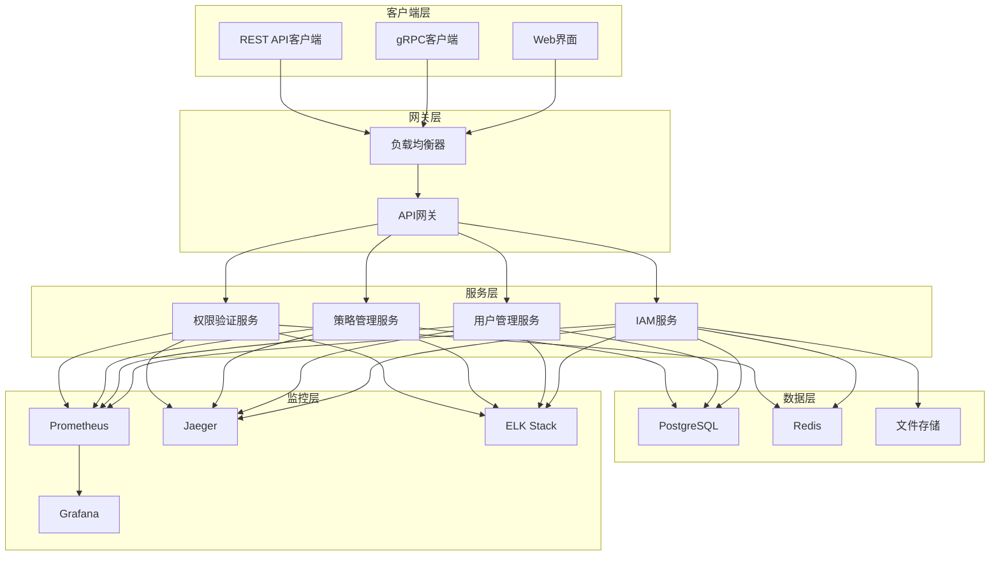

# 部署指南

本指南将帮助您在不同环境中部署VGO微服务，包括开发环境、测试环境和生产环境。VGO微服务支持多种部署方式，您可以根据实际需求选择最适合的部署方案。

## 📋 部署方式概览

| 部署方式 | 适用场景 | 复杂度 | 推荐指数 |
|----------|----------|--------|----------|
| [Docker Compose](./docker-compose.md) | 开发、测试环境 | ⭐ | ⭐⭐⭐⭐⭐ |
| [Kubernetes](./kubernetes.md) | 生产环境 | ⭐⭐⭐⭐ | ⭐⭐⭐⭐⭐ |
| [二进制部署](./binary.md) | 简单生产环境 | ⭐⭐ | ⭐⭐⭐ |
| [源码编译](./source.md) | 开发环境 | ⭐⭐⭐ | ⭐⭐ |
| [云服务部署](./cloud.md) | 云原生环境 | ⭐⭐⭐⭐⭐ | ⭐⭐⭐⭐ |

## 🏗️ 系统架构

### 核心组件



### 服务端口分配

| 服务 | 端口 | 协议 | 说明 |
|------|------|------|------|
| IAM gRPC | 50051 | gRPC | 主要API服务 |
| IAM HTTP | 8080 | HTTP | REST API和Web界面 |
| 健康检查 | 8081 | HTTP | 健康检查端点 |
| 指标收集 | 8082 | HTTP | Prometheus指标 |
| PostgreSQL | 5432 | TCP | 数据库服务 |
| Redis | 6379 | TCP | 缓存服务 |
| Prometheus | 9090 | HTTP | 监控服务 |
| Grafana | 3000 | HTTP | 可视化界面 |
| Jaeger | 16686 | HTTP | 链路追踪界面 |

## 🔧 环境要求

### 最小系统要求

| 组件 | 最小配置 | 推荐配置 |
|------|----------|----------|
| CPU | 2核 | 4核+ |
| 内存 | 4GB | 8GB+ |
| 存储 | 20GB | 100GB+ |
| 网络 | 100Mbps | 1Gbps+ |

### 软件依赖

#### 必需组件
- **操作系统**: Linux (Ubuntu 20.04+, CentOS 8+, RHEL 8+)
- **容器运行时**: Docker 20.10+ 或 Podman 3.0+
- **数据库**: PostgreSQL 13+
- **缓存**: Redis 6.0+

#### 可选组件
- **容器编排**: Kubernetes 1.20+ 或 Docker Swarm
- **负载均衡**: Nginx, HAProxy, 或云负载均衡器
- **监控**: Prometheus + Grafana
- **日志**: ELK Stack 或 Loki
- **链路追踪**: Jaeger 或 Zipkin

## 🚀 快速开始

### 1. 使用Docker Compose（推荐）

最简单的部署方式，适合开发和测试环境：

```bash
# 克隆项目
git clone https://github.com/your-org/vgo-microservice.git
cd vgo-microservice

# 启动所有服务
docker-compose up -d

# 检查服务状态
docker-compose ps

# 查看日志
docker-compose logs -f iam
```

### 2. 验证部署

```bash
# 检查服务健康状态
curl http://localhost:8081/health

# 访问Web界面
open http://localhost:8080

# 测试gRPC API
grpcurl -plaintext localhost:50051 list
```

### 3. 初始化数据

```bash
# 创建管理员用户
docker-compose exec iam ./vgo-iam admin create-user \
  --username admin \
  --email admin@example.com \
  --password admin123

# 创建访问密钥
docker-compose exec iam ./vgo-iam admin create-access-key \
  --username admin \
  --description "管理员密钥"
```

## 🔐 安全配置

### 基础安全设置

1. **更改默认密码**
   ```bash
   # 更改数据库密码
   export POSTGRES_PASSWORD="your-secure-password"
   
   # 更改Redis密码
   export REDIS_PASSWORD="your-redis-password"
   
   # 更改JWT密钥
   export JWT_SECRET="your-jwt-secret-key"
   ```

2. **启用TLS**
   ```yaml
   # docker-compose.yml
   services:
     iam:
       environment:
         - TLS_ENABLED=true
         - TLS_CERT_FILE=/certs/server.crt
         - TLS_KEY_FILE=/certs/server.key
       volumes:
         - ./certs:/certs:ro
   ```

3. **网络隔离**
   ```yaml
   # docker-compose.yml
   networks:
     frontend:
       driver: bridge
     backend:
       driver: bridge
       internal: true
   ```

### 生产环境安全清单

- [ ] 使用强密码和密钥
- [ ] 启用TLS/SSL加密
- [ ] 配置防火墙规则
- [ ] 启用访问日志
- [ ] 配置入侵检测
- [ ] 定期安全更新
- [ ] 备份加密
- [ ] 权限最小化

## 📊 监控配置

### Prometheus配置

```yaml
# prometheus.yml
global:
  scrape_interval: 15s
  evaluation_interval: 15s

scrape_configs:
  - job_name: 'vgo-iam'
    static_configs:
      - targets: ['iam:8082']
    metrics_path: /metrics
    scrape_interval: 10s
    
  - job_name: 'postgres'
    static_configs:
      - targets: ['postgres-exporter:9187']
    
  - job_name: 'redis'
    static_configs:
      - targets: ['redis-exporter:9121']
```

### Grafana仪表板

预配置的仪表板包括：
- **系统概览**: CPU、内存、磁盘使用率
- **服务性能**: 请求量、响应时间、错误率
- **数据库监控**: 连接数、查询性能、锁等待
- **缓存监控**: 命中率、内存使用、连接数
- **业务指标**: 用户数量、权限检查次数、API调用统计

## 🔄 备份和恢复

### 数据备份

```bash
# 数据库备份
docker-compose exec postgres pg_dump -U vgo_user vgo_db > backup_$(date +%Y%m%d_%H%M%S).sql

# Redis备份
docker-compose exec redis redis-cli BGSAVE
docker-compose exec redis cp /data/dump.rdb /backup/

# 配置文件备份
tar -czf config_backup_$(date +%Y%m%d_%H%M%S).tar.gz configs/
```

### 自动备份脚本

```bash
#!/bin/bash
# backup.sh

BACKUP_DIR="/backup/vgo"
DATE=$(date +%Y%m%d_%H%M%S)
RETENTION_DAYS=30

# 创建备份目录
mkdir -p $BACKUP_DIR

# 数据库备份
docker-compose exec -T postgres pg_dump -U vgo_user vgo_db | gzip > $BACKUP_DIR/db_$DATE.sql.gz

# Redis备份
docker-compose exec redis redis-cli BGSAVE
docker-compose cp redis:/data/dump.rdb $BACKUP_DIR/redis_$DATE.rdb

# 清理旧备份
find $BACKUP_DIR -name "*.sql.gz" -mtime +$RETENTION_DAYS -delete
find $BACKUP_DIR -name "*.rdb" -mtime +$RETENTION_DAYS -delete

echo "备份完成: $DATE"
```

### 数据恢复

```bash
# 恢复数据库
docker-compose exec -T postgres psql -U vgo_user -d vgo_db < backup_20240115_103000.sql

# 恢复Redis
docker-compose stop redis
docker-compose cp redis_20240115_103000.rdb redis:/data/dump.rdb
docker-compose start redis
```

## 🔧 故障排除

### 常见问题

#### 1. 服务启动失败

**症状**: 容器无法启动或立即退出

**排查步骤**:
```bash
# 查看容器日志
docker-compose logs iam

# 检查容器状态
docker-compose ps

# 检查资源使用
docker stats

# 检查端口占用
netstat -tlnp | grep :50051
```

**常见原因**:
- 端口被占用
- 配置文件错误
- 依赖服务未启动
- 资源不足

#### 2. 数据库连接失败

**症状**: 服务日志显示数据库连接错误

**排查步骤**:
```bash
# 检查数据库状态
docker-compose exec postgres pg_isready -U vgo_user

# 测试连接
docker-compose exec postgres psql -U vgo_user -d vgo_db -c "SELECT 1;"

# 检查网络连通性
docker-compose exec iam ping postgres
```

**解决方案**:
- 检查数据库配置
- 确认用户名密码正确
- 检查网络配置
- 查看数据库日志

#### 3. 权限验证失败

**症状**: API调用返回权限不足错误

**排查步骤**:
```bash
# 检查用户是否存在
grpcurl -plaintext -d '{"user_name":"test_user"}' localhost:50051 iam.v1.IAM/GetUser

# 检查用户策略
grpcurl -plaintext -d '{"user_name":"test_user"}' localhost:50051 iam.v1.IAM/ListUserPolicies

# 测试权限检查
grpcurl -plaintext -d '{
  "user_name":"test_user",
  "action":"iam:GetUser",
  "resource":"arn:iam::user/test_user"
}' localhost:50051 iam.v1.IAM/CheckPermission
```

### 性能优化

#### 1. 数据库优化

```sql
-- 创建索引
CREATE INDEX CONCURRENTLY idx_users_username ON users(username);
CREATE INDEX CONCURRENTLY idx_policies_name ON policies(name);
CREATE INDEX CONCURRENTLY idx_user_policies_user_id ON user_policies(user_id);

-- 分析表统计信息
ANALYZE users;
ANALYZE policies;
ANALYZE user_policies;

-- 查看慢查询
SELECT query, mean_time, calls 
FROM pg_stat_statements 
ORDER BY mean_time DESC 
LIMIT 10;
```

#### 2. Redis优化

```bash
# 配置内存策略
redis-cli CONFIG SET maxmemory-policy allkeys-lru

# 启用持久化
redis-cli CONFIG SET save "900 1 300 10 60 10000"

# 监控性能
redis-cli --latency-history
redis-cli INFO memory
```

#### 3. 应用优化

```yaml
# docker-compose.yml
services:
  iam:
    environment:
      # 连接池配置
      - DB_MAX_OPEN_CONNS=25
      - DB_MAX_IDLE_CONNS=5
      - DB_CONN_MAX_LIFETIME=300s
      
      # 缓存配置
      - CACHE_TTL=300s
      - CACHE_MAX_SIZE=1000
      
      # 性能配置
      - GOMAXPROCS=4
      - GOGC=100
    
    # 资源限制
    deploy:
      resources:
        limits:
          cpus: '2.0'
          memory: 1G
        reservations:
          cpus: '0.5'
          memory: 512M
```

## 📈 扩展部署

### 水平扩展

```yaml
# docker-compose.yml
services:
  iam:
    deploy:
      replicas: 3
    
  nginx:
    image: nginx:alpine
    ports:
      - "80:80"
      - "443:443"
    volumes:
      - ./nginx.conf:/etc/nginx/nginx.conf
    depends_on:
      - iam
```

### 负载均衡配置

```nginx
# nginx.conf
upstream iam_backend {
    least_conn;
    server iam_1:8080 max_fails=3 fail_timeout=30s;
    server iam_2:8080 max_fails=3 fail_timeout=30s;
    server iam_3:8080 max_fails=3 fail_timeout=30s;
}

server {
    listen 80;
    server_name your-domain.com;
    
    location / {
        proxy_pass http://iam_backend;
        proxy_set_header Host $host;
        proxy_set_header X-Real-IP $remote_addr;
        proxy_set_header X-Forwarded-For $proxy_add_x_forwarded_for;
        proxy_set_header X-Forwarded-Proto $scheme;
        
        # 健康检查
        proxy_next_upstream error timeout invalid_header http_500 http_502 http_503 http_504;
        proxy_connect_timeout 5s;
        proxy_send_timeout 10s;
        proxy_read_timeout 10s;
    }
    
    location /health {
        access_log off;
        proxy_pass http://iam_backend/health;
    }
}
```

## 📚 相关文档

- [Docker Compose部署](./docker-compose.md) - 详细的Docker Compose部署指南
- [Kubernetes部署](./kubernetes.md) - 生产级Kubernetes部署
- [二进制部署](./binary.md) - 传统二进制文件部署
- [云服务部署](./cloud.md) - 云原生部署方案
- [监控配置](./monitoring.md) - 完整的监控解决方案
- [安全配置](./security.md) - 生产环境安全配置
- [故障排除](./troubleshooting.md) - 常见问题解决方案

---

::: tip 提示
建议先在测试环境验证部署方案，确认无误后再部署到生产环境。
:::

::: warning 注意
生产环境部署前请务必阅读安全配置章节，确保系统安全。
:::