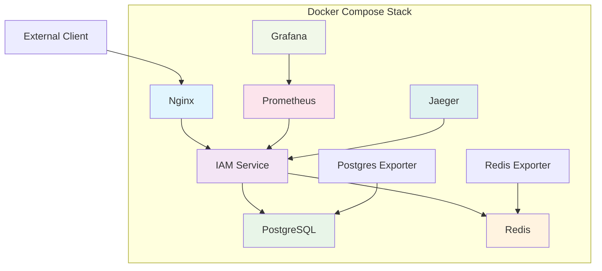

# Docker Compose 部署

Docker Compose是部署VGO微服务最简单快捷的方式，特别适合开发环境、测试环境和小规模生产环境。本指南将详细介绍如何使用Docker Compose部署完整的VGO微服务栈。

## 📋 部署概览

### 服务组件



### 端口映射

| 服务 | 内部端口 | 外部端口 | 说明 |
|------|----------|----------|------|
| Nginx | 80/443 | 80/443 | Web入口 |
| IAM gRPC | 50051 | 50051 | gRPC API |
| IAM HTTP | 8080 | - | 内部HTTP API |
| PostgreSQL | 5432 | 5432 | 数据库（开发环境） |
| Redis | 6379 | 6379 | 缓存（开发环境） |
| Prometheus | 9090 | 9090 | 监控服务 |
| Grafana | 3000 | 3000 | 可视化界面 |
| Jaeger | 16686 | 16686 | 链路追踪界面 |

## 🚀 快速开始

### 1. 环境准备

#### 系统要求
- **操作系统**: Linux, macOS, Windows
- **Docker**: 20.10+
- **Docker Compose**: 2.0+
- **内存**: 最少4GB，推荐8GB+
- **存储**: 最少10GB可用空间

#### 安装Docker和Docker Compose

**Ubuntu/Debian:**
```bash
# 安装Docker
curl -fsSL https://get.docker.com -o get-docker.sh
sudo sh get-docker.sh

# 安装Docker Compose
sudo curl -L "https://github.com/docker/compose/releases/latest/download/docker-compose-$(uname -s)-$(uname -m)" -o /usr/local/bin/docker-compose
sudo chmod +x /usr/local/bin/docker-compose

# 添加用户到docker组
sudo usermod -aG docker $USER
```

**CentOS/RHEL:**
```bash
# 安装Docker
sudo yum install -y yum-utils
sudo yum-config-manager --add-repo https://download.docker.com/linux/centos/docker-ce.repo
sudo yum install -y docker-ce docker-ce-cli containerd.io
sudo systemctl start docker
sudo systemctl enable docker

# 安装Docker Compose
sudo curl -L "https://github.com/docker/compose/releases/latest/download/docker-compose-$(uname -s)-$(uname -m)" -o /usr/local/bin/docker-compose
sudo chmod +x /usr/local/bin/docker-compose
```

**macOS:**
```bash
# 使用Homebrew
brew install docker docker-compose

# 或下载Docker Desktop
# https://www.docker.com/products/docker-desktop
```

### 2. 获取项目文件

```bash
# 克隆项目
git clone https://github.com/your-org/vgo-microservice.git
cd vgo-microservice

# 或者创建项目目录
mkdir vgo-deployment
cd vgo-deployment
```

### 3. 配置文件准备

#### 创建docker-compose.yml

```yaml
# docker-compose.yml
version: '3.8'

services:
  # PostgreSQL数据库
  postgres:
    image: postgres:17-alpine
    container_name: vgo-postgres
    environment:
      POSTGRES_DB: vgo_db
      POSTGRES_USER: vgo_user
      POSTGRES_PASSWORD: ${POSTGRES_PASSWORD:-vgo_password}
      POSTGRES_INITDB_ARGS: "--encoding=UTF8 --locale=C"
    volumes:
      - postgres_data:/var/lib/postgresql/data
      - ./init-scripts:/docker-entrypoint-initdb.d
    ports:
      - "5432:5432"
    networks:
      - backend
    restart: unless-stopped
    healthcheck:
      test: ["CMD-SHELL", "pg_isready -U vgo_user -d vgo_db"]
      interval: 10s
      timeout: 5s
      retries: 5

  # Redis缓存
  redis:
    image: redis:7-alpine
    container_name: vgo-redis
    command: redis-server --requirepass ${REDIS_PASSWORD:-redis_password} --appendonly yes
    volumes:
      - redis_data:/data
      - ./redis.conf:/usr/local/etc/redis/redis.conf
    ports:
      - "6379:6379"
    networks:
      - backend
    restart: unless-stopped
    healthcheck:
      test: ["CMD", "redis-cli", "--raw", "incr", "ping"]
      interval: 10s
      timeout: 3s
      retries: 5

  # IAM微服务
  iam:
    image: vgo/iam:latest
    container_name: vgo-iam
    build:
      context: .
      dockerfile: Dockerfile
    environment:
      # 数据库配置
      - DB_HOST=postgres
      - DB_PORT=5432
      - DB_NAME=vgo_db
      - DB_USER=vgo_user
      - DB_PASSWORD=${POSTGRES_PASSWORD:-vgo_password}
      - DB_SSLMODE=disable
      - DB_MAX_OPEN_CONNS=25
      - DB_MAX_IDLE_CONNS=5
      - DB_CONN_MAX_LIFETIME=300s
      
      # Redis配置
      - REDIS_HOST=redis
      - REDIS_PORT=6379
      - REDIS_PASSWORD=${REDIS_PASSWORD:-redis_password}
      - REDIS_DB=0
      - REDIS_POOL_SIZE=10
      
      # 服务配置
      - GRPC_PORT=50051
      - HTTP_PORT=8080
      - HEALTH_PORT=8081
      - METRICS_PORT=8082
      
      # 安全配置
      - JWT_SECRET=${JWT_SECRET:-your-jwt-secret-key}
      - ENCRYPTION_KEY=${ENCRYPTION_KEY:-your-encryption-key}
      - TLS_ENABLED=false
      
      # 日志配置
      - LOG_LEVEL=info
      - LOG_FORMAT=json
      
      # 监控配置
      - METRICS_ENABLED=true
      - TRACING_ENABLED=true
      - JAEGER_ENDPOINT=http://jaeger:14268/api/traces
    ports:
      - "50051:50051"
      - "8080:8080"
      - "8081:8081"
      - "8082:8082"
    volumes:
      - ./configs:/app/configs
      - ./logs:/app/logs
    networks:
      - frontend
      - backend
    depends_on:
      postgres:
        condition: service_healthy
      redis:
        condition: service_healthy
    restart: unless-stopped
    healthcheck:
      test: ["CMD", "curl", "-f", "http://localhost:8081/health"]
      interval: 30s
      timeout: 10s
      retries: 3
      start_period: 40s

  # Nginx反向代理
  nginx:
    image: nginx:alpine
    container_name: vgo-nginx
    ports:
      - "80:80"
      - "443:443"
    volumes:
      - ./nginx/nginx.conf:/etc/nginx/nginx.conf
      - ./nginx/conf.d:/etc/nginx/conf.d
      - ./certs:/etc/nginx/certs
      - ./logs/nginx:/var/log/nginx
    networks:
      - frontend
    depends_on:
      - iam
    restart: unless-stopped
    healthcheck:
      test: ["CMD", "curl", "-f", "http://localhost/health"]
      interval: 30s
      timeout: 10s
      retries: 3

  # Prometheus监控
  prometheus:
    image: prom/prometheus:latest
    container_name: vgo-prometheus
    command:
      - '--config.file=/etc/prometheus/prometheus.yml'
      - '--storage.tsdb.path=/prometheus'
      - '--web.console.libraries=/etc/prometheus/console_libraries'
      - '--web.console.templates=/etc/prometheus/consoles'
      - '--storage.tsdb.retention.time=200h'
      - '--web.enable-lifecycle'
    ports:
      - "9090:9090"
    volumes:
      - ./prometheus/prometheus.yml:/etc/prometheus/prometheus.yml
      - prometheus_data:/prometheus
    networks:
      - backend
    restart: unless-stopped

  # Grafana可视化
  grafana:
    image: grafana/grafana:latest
    container_name: vgo-grafana
    environment:
      - GF_SECURITY_ADMIN_PASSWORD=${GRAFANA_PASSWORD:-admin}
      - GF_USERS_ALLOW_SIGN_UP=false
    ports:
      - "3000:3000"
    volumes:
      - grafana_data:/var/lib/grafana
      - ./grafana/provisioning:/etc/grafana/provisioning
      - ./grafana/dashboards:/var/lib/grafana/dashboards
    networks:
      - backend
    depends_on:
      - prometheus
    restart: unless-stopped

  # Jaeger链路追踪
  jaeger:
    image: jaegertracing/all-in-one:latest
    container_name: vgo-jaeger
    environment:
      - COLLECTOR_OTLP_ENABLED=true
    ports:
      - "16686:16686"
      - "14268:14268"
    networks:
      - backend
    restart: unless-stopped

  # PostgreSQL监控
  postgres-exporter:
    image: prometheuscommunity/postgres-exporter:latest
    container_name: vgo-postgres-exporter
    environment:
      - DATA_SOURCE_NAME=postgresql://vgo_user:${POSTGRES_PASSWORD:-vgo_password}@postgres:5432/vgo_db?sslmode=disable
    ports:
      - "9187:9187"
    networks:
      - backend
    depends_on:
      - postgres
    restart: unless-stopped

  # Redis监控
  redis-exporter:
    image: oliver006/redis_exporter:latest
    container_name: vgo-redis-exporter
    environment:
      - REDIS_ADDR=redis://redis:6379
      - REDIS_PASSWORD=${REDIS_PASSWORD:-redis_password}
    ports:
      - "9121:9121"
    networks:
      - backend
    depends_on:
      - redis
    restart: unless-stopped

volumes:
  postgres_data:
  redis_data:
  prometheus_data:
  grafana_data:

networks:
  frontend:
    driver: bridge
  backend:
    driver: bridge
    internal: true
```

#### 创建环境变量文件

```bash
# .env
# 数据库配置
POSTGRES_PASSWORD=your-secure-postgres-password

# Redis配置
REDIS_PASSWORD=your-secure-redis-password

# 安全配置
JWT_SECRET=your-very-long-jwt-secret-key-at-least-32-characters
ENCRYPTION_KEY=your-32-character-encryption-key

# Grafana配置
GRAFANA_PASSWORD=your-grafana-admin-password

# 环境标识
ENVIRONMENT=development
```

#### 创建Nginx配置

```nginx
# nginx/nginx.conf
user nginx;
worker_processes auto;
error_log /var/log/nginx/error.log warn;
pid /var/run/nginx.pid;

events {
    worker_connections 1024;
    use epoll;
    multi_accept on;
}

http {
    include /etc/nginx/mime.types;
    default_type application/octet-stream;
    
    # 日志格式
    log_format main '$remote_addr - $remote_user [$time_local] "$request" '
                    '$status $body_bytes_sent "$http_referer" '
                    '"$http_user_agent" "$http_x_forwarded_for" '
                    'rt=$request_time uct="$upstream_connect_time" '
                    'uht="$upstream_header_time" urt="$upstream_response_time"';
    
    access_log /var/log/nginx/access.log main;
    
    # 基础配置
    sendfile on;
    tcp_nopush on;
    tcp_nodelay on;
    keepalive_timeout 65;
    types_hash_max_size 2048;
    client_max_body_size 100M;
    
    # Gzip压缩
    gzip on;
    gzip_vary on;
    gzip_min_length 1024;
    gzip_types text/plain text/css text/xml text/javascript application/javascript application/xml+rss application/json;
    
    # 上游服务器
    upstream iam_backend {
        least_conn;
        server iam:8080 max_fails=3 fail_timeout=30s;
        keepalive 32;
    }
    
    upstream iam_grpc {
        server iam:50051;
    }
    
    # HTTP服务器
    server {
        listen 80;
        server_name _;
        
        # 健康检查
        location /health {
            access_log off;
            proxy_pass http://iam_backend/health;
            proxy_set_header Host $host;
            proxy_set_header X-Real-IP $remote_addr;
            proxy_set_header X-Forwarded-For $proxy_add_x_forwarded_for;
            proxy_set_header X-Forwarded-Proto $scheme;
        }
        
        # API代理
        location /api/ {
            proxy_pass http://iam_backend;
            proxy_set_header Host $host;
            proxy_set_header X-Real-IP $remote_addr;
            proxy_set_header X-Forwarded-For $proxy_add_x_forwarded_for;
            proxy_set_header X-Forwarded-Proto $scheme;
            
            # 超时配置
            proxy_connect_timeout 5s;
            proxy_send_timeout 60s;
            proxy_read_timeout 60s;
            
            # 缓冲配置
            proxy_buffering on;
            proxy_buffer_size 4k;
            proxy_buffers 8 4k;
        }
        
        # Web界面
        location / {
            proxy_pass http://iam_backend;
            proxy_set_header Host $host;
            proxy_set_header X-Real-IP $remote_addr;
            proxy_set_header X-Forwarded-For $proxy_add_x_forwarded_for;
            proxy_set_header X-Forwarded-Proto $scheme;
            
            # WebSocket支持
            proxy_http_version 1.1;
            proxy_set_header Upgrade $http_upgrade;
            proxy_set_header Connection "upgrade";
        }
        
        # 静态文件缓存
        location ~* \.(js|css|png|jpg|jpeg|gif|ico|svg)$ {
            proxy_pass http://iam_backend;
            proxy_set_header Host $host;
            expires 1y;
            add_header Cache-Control "public, immutable";
        }
    }
    
    # gRPC服务器（如果需要直接暴露gRPC）
    server {
        listen 50051 http2;
        
        location / {
            grpc_pass grpc://iam_grpc;
            grpc_set_header Host $host;
            grpc_set_header X-Real-IP $remote_addr;
            grpc_set_header X-Forwarded-For $proxy_add_x_forwarded_for;
        }
    }
}
```

#### 创建Prometheus配置

```yaml
# prometheus/prometheus.yml
global:
  scrape_interval: 15s
  evaluation_interval: 15s
  external_labels:
    cluster: 'vgo-cluster'
    environment: 'development'

scrape_configs:
  # VGO IAM服务
  - job_name: 'vgo-iam'
    static_configs:
      - targets: ['iam:8082']
    metrics_path: /metrics
    scrape_interval: 10s
    scrape_timeout: 5s
    
  # PostgreSQL
  - job_name: 'postgres'
    static_configs:
      - targets: ['postgres-exporter:9187']
    scrape_interval: 15s
    
  # Redis
  - job_name: 'redis'
    static_configs:
      - targets: ['redis-exporter:9121']
    scrape_interval: 15s
    
  # Prometheus自身
  - job_name: 'prometheus'
    static_configs:
      - targets: ['localhost:9090']
    
  # Nginx（如果配置了nginx-prometheus-exporter）
  - job_name: 'nginx'
    static_configs:
      - targets: ['nginx-exporter:9113']
    scrape_interval: 15s

# 告警规则
rule_files:
  - "alert_rules.yml"

# 告警管理器配置（可选）
# alerting:
#   alertmanagers:
#     - static_configs:
#         - targets:
#           - alertmanager:9093
```

### 4. 启动服务

```bash
# 创建必要的目录
mkdir -p {configs,logs,nginx/conf.d,prometheus,grafana/{provisioning,dashboards},certs,init-scripts}

# 设置权限
chmod +x scripts/*.sh

# 启动所有服务
docker-compose up -d

# 查看服务状态
docker-compose ps

# 查看日志
docker-compose logs -f iam
```

### 5. 验证部署

```bash
# 检查服务健康状态
curl http://localhost/health

# 测试gRPC API
grpcurl -plaintext localhost:50051 list

# 访问Web界面
open http://localhost

# 访问监控界面
open http://localhost:3000  # Grafana
open http://localhost:9090  # Prometheus
open http://localhost:16686 # Jaeger
```

## 🔧 配置详解

### 环境变量配置

#### 数据库配置
```bash
# 基础连接配置
DB_HOST=postgres
DB_PORT=5432
DB_NAME=vgo_db
DB_USER=vgo_user
DB_PASSWORD=your-password
DB_SSLMODE=disable

# 连接池配置
DB_MAX_OPEN_CONNS=25        # 最大打开连接数
DB_MAX_IDLE_CONNS=5         # 最大空闲连接数
DB_CONN_MAX_LIFETIME=300s   # 连接最大生命周期

# 查询配置
DB_QUERY_TIMEOUT=30s        # 查询超时时间
DB_EXEC_TIMEOUT=30s         # 执行超时时间
```

#### Redis配置
```bash
# 基础连接配置
REDIS_HOST=redis
REDIS_PORT=6379
REDIS_PASSWORD=your-password
REDIS_DB=0

# 连接池配置
REDIS_POOL_SIZE=10          # 连接池大小
REDIS_MIN_IDLE_CONNS=5      # 最小空闲连接数
REDIS_POOL_TIMEOUT=5s       # 连接池超时
REDIS_IDLE_TIMEOUT=300s     # 空闲连接超时

# 缓存配置
REDIS_DEFAULT_TTL=3600s     # 默认TTL
REDIS_MAX_RETRIES=3         # 最大重试次数
```

#### 服务配置
```bash
# 端口配置
GRPC_PORT=50051
HTTP_PORT=8080
HEALTH_PORT=8081
METRICS_PORT=8082

# 性能配置
GOMEMLIMIT=1GiB            # Go内存限制
GOMAXPROCS=4               # Go最大进程数
GOGC=100                   # GC目标百分比

# 超时配置
SERVER_READ_TIMEOUT=30s    # 读取超时
SERVER_WRITE_TIMEOUT=30s   # 写入超时
SERVER_IDLE_TIMEOUT=120s   # 空闲超时
```

### 数据初始化

#### 创建初始化脚本

```sql
-- init-scripts/01-init-database.sql
-- 创建扩展
CREATE EXTENSION IF NOT EXISTS "uuid-ossp";
CREATE EXTENSION IF NOT EXISTS "pgcrypto";

-- 创建用户表
CREATE TABLE IF NOT EXISTS users (
    id UUID PRIMARY KEY DEFAULT uuid_generate_v4(),
    username VARCHAR(255) UNIQUE NOT NULL,
    email VARCHAR(255) UNIQUE NOT NULL,
    password_hash VARCHAR(255) NOT NULL,
    status VARCHAR(50) DEFAULT 'active',
    created_at TIMESTAMP WITH TIME ZONE DEFAULT NOW(),
    updated_at TIMESTAMP WITH TIME ZONE DEFAULT NOW()
);

-- 创建策略表
CREATE TABLE IF NOT EXISTS policies (
    id UUID PRIMARY KEY DEFAULT uuid_generate_v4(),
    name VARCHAR(255) UNIQUE NOT NULL,
    description TEXT,
    document JSONB NOT NULL,
    version VARCHAR(50) DEFAULT '2025-01-01',
    created_at TIMESTAMP WITH TIME ZONE DEFAULT NOW(),
    updated_at TIMESTAMP WITH TIME ZONE DEFAULT NOW()
);

-- 创建用户策略关联表
CREATE TABLE IF NOT EXISTS user_policies (
    id UUID PRIMARY KEY DEFAULT uuid_generate_v4(),
    user_id UUID NOT NULL REFERENCES users(id) ON DELETE CASCADE,
    policy_id UUID NOT NULL REFERENCES policies(id) ON DELETE CASCADE,
    created_at TIMESTAMP WITH TIME ZONE DEFAULT NOW(),
    UNIQUE(user_id, policy_id)
);

-- 创建访问密钥表
CREATE TABLE IF NOT EXISTS access_keys (
    id UUID PRIMARY KEY DEFAULT uuid_generate_v4(),
    user_id UUID NOT NULL REFERENCES users(id) ON DELETE CASCADE,
    access_key_id VARCHAR(255) UNIQUE NOT NULL,
    secret_access_key_hash VARCHAR(255) NOT NULL,
    description TEXT,
    status VARCHAR(50) DEFAULT 'active',
    last_used_at TIMESTAMP WITH TIME ZONE,
    created_at TIMESTAMP WITH TIME ZONE DEFAULT NOW(),
    updated_at TIMESTAMP WITH TIME ZONE DEFAULT NOW()
);

-- 创建应用表
CREATE TABLE IF NOT EXISTS applications (
    id UUID PRIMARY KEY DEFAULT uuid_generate_v4(),
    name VARCHAR(255) UNIQUE NOT NULL,
    description TEXT,
    client_id VARCHAR(255) UNIQUE NOT NULL,
    client_secret_hash VARCHAR(255) NOT NULL,
    type VARCHAR(50) DEFAULT 'web',
    status VARCHAR(50) DEFAULT 'active',
    created_at TIMESTAMP WITH TIME ZONE DEFAULT NOW(),
    updated_at TIMESTAMP WITH TIME ZONE DEFAULT NOW()
);

-- 创建索引
CREATE INDEX IF NOT EXISTS idx_users_username ON users(username);
CREATE INDEX IF NOT EXISTS idx_users_email ON users(email);
CREATE INDEX IF NOT EXISTS idx_users_status ON users(status);
CREATE INDEX IF NOT EXISTS idx_policies_name ON policies(name);
CREATE INDEX IF NOT EXISTS idx_user_policies_user_id ON user_policies(user_id);
CREATE INDEX IF NOT EXISTS idx_user_policies_policy_id ON user_policies(policy_id);
CREATE INDEX IF NOT EXISTS idx_access_keys_user_id ON access_keys(user_id);
CREATE INDEX IF NOT EXISTS idx_access_keys_access_key_id ON access_keys(access_key_id);
CREATE INDEX IF NOT EXISTS idx_applications_client_id ON applications(client_id);
```

```sql
-- init-scripts/02-seed-data.sql
-- 插入管理员用户
INSERT INTO users (username, email, password_hash, status) VALUES 
('admin', 'admin@example.com', crypt('admin123', gen_salt('bf')), 'active')
ON CONFLICT (username) DO NOTHING;

-- 插入管理员策略
INSERT INTO policies (name, description, document) VALUES 
('AdminPolicy', '管理员完全权限策略', '{
  "Version": "2025-01-01",
  "Statement": [
    {
      "Effect": "Allow",
      "Action": "*",
      "Resource": "*"
    }
  ]
}'::jsonb)
ON CONFLICT (name) DO NOTHING;

-- 绑定管理员策略
INSERT INTO user_policies (user_id, policy_id)
SELECT u.id, p.id
FROM users u, policies p
WHERE u.username = 'admin' AND p.name = 'AdminPolicy'
ON CONFLICT (user_id, policy_id) DO NOTHING;

-- 插入只读策略
INSERT INTO policies (name, description, document) VALUES 
('ReadOnlyPolicy', '只读权限策略', '{
  "Version": "2025-01-01",
  "Statement": [
    {
      "Effect": "Allow",
      "Action": [
        "iam:GetUser",
        "iam:ListUsers",
        "iam:GetPolicy",
        "iam:ListPolicies",
        "iam:ListUserPolicies",
        "iam:CheckPermission"
      ],
      "Resource": "*"
    }
  ]
}'::jsonb)
ON CONFLICT (name) DO NOTHING;
```

### 备份和恢复

#### 自动备份脚本

```bash
#!/bin/bash
# scripts/backup.sh

set -e

# 配置
BACKUP_DIR="./backups"
DATE=$(date +%Y%m%d_%H%M%S)
RETENTION_DAYS=7
COMPOSE_PROJECT="vgo"

# 创建备份目录
mkdir -p $BACKUP_DIR

echo "开始备份 - $DATE"

# 备份数据库
echo "备份PostgreSQL数据库..."
docker-compose exec -T postgres pg_dump -U vgo_user vgo_db | gzip > $BACKUP_DIR/postgres_$DATE.sql.gz

# 备份Redis
echo "备份Redis数据..."
docker-compose exec redis redis-cli BGSAVE
sleep 5
docker-compose exec redis cat /data/dump.rdb | gzip > $BACKUP_DIR/redis_$DATE.rdb.gz

# 备份配置文件
echo "备份配置文件..."
tar -czf $BACKUP_DIR/configs_$DATE.tar.gz configs/ .env docker-compose.yml nginx/ prometheus/ grafana/

# 备份日志（最近7天）
echo "备份日志文件..."
find logs/ -name "*.log" -mtime -7 | tar -czf $BACKUP_DIR/logs_$DATE.tar.gz -T -

# 清理旧备份
echo "清理旧备份..."
find $BACKUP_DIR -name "*.gz" -mtime +$RETENTION_DAYS -delete
find $BACKUP_DIR -name "*.tar.gz" -mtime +$RETENTION_DAYS -delete

echo "备份完成 - $DATE"
echo "备份文件:"
ls -la $BACKUP_DIR/*$DATE*
```

#### 恢复脚本

```bash
#!/bin/bash
# scripts/restore.sh

set -e

if [ $# -ne 1 ]; then
    echo "用法: $0 <备份日期>"
    echo "示例: $0 20240115_103000"
    exit 1
fi

BACKUP_DATE=$1
BACKUP_DIR="./backups"

echo "开始恢复 - $BACKUP_DATE"

# 检查备份文件是否存在
if [ ! -f "$BACKUP_DIR/postgres_$BACKUP_DATE.sql.gz" ]; then
    echo "错误: 找不到数据库备份文件"
    exit 1
fi

# 停止服务
echo "停止服务..."
docker-compose stop iam

# 恢复数据库
echo "恢复PostgreSQL数据库..."
zcat $BACKUP_DIR/postgres_$BACKUP_DATE.sql.gz | docker-compose exec -T postgres psql -U vgo_user -d vgo_db

# 恢复Redis
if [ -f "$BACKUP_DIR/redis_$BACKUP_DATE.rdb.gz" ]; then
    echo "恢复Redis数据..."
    docker-compose stop redis
    zcat $BACKUP_DIR/redis_$BACKUP_DATE.rdb.gz | docker-compose exec -T redis sh -c 'cat > /data/dump.rdb'
    docker-compose start redis
fi

# 恢复配置文件（可选）
if [ -f "$BACKUP_DIR/configs_$BACKUP_DATE.tar.gz" ]; then
    echo "是否恢复配置文件? (y/N)"
    read -r response
    if [[ "$response" =~ ^[Yy]$ ]]; then
        echo "恢复配置文件..."
        tar -xzf $BACKUP_DIR/configs_$BACKUP_DATE.tar.gz
    fi
fi

# 启动服务
echo "启动服务..."
docker-compose start iam

# 等待服务启动
echo "等待服务启动..."
sleep 10

# 验证恢复
echo "验证恢复..."
if curl -f http://localhost/health > /dev/null 2>&1; then
    echo "恢复成功!"
else
    echo "恢复可能失败，请检查服务状态"
    docker-compose logs iam
fi
```

## 🔍 故障排除

### 常见问题

#### 1. 容器启动失败

**问题**: 容器无法启动或立即退出

**排查步骤**:
```bash
# 查看容器状态
docker-compose ps

# 查看容器日志
docker-compose logs iam
docker-compose logs postgres
docker-compose logs redis

# 检查资源使用
docker stats

# 检查端口占用
netstat -tlnp | grep -E ':(50051|8080|5432|6379)'
```

**常见解决方案**:
- 检查端口是否被占用
- 确认配置文件语法正确
- 检查磁盘空间是否充足
- 验证环境变量设置

#### 2. 数据库连接失败

**问题**: IAM服务无法连接到PostgreSQL

**排查步骤**:
```bash
# 检查PostgreSQL状态
docker-compose exec postgres pg_isready -U vgo_user

# 测试数据库连接
docker-compose exec postgres psql -U vgo_user -d vgo_db -c "SELECT 1;"

# 检查网络连通性
docker-compose exec iam ping postgres

# 查看数据库日志
docker-compose logs postgres
```

**解决方案**:
- 确认数据库用户名密码正确
- 检查数据库是否已完全启动
- 验证网络配置
- 检查防火墙设置

#### 3. Redis连接问题

**问题**: 无法连接到Redis缓存

**排查步骤**:
```bash
# 检查Redis状态
docker-compose exec redis redis-cli ping

# 测试认证
docker-compose exec redis redis-cli -a your-password ping

# 检查Redis配置
docker-compose exec redis redis-cli CONFIG GET '*'

# 查看Redis日志
docker-compose logs redis
```

#### 4. 性能问题

**问题**: 服务响应缓慢

**排查步骤**:
```bash
# 检查资源使用
docker stats

# 查看数据库性能
docker-compose exec postgres psql -U vgo_user -d vgo_db -c "
  SELECT query, mean_time, calls 
  FROM pg_stat_statements 
  ORDER BY mean_time DESC 
  LIMIT 10;"

# 检查Redis性能
docker-compose exec redis redis-cli --latency-history

# 查看应用指标
curl http://localhost:8082/metrics
```

### 监控和调试

#### 启用调试日志

```yaml
# docker-compose.yml
services:
  iam:
    environment:
      - LOG_LEVEL=debug
      - DB_LOG_LEVEL=debug
      - GRPC_LOG_LEVEL=debug
```

#### 性能分析

```bash
# 启用Go性能分析
docker-compose exec iam curl http://localhost:8082/debug/pprof/profile?seconds=30 > cpu.prof

# 内存分析
docker-compose exec iam curl http://localhost:8082/debug/pprof/heap > heap.prof

# 查看goroutine
docker-compose exec iam curl http://localhost:8082/debug/pprof/goroutine?debug=1
```

## 📈 生产环境优化

### 资源限制

```yaml
# docker-compose.yml
services:
  iam:
    deploy:
      resources:
        limits:
          cpus: '2.0'
          memory: 1G
        reservations:
          cpus: '0.5'
          memory: 512M
    
  postgres:
    deploy:
      resources:
        limits:
          cpus: '1.0'
          memory: 2G
        reservations:
          cpus: '0.5'
          memory: 1G
    
  redis:
    deploy:
      resources:
        limits:
          cpus: '0.5'
          memory: 512M
        reservations:
          cpus: '0.1'
          memory: 128M
```

### 安全加固

```yaml
# docker-compose.yml
services:
  iam:
    security_opt:
      - no-new-privileges:true
    read_only: true
    tmpfs:
      - /tmp
      - /var/tmp
    user: "1000:1000"
    cap_drop:
      - ALL
    cap_add:
      - NET_BIND_SERVICE
```

### 日志管理

```yaml
# docker-compose.yml
services:
  iam:
    logging:
      driver: "json-file"
      options:
        max-size: "100m"
        max-file: "5"
        labels: "service=iam,environment=production"
```

## 📚 相关文档

- [Kubernetes部署](./kubernetes.md) - 生产级容器编排
- [监控配置](./monitoring.md) - 完整监控解决方案
- [安全配置](./security.md) - 生产环境安全
- [故障排除](./troubleshooting.md) - 问题诊断指南
- [性能调优](./performance.md) - 性能优化建议

---

::: tip 提示
Docker Compose适合中小规模部署，对于大规模生产环境建议使用Kubernetes。
:::

::: warning 注意
生产环境请务必修改默认密码，启用TLS加密，并配置适当的资源限制。
:::