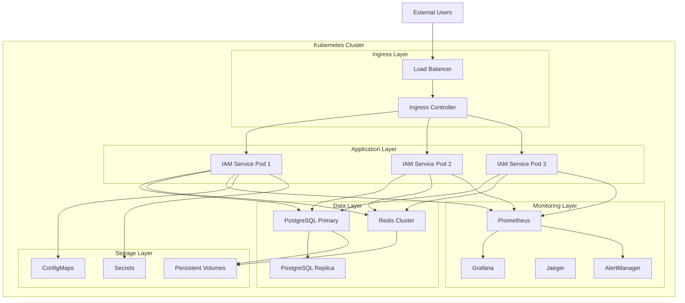

# Kubernetes 部署

Kubernetes是VGO微服务在生产环境的推荐部署方式，提供了高可用、自动扩缩容、服务发现、负载均衡等企业级特性。本指南将详细介绍如何在Kubernetes集群中部署VGO微服务。

## 📋 部署架构

### 集群架构图



### 资源分布

| 组件 | 副本数 | CPU请求 | CPU限制 | 内存请求 | 内存限制 | 存储 |
|------|--------|---------|---------|----------|----------|------|
| IAM Service | 3 | 500m | 1000m | 512Mi | 1Gi | - |
| PostgreSQL | 1+1 | 1000m | 2000m | 1Gi | 2Gi | 100Gi |
| Redis | 3 | 250m | 500m | 256Mi | 512Mi | 10Gi |
| Prometheus | 1 | 500m | 1000m | 1Gi | 2Gi | 50Gi |
| Grafana | 1 | 100m | 200m | 128Mi | 256Mi | 10Gi |

## 🚀 快速开始

### 1. 环境准备

#### 集群要求
- **Kubernetes版本**: 1.20+
- **节点数量**: 最少3个节点
- **总CPU**: 最少8核
- **总内存**: 最少16GB
- **存储**: 支持动态PV供应

#### 必需组件
- **Ingress Controller**: Nginx, Traefik, 或 Istio
- **存储类**: 支持ReadWriteOnce和ReadWriteMany
- **DNS**: CoreDNS或kube-dns
- **网络插件**: Calico, Flannel, 或 Weave

#### 工具安装

```bash
# 安装kubectl
curl -LO "https://dl.k8s.io/release/$(curl -L -s https://dl.k8s.io/release/stable.txt)/bin/linux/amd64/kubectl"
sudo install -o root -g root -m 0755 kubectl /usr/local/bin/kubectl

# 安装Helm
curl https://raw.githubusercontent.com/helm/helm/main/scripts/get-helm-3 | bash

# 验证安装
kubectl version --client
helm version
```

### 2. 创建命名空间

```yaml
# namespace.yaml
apiVersion: v1
kind: Namespace
metadata:
  name: vgo-system
  labels:
    name: vgo-system
    app.kubernetes.io/name: vgo
    app.kubernetes.io/instance: vgo-production
---
apiVersion: v1
kind: Namespace
metadata:
  name: vgo-monitoring
  labels:
    name: vgo-monitoring
    app.kubernetes.io/name: monitoring
```

```bash
# 应用命名空间
kubectl apply -f namespace.yaml
```

### 3. 配置存储

#### 存储类定义

```yaml
# storage-class.yaml
apiVersion: storage.k8s.io/v1
kind: StorageClass
metadata:
  name: vgo-ssd
  annotations:
    storageclass.kubernetes.io/is-default-class: "false"
provisioner: kubernetes.io/aws-ebs  # 根据云提供商调整
parameters:
  type: gp3
  fsType: ext4
  encrypted: "true"
volumeBindingMode: WaitForFirstConsumer
allowVolumeExpansion: true
reclaimPolicy: Retain
---
apiVersion: storage.k8s.io/v1
kind: StorageClass
metadata:
  name: vgo-standard
provisioner: kubernetes.io/aws-ebs
parameters:
  type: gp2
  fsType: ext4
volumeBindingMode: WaitForFirstConsumer
allowVolumeExpansion: true
reclaimPolicy: Delete
```

### 4. 配置密钥和配置

#### 创建密钥

```yaml
# secrets.yaml
apiVersion: v1
kind: Secret
metadata:
  name: vgo-database-secret
  namespace: vgo-system
type: Opaque
data:
  username: dmdvX3VzZXI=  # base64编码的 "vgo_user"
  password: eW91ci1zZWN1cmUtcGFzc3dvcmQ=  # base64编码的密码
  database: dmdvX2Ri  # base64编码的 "vgo_db"
---
apiVersion: v1
kind: Secret
metadata:
  name: vgo-redis-secret
  namespace: vgo-system
type: Opaque
data:
  password: eW91ci1yZWRpcy1wYXNzd29yZA==  # base64编码的Redis密码
---
apiVersion: v1
kind: Secret
metadata:
  name: vgo-app-secret
  namespace: vgo-system
type: Opaque
data:
  jwt-secret: eW91ci12ZXJ5LWxvbmctand0LXNlY3JldC1rZXktYXQtbGVhc3QtMzItY2hhcmFjdGVycw==
  encryption-key: eW91ci0zMi1jaGFyYWN0ZXItZW5jcnlwdGlvbi1rZXk=
```

#### 创建配置映射

```yaml
# configmap.yaml
apiVersion: v1
kind: ConfigMap
metadata:
  name: vgo-config
  namespace: vgo-system
data:
  app.yaml: |
    server:
      grpc_port: 50051
      http_port: 8080
      health_port: 8081
      metrics_port: 8082
      read_timeout: 30s
      write_timeout: 30s
      idle_timeout: 120s
    
    database:
      host: vgo-postgres
      port: 5432
      sslmode: require
      max_open_conns: 25
      max_idle_conns: 5
      conn_max_lifetime: 300s
      query_timeout: 30s
    
    redis:
      host: vgo-redis
      port: 6379
      db: 0
      pool_size: 10
      min_idle_conns: 5
      pool_timeout: 5s
      idle_timeout: 300s
      default_ttl: 3600s
    
    logging:
      level: info
      format: json
      output: stdout
    
    metrics:
      enabled: true
      path: /metrics
    
    tracing:
      enabled: true
      jaeger_endpoint: http://jaeger-collector.vgo-monitoring:14268/api/traces
      sample_rate: 0.1
    
    security:
      tls_enabled: true
      cors_enabled: true
      cors_origins:
        - "https://vgo.example.com"
        - "https://admin.vgo.example.com"
---
apiVersion: v1
kind: ConfigMap
metadata:
  name: postgres-config
  namespace: vgo-system
data:
  postgresql.conf: |
    # 连接设置
    listen_addresses = '*'
    port = 5432
    max_connections = 200
    
    # 内存设置
    shared_buffers = 256MB
    effective_cache_size = 1GB
    work_mem = 4MB
    maintenance_work_mem = 64MB
    
    # WAL设置
    wal_level = replica
    max_wal_size = 1GB
    min_wal_size = 80MB
    checkpoint_completion_target = 0.9
    
    # 复制设置
    hot_standby = on
    max_replication_slots = 10
    max_wal_senders = 10
    
    # 日志设置
    log_destination = 'stderr'
    logging_collector = on
    log_directory = 'log'
    log_filename = 'postgresql-%Y-%m-%d_%H%M%S.log'
    log_statement = 'mod'
    log_min_duration_statement = 1000
    
    # 性能设置
    random_page_cost = 1.1
    effective_io_concurrency = 200
  
  pg_hba.conf: |
    # TYPE  DATABASE        USER            ADDRESS                 METHOD
    local   all             all                                     trust
    host    all             all             127.0.0.1/32            md5
    host    all             all             ::1/128                 md5
    host    all             all             0.0.0.0/0               md5
    host    replication     all             0.0.0.0/0               md5
```

```bash
# 应用密钥和配置
kubectl apply -f secrets.yaml
kubectl apply -f configmap.yaml
```

### 5. 部署PostgreSQL

#### PostgreSQL主库

```yaml
# postgres-primary.yaml
apiVersion: apps/v1
kind: StatefulSet
metadata:
  name: vgo-postgres
  namespace: vgo-system
  labels:
    app: vgo-postgres
    role: primary
spec:
  serviceName: vgo-postgres
  replicas: 1
  selector:
    matchLabels:
      app: vgo-postgres
      role: primary
  template:
    metadata:
      labels:
        app: vgo-postgres
        role: primary
    spec:
      securityContext:
        fsGroup: 999
      containers:
      - name: postgres
        image: postgres:17-alpine
        ports:
        - containerPort: 5432
          name: postgres
        env:
        - name: POSTGRES_DB
          valueFrom:
            secretKeyRef:
              name: vgo-database-secret
              key: database
        - name: POSTGRES_USER
          valueFrom:
            secretKeyRef:
              name: vgo-database-secret
              key: username
        - name: POSTGRES_PASSWORD
          valueFrom:
            secretKeyRef:
              name: vgo-database-secret
              key: password
        - name: POSTGRES_INITDB_ARGS
          value: "--encoding=UTF8 --locale=C"
        - name: PGDATA
          value: /var/lib/postgresql/data/pgdata
        volumeMounts:
        - name: postgres-data
          mountPath: /var/lib/postgresql/data
        - name: postgres-config
          mountPath: /etc/postgresql
        - name: postgres-init
          mountPath: /docker-entrypoint-initdb.d
        resources:
          requests:
            cpu: 1000m
            memory: 1Gi
          limits:
            cpu: 2000m
            memory: 2Gi
        livenessProbe:
          exec:
            command:
            - /bin/sh
            - -c
            - pg_isready -U $POSTGRES_USER -d $POSTGRES_DB
          initialDelaySeconds: 30
          periodSeconds: 10
          timeoutSeconds: 5
          failureThreshold: 3
        readinessProbe:
          exec:
            command:
            - /bin/sh
            - -c
            - pg_isready -U $POSTGRES_USER -d $POSTGRES_DB
          initialDelaySeconds: 5
          periodSeconds: 5
          timeoutSeconds: 3
          failureThreshold: 3
      volumes:
      - name: postgres-config
        configMap:
          name: postgres-config
      - name: postgres-init
        configMap:
          name: postgres-init-scripts
  volumeClaimTemplates:
  - metadata:
      name: postgres-data
    spec:
      accessModes: ["ReadWriteOnce"]
      storageClassName: vgo-ssd
      resources:
        requests:
          storage: 100Gi
---
apiVersion: v1
kind: Service
metadata:
  name: vgo-postgres
  namespace: vgo-system
  labels:
    app: vgo-postgres
spec:
  type: ClusterIP
  ports:
  - port: 5432
    targetPort: 5432
    name: postgres
  selector:
    app: vgo-postgres
    role: primary
```

### 6. 部署Redis

```yaml
# redis.yaml
apiVersion: apps/v1
kind: StatefulSet
metadata:
  name: vgo-redis
  namespace: vgo-system
  labels:
    app: vgo-redis
spec:
  serviceName: vgo-redis
  replicas: 1
  selector:
    matchLabels:
      app: vgo-redis
  template:
    metadata:
      labels:
        app: vgo-redis
    spec:
      containers:
      - name: redis
        image: redis:7-alpine
        command:
        - redis-server
        - /etc/redis/redis.conf
        - --requirepass
        - $(REDIS_PASSWORD)
        ports:
        - containerPort: 6379
          name: redis
        env:
        - name: REDIS_PASSWORD
          valueFrom:
            secretKeyRef:
              name: vgo-redis-secret
              key: password
        volumeMounts:
        - name: redis-data
          mountPath: /data
        - name: redis-config
          mountPath: /etc/redis
        resources:
          requests:
            cpu: 250m
            memory: 256Mi
          limits:
            cpu: 500m
            memory: 512Mi
        livenessProbe:
          exec:
            command:
            - redis-cli
            - -a
            - $(REDIS_PASSWORD)
            - ping
          initialDelaySeconds: 30
          periodSeconds: 10
          timeoutSeconds: 5
          failureThreshold: 3
        readinessProbe:
          exec:
            command:
            - redis-cli
            - -a
            - $(REDIS_PASSWORD)
            - ping
          initialDelaySeconds: 5
          periodSeconds: 5
          timeoutSeconds: 3
          failureThreshold: 3
      volumes:
      - name: redis-config
        configMap:
          name: redis-config
  volumeClaimTemplates:
  - metadata:
      name: redis-data
    spec:
      accessModes: ["ReadWriteOnce"]
      storageClassName: vgo-ssd
      resources:
        requests:
          storage: 10Gi
---
apiVersion: v1
kind: Service
metadata:
  name: vgo-redis
  namespace: vgo-system
  labels:
    app: vgo-redis
spec:
  type: ClusterIP
  ports:
  - port: 6379
    targetPort: 6379
    name: redis
  selector:
    app: vgo-redis
---
apiVersion: v1
kind: ConfigMap
metadata:
  name: redis-config
  namespace: vgo-system
data:
  redis.conf: |
    # 网络配置
    bind 0.0.0.0
    port 6379
    tcp-backlog 511
    timeout 0
    tcp-keepalive 300
    
    # 持久化配置
    save 900 1
    save 300 10
    save 60 10000
    stop-writes-on-bgsave-error yes
    rdbcompression yes
    rdbchecksum yes
    dbfilename dump.rdb
    dir /data
    
    # AOF配置
    appendonly yes
    appendfilename "appendonly.aof"
    appendfsync everysec
    no-appendfsync-on-rewrite no
    auto-aof-rewrite-percentage 100
    auto-aof-rewrite-min-size 64mb
    
    # 内存配置
    maxmemory 400mb
    maxmemory-policy allkeys-lru
    
    # 日志配置
    loglevel notice
    logfile ""
    
    # 客户端配置
    maxclients 10000
```

### 7. 部署IAM服务

```yaml
# iam-deployment.yaml
apiVersion: apps/v1
kind: Deployment
metadata:
  name: vgo-iam
  namespace: vgo-system
  labels:
    app: vgo-iam
    version: v1.0.0
spec:
  replicas: 3
  strategy:
    type: RollingUpdate
    rollingUpdate:
      maxSurge: 1
      maxUnavailable: 1
  selector:
    matchLabels:
      app: vgo-iam
  template:
    metadata:
      labels:
        app: vgo-iam
        version: v1.0.0
      annotations:
        prometheus.io/scrape: "true"
        prometheus.io/port: "8082"
        prometheus.io/path: "/metrics"
    spec:
      serviceAccountName: vgo-iam
      securityContext:
        runAsNonRoot: true
        runAsUser: 1000
        runAsGroup: 1000
        fsGroup: 1000
      containers:
      - name: iam
        image: vgo/iam:v1.0.0
        imagePullPolicy: IfNotPresent
        ports:
        - containerPort: 50051
          name: grpc
          protocol: TCP
        - containerPort: 8080
          name: http
          protocol: TCP
        - containerPort: 8081
          name: health
          protocol: TCP
        - containerPort: 8082
          name: metrics
          protocol: TCP
        env:
        - name: CONFIG_FILE
          value: "/etc/vgo/app.yaml"
        - name: DB_PASSWORD
          valueFrom:
            secretKeyRef:
              name: vgo-database-secret
              key: password
        - name: REDIS_PASSWORD
          valueFrom:
            secretKeyRef:
              name: vgo-redis-secret
              key: password
        - name: JWT_SECRET
          valueFrom:
            secretKeyRef:
              name: vgo-app-secret
              key: jwt-secret
        - name: ENCRYPTION_KEY
          valueFrom:
            secretKeyRef:
              name: vgo-app-secret
              key: encryption-key
        - name: POD_NAME
          valueFrom:
            fieldRef:
              fieldPath: metadata.name
        - name: POD_NAMESPACE
          valueFrom:
            fieldRef:
              fieldPath: metadata.namespace
        - name: POD_IP
          valueFrom:
            fieldRef:
              fieldPath: status.podIP
        volumeMounts:
        - name: config
          mountPath: /etc/vgo
          readOnly: true
        - name: tmp
          mountPath: /tmp
        resources:
          requests:
            cpu: 500m
            memory: 512Mi
          limits:
            cpu: 1000m
            memory: 1Gi
        livenessProbe:
          httpGet:
            path: /health
            port: 8081
          initialDelaySeconds: 30
          periodSeconds: 10
          timeoutSeconds: 5
          failureThreshold: 3
        readinessProbe:
          httpGet:
            path: /ready
            port: 8081
          initialDelaySeconds: 5
          periodSeconds: 5
          timeoutSeconds: 3
          failureThreshold: 3
        startupProbe:
          httpGet:
            path: /health
            port: 8081
          initialDelaySeconds: 10
          periodSeconds: 5
          timeoutSeconds: 3
          failureThreshold: 30
        securityContext:
          allowPrivilegeEscalation: false
          readOnlyRootFilesystem: true
          capabilities:
            drop:
            - ALL
      volumes:
      - name: config
        configMap:
          name: vgo-config
      - name: tmp
        emptyDir: {}
      affinity:
        podAntiAffinity:
          preferredDuringSchedulingIgnoredDuringExecution:
          - weight: 100
            podAffinityTerm:
              labelSelector:
                matchExpressions:
                - key: app
                  operator: In
                  values:
                  - vgo-iam
              topologyKey: kubernetes.io/hostname
      tolerations:
      - key: "node.kubernetes.io/not-ready"
        operator: "Exists"
        effect: "NoExecute"
        tolerationSeconds: 300
      - key: "node.kubernetes.io/unreachable"
        operator: "Exists"
        effect: "NoExecute"
        tolerationSeconds: 300
---
apiVersion: v1
kind: Service
metadata:
  name: vgo-iam
  namespace: vgo-system
  labels:
    app: vgo-iam
  annotations:
    service.beta.kubernetes.io/aws-load-balancer-type: nlb
spec:
  type: ClusterIP
  ports:
  - port: 50051
    targetPort: 50051
    name: grpc
    protocol: TCP
  - port: 8080
    targetPort: 8080
    name: http
    protocol: TCP
  - port: 8081
    targetPort: 8081
    name: health
    protocol: TCP
  - port: 8082
    targetPort: 8082
    name: metrics
    protocol: TCP
  selector:
    app: vgo-iam
---
apiVersion: v1
kind: ServiceAccount
metadata:
  name: vgo-iam
  namespace: vgo-system
  labels:
    app: vgo-iam
automountServiceAccountToken: false
```

### 8. 配置Ingress

```yaml
# ingress.yaml
apiVersion: networking.k8s.io/v1
kind: Ingress
metadata:
  name: vgo-ingress
  namespace: vgo-system
  labels:
    app: vgo
  annotations:
    kubernetes.io/ingress.class: nginx
    nginx.ingress.kubernetes.io/ssl-redirect: "true"
    nginx.ingress.kubernetes.io/force-ssl-redirect: "true"
    nginx.ingress.kubernetes.io/backend-protocol: "HTTP"
    nginx.ingress.kubernetes.io/proxy-body-size: "100m"
    nginx.ingress.kubernetes.io/proxy-connect-timeout: "5"
    nginx.ingress.kubernetes.io/proxy-send-timeout: "60"
    nginx.ingress.kubernetes.io/proxy-read-timeout: "60"
    nginx.ingress.kubernetes.io/rate-limit: "100"
    nginx.ingress.kubernetes.io/rate-limit-window: "1m"
    cert-manager.io/cluster-issuer: "letsencrypt-prod"
spec:
  tls:
  - hosts:
    - vgo.example.com
    - api.vgo.example.com
    secretName: vgo-tls-secret
  rules:
  - host: vgo.example.com
    http:
      paths:
      - path: /
        pathType: Prefix
        backend:
          service:
            name: vgo-iam
            port:
              number: 8080
  - host: api.vgo.example.com
    http:
      paths:
      - path: /
        pathType: Prefix
        backend:
          service:
            name: vgo-iam
            port:
              number: 8080
---
# gRPC Ingress (如果需要)
apiVersion: networking.k8s.io/v1
kind: Ingress
metadata:
  name: vgo-grpc-ingress
  namespace: vgo-system
  labels:
    app: vgo
  annotations:
    kubernetes.io/ingress.class: nginx
    nginx.ingress.kubernetes.io/ssl-redirect: "true"
    nginx.ingress.kubernetes.io/backend-protocol: "GRPC"
    nginx.ingress.kubernetes.io/grpc-backend: "true"
    cert-manager.io/cluster-issuer: "letsencrypt-prod"
spec:
  tls:
  - hosts:
    - grpc.vgo.example.com
    secretName: vgo-grpc-tls-secret
  rules:
  - host: grpc.vgo.example.com
    http:
      paths:
      - path: /
        pathType: Prefix
        backend:
          service:
            name: vgo-iam
            port:
              number: 50051
```

### 9. 部署应用

```bash
# 按顺序部署
kubectl apply -f storage-class.yaml
kubectl apply -f secrets.yaml
kubectl apply -f configmap.yaml
kubectl apply -f postgres-primary.yaml
kubectl apply -f redis.yaml

# 等待数据库就绪
kubectl wait --for=condition=ready pod -l app=vgo-postgres -n vgo-system --timeout=300s
kubectl wait --for=condition=ready pod -l app=vgo-redis -n vgo-system --timeout=300s

# 部署应用
kubectl apply -f iam-deployment.yaml

# 等待应用就绪
kubectl wait --for=condition=ready pod -l app=vgo-iam -n vgo-system --timeout=300s

# 部署Ingress
kubectl apply -f ingress.yaml
```

### 10. 验证部署

```bash
# 检查Pod状态
kubectl get pods -n vgo-system

# 检查服务状态
kubectl get svc -n vgo-system

# 检查Ingress状态
kubectl get ingress -n vgo-system

# 查看应用日志
kubectl logs -f deployment/vgo-iam -n vgo-system

# 测试健康检查
kubectl exec -it deployment/vgo-iam -n vgo-system -- curl http://localhost:8081/health

# 测试gRPC API
kubectl port-forward svc/vgo-iam 50051:50051 -n vgo-system &
grpcurl -plaintext localhost:50051 list
```

## 🔧 高级配置

### 水平Pod自动扩缩容(HPA)

```yaml
# hpa.yaml
apiVersion: autoscaling/v2
kind: HorizontalPodAutoscaler
metadata:
  name: vgo-iam-hpa
  namespace: vgo-system
spec:
  scaleTargetRef:
    apiVersion: apps/v1
    kind: Deployment
    name: vgo-iam
  minReplicas: 3
  maxReplicas: 10
  metrics:
  - type: Resource
    resource:
      name: cpu
      target:
        type: Utilization
        averageUtilization: 70
  - type: Resource
    resource:
      name: memory
      target:
        type: Utilization
        averageUtilization: 80
  - type: Pods
    pods:
      metric:
        name: grpc_requests_per_second
      target:
        type: AverageValue
        averageValue: "100"
  behavior:
    scaleDown:
      stabilizationWindowSeconds: 300
      policies:
      - type: Percent
        value: 10
        periodSeconds: 60
    scaleUp:
      stabilizationWindowSeconds: 60
      policies:
      - type: Percent
        value: 50
        periodSeconds: 60
      - type: Pods
        value: 2
        periodSeconds: 60
      selectPolicy: Max
```

### 垂直Pod自动扩缩容(VPA)

```yaml
# vpa.yaml
apiVersion: autoscaling.k8s.io/v1
kind: VerticalPodAutoscaler
metadata:
  name: vgo-iam-vpa
  namespace: vgo-system
spec:
  targetRef:
    apiVersion: apps/v1
    kind: Deployment
    name: vgo-iam
  updatePolicy:
    updateMode: "Auto"
  resourcePolicy:
    containerPolicies:
    - containerName: iam
      minAllowed:
        cpu: 100m
        memory: 128Mi
      maxAllowed:
        cpu: 2000m
        memory: 2Gi
      controlledResources: ["cpu", "memory"]
      controlledValues: RequestsAndLimits
```

### Pod中断预算(PDB)

```yaml
# pdb.yaml
apiVersion: policy/v1
kind: PodDisruptionBudget
metadata:
  name: vgo-iam-pdb
  namespace: vgo-system
spec:
  minAvailable: 2
  selector:
    matchLabels:
      app: vgo-iam
---
apiVersion: policy/v1
kind: PodDisruptionBudget
metadata:
  name: vgo-postgres-pdb
  namespace: vgo-system
spec:
  maxUnavailable: 0
  selector:
    matchLabels:
      app: vgo-postgres
```

### 网络策略

```yaml
# network-policy.yaml
apiVersion: networking.k8s.io/v1
kind: NetworkPolicy
metadata:
  name: vgo-iam-netpol
  namespace: vgo-system
spec:
  podSelector:
    matchLabels:
      app: vgo-iam
  policyTypes:
  - Ingress
  - Egress
  ingress:
  - from:
    - namespaceSelector:
        matchLabels:
          name: ingress-nginx
    - podSelector:
        matchLabels:
          app: vgo-iam
    ports:
    - protocol: TCP
      port: 8080
    - protocol: TCP
      port: 50051
  - from:
    - namespaceSelector:
        matchLabels:
          name: vgo-monitoring
    ports:
    - protocol: TCP
      port: 8082
  egress:
  - to:
    - podSelector:
        matchLabels:
          app: vgo-postgres
    ports:
    - protocol: TCP
      port: 5432
  - to:
    - podSelector:
        matchLabels:
          app: vgo-redis
    ports:
    - protocol: TCP
      port: 6379
  - to: []
    ports:
    - protocol: TCP
      port: 53
    - protocol: UDP
      port: 53
  - to: []
    ports:
    - protocol: TCP
      port: 443
---
apiVersion: networking.k8s.io/v1
kind: NetworkPolicy
metadata:
  name: vgo-postgres-netpol
  namespace: vgo-system
spec:
  podSelector:
    matchLabels:
      app: vgo-postgres
  policyTypes:
  - Ingress
  ingress:
  - from:
    - podSelector:
        matchLabels:
          app: vgo-iam
    - podSelector:
        matchLabels:
          app: postgres-exporter
    ports:
    - protocol: TCP
      port: 5432
```

## 📊 监控配置

### Prometheus配置

```yaml
# prometheus.yaml
apiVersion: v1
kind: ConfigMap
metadata:
  name: prometheus-config
  namespace: vgo-monitoring
data:
  prometheus.yml: |
    global:
      scrape_interval: 15s
      evaluation_interval: 15s
      external_labels:
        cluster: 'vgo-k8s-cluster'
        environment: 'production'
    
    rule_files:
      - "/etc/prometheus/rules/*.yml"
    
    scrape_configs:
      # Kubernetes API Server
      - job_name: 'kubernetes-apiservers'
        kubernetes_sd_configs:
        - role: endpoints
        scheme: https
        tls_config:
          ca_file: /var/run/secrets/kubernetes.io/serviceaccount/ca.crt
        bearer_token_file: /var/run/secrets/kubernetes.io/serviceaccount/token
        relabel_configs:
        - source_labels: [__meta_kubernetes_namespace, __meta_kubernetes_service_name, __meta_kubernetes_endpoint_port_name]
          action: keep
          regex: default;kubernetes;https
      
      # Kubernetes Nodes
      - job_name: 'kubernetes-nodes'
        kubernetes_sd_configs:
        - role: node
        scheme: https
        tls_config:
          ca_file: /var/run/secrets/kubernetes.io/serviceaccount/ca.crt
        bearer_token_file: /var/run/secrets/kubernetes.io/serviceaccount/token
        relabel_configs:
        - action: labelmap
          regex: __meta_kubernetes_node_label_(.+)
        - target_label: __address__
          replacement: kubernetes.default.svc:443
        - source_labels: [__meta_kubernetes_node_name]
          regex: (.+)
          target_label: __metrics_path__
          replacement: /api/v1/nodes/${1}/proxy/metrics
      
      # Kubernetes Pods
      - job_name: 'kubernetes-pods'
        kubernetes_sd_configs:
        - role: pod
        relabel_configs:
        - source_labels: [__meta_kubernetes_pod_annotation_prometheus_io_scrape]
          action: keep
          regex: true
        - source_labels: [__meta_kubernetes_pod_annotation_prometheus_io_path]
          action: replace
          target_label: __metrics_path__
          regex: (.+)
        - source_labels: [__address__, __meta_kubernetes_pod_annotation_prometheus_io_port]
          action: replace
          regex: ([^:]+)(?::\d+)?;(\d+)
          replacement: $1:$2
          target_label: __address__
        - action: labelmap
          regex: __meta_kubernetes_pod_label_(.+)
        - source_labels: [__meta_kubernetes_namespace]
          action: replace
          target_label: kubernetes_namespace
        - source_labels: [__meta_kubernetes_pod_name]
          action: replace
          target_label: kubernetes_pod_name
      
      # VGO IAM Service
      - job_name: 'vgo-iam'
        kubernetes_sd_configs:
        - role: endpoints
          namespaces:
            names:
            - vgo-system
        relabel_configs:
        - source_labels: [__meta_kubernetes_service_name]
          action: keep
          regex: vgo-iam
        - source_labels: [__meta_kubernetes_endpoint_port_name]
          action: keep
          regex: metrics
        - source_labels: [__meta_kubernetes_namespace]
          target_label: namespace
        - source_labels: [__meta_kubernetes_service_name]
          target_label: service
        - source_labels: [__meta_kubernetes_pod_name]
          target_label: pod
    
    alerting:
      alertmanagers:
      - kubernetes_sd_configs:
        - role: pod
          namespaces:
            names:
            - vgo-monitoring
        relabel_configs:
        - source_labels: [__meta_kubernetes_pod_label_app]
          action: keep
          regex: alertmanager
---
apiVersion: apps/v1
kind: Deployment
metadata:
  name: prometheus
  namespace: vgo-monitoring
  labels:
    app: prometheus
spec:
  replicas: 1
  selector:
    matchLabels:
      app: prometheus
  template:
    metadata:
      labels:
        app: prometheus
    spec:
      serviceAccountName: prometheus
      containers:
      - name: prometheus
        image: prom/prometheus:latest
        args:
        - '--config.file=/etc/prometheus/prometheus.yml'
        - '--storage.tsdb.path=/prometheus/'
        - '--web.console.libraries=/etc/prometheus/console_libraries'
        - '--web.console.templates=/etc/prometheus/consoles'
        - '--storage.tsdb.retention.time=200h'
        - '--web.enable-lifecycle'
        - '--web.enable-admin-api'
        ports:
        - containerPort: 9090
        volumeMounts:
        - name: prometheus-config
          mountPath: /etc/prometheus
        - name: prometheus-storage
          mountPath: /prometheus
        resources:
          requests:
            cpu: 500m
            memory: 1Gi
          limits:
            cpu: 1000m
            memory: 2Gi
      volumes:
      - name: prometheus-config
        configMap:
          name: prometheus-config
      - name: prometheus-storage
        persistentVolumeClaim:
          claimName: prometheus-pvc
---
apiVersion: v1
kind: Service
metadata:
  name: prometheus
  namespace: vgo-monitoring
  labels:
    app: prometheus
spec:
  type: ClusterIP
  ports:
  - port: 9090
    targetPort: 9090
    name: web
  selector:
    app: prometheus
```

## 🔄 备份和恢复

### 数据库备份CronJob

```yaml
# backup-cronjob.yaml
apiVersion: batch/v1
kind: CronJob
metadata:
  name: postgres-backup
  namespace: vgo-system
spec:
  schedule: "0 2 * * *"  # 每天凌晨2点
  jobTemplate:
    spec:
      template:
        spec:
          containers:
          - name: postgres-backup
            image: postgres:17-alpine
            command:
            - /bin/bash
            - -c
            - |
              set -e
              BACKUP_FILE="/backup/postgres_$(date +%Y%m%d_%H%M%S).sql.gz"
              echo "开始备份到 $BACKUP_FILE"
              pg_dump -h vgo-postgres -U $POSTGRES_USER -d $POSTGRES_DB | gzip > $BACKUP_FILE
              echo "备份完成"
              
              # 清理7天前的备份
              find /backup -name "postgres_*.sql.gz" -mtime +7 -delete
              echo "清理完成"
            env:
            - name: POSTGRES_USER
              valueFrom:
                secretKeyRef:
                  name: vgo-database-secret
                  key: username
            - name: POSTGRES_DB
              valueFrom:
                secretKeyRef:
                  name: vgo-database-secret
                  key: database
            - name: PGPASSWORD
              valueFrom:
                secretKeyRef:
                  name: vgo-database-secret
                  key: password
            volumeMounts:
            - name: backup-storage
              mountPath: /backup
          volumes:
          - name: backup-storage
            persistentVolumeClaim:
              claimName: backup-pvc
          restartPolicy: OnFailure
  successfulJobsHistoryLimit: 3
  failedJobsHistoryLimit: 1
```

### 备份存储PVC

```yaml
# backup-pvc.yaml
apiVersion: v1
kind: PersistentVolumeClaim
metadata:
  name: backup-pvc
  namespace: vgo-system
spec:
  accessModes:
    - ReadWriteOnce
  storageClassName: vgo-standard
  resources:
    requests:
      storage: 100Gi
```

## 🔧 故障排除

### 常见问题诊断

#### 1. Pod启动失败

```bash
# 查看Pod状态
kubectl get pods -n vgo-system

# 查看Pod详细信息
kubectl describe pod <pod-name> -n vgo-system

# 查看Pod日志
kubectl logs <pod-name> -n vgo-system

# 查看前一个容器的日志
kubectl logs <pod-name> -n vgo-system --previous

# 进入Pod调试
kubectl exec -it <pod-name> -n vgo-system -- /bin/sh
```

#### 2. 服务连接问题

```bash
# 测试服务连通性
kubectl run test-pod --image=busybox --rm -it --restart=Never -- nslookup vgo-iam.vgo-system.svc.cluster.local

# 测试端口连通性
kubectl run test-pod --image=busybox --rm -it --restart=Never -- telnet vgo-iam.vgo-system.svc.cluster.local 8080

# 查看服务端点
kubectl get endpoints -n vgo-system

# 查看服务详情
kubectl describe svc vgo-iam -n vgo-system
```

#### 3. 存储问题

```bash
# 查看PVC状态
kubectl get pvc -n vgo-system

# 查看PV状态
kubectl get pv

# 查看存储类
kubectl get storageclass

# 查看PVC详情
kubectl describe pvc postgres-data-vgo-postgres-0 -n vgo-system
```

### 性能调优

#### 资源监控

```bash
# 查看节点资源使用
kubectl top nodes

# 查看Pod资源使用
kubectl top pods -n vgo-system

# 查看容器资源使用
kubectl top pods -n vgo-system --containers
```

#### 性能分析

```bash
# 启用性能分析
kubectl port-forward svc/vgo-iam 8082:8082 -n vgo-system &

# CPU分析
curl http://localhost:8082/debug/pprof/profile?seconds=30 > cpu.prof

# 内存分析
curl http://localhost:8082/debug/pprof/heap > heap.prof

# 查看goroutine
curl http://localhost:8082/debug/pprof/goroutine?debug=1
```

## 📈 扩展和升级

### 滚动更新

```bash
# 更新镜像
kubectl set image deployment/vgo-iam iam=vgo/iam:v1.1.0 -n vgo-system

# 查看更新状态
kubectl rollout status deployment/vgo-iam -n vgo-system

# 查看更新历史
kubectl rollout history deployment/vgo-iam -n vgo-system

# 回滚到上一个版本
kubectl rollout undo deployment/vgo-iam -n vgo-system

# 回滚到指定版本
kubectl rollout undo deployment/vgo-iam --to-revision=2 -n vgo-system
```

### 蓝绿部署

```yaml
# blue-green-deployment.yaml
apiVersion: argoproj.io/v1alpha1
kind: Rollout
metadata:
  name: vgo-iam-rollout
  namespace: vgo-system
spec:
  replicas: 3
  strategy:
    blueGreen:
      activeService: vgo-iam-active
      previewService: vgo-iam-preview
      autoPromotionEnabled: false
      scaleDownDelaySeconds: 30
      prePromotionAnalysis:
        templates:
        - templateName: success-rate
        args:
        - name: service-name
          value: vgo-iam-preview.vgo-system.svc.cluster.local
      postPromotionAnalysis:
        templates:
        - templateName: success-rate
        args:
        - name: service-name
          value: vgo-iam-active.vgo-system.svc.cluster.local
  selector:
    matchLabels:
      app: vgo-iam
  template:
    metadata:
      labels:
        app: vgo-iam
    spec:
      containers:
      - name: iam
        image: vgo/iam:v1.1.0
        # ... 其他配置
```

## 📚 相关文档

- [Docker Compose部署](./docker-compose.md) - 简单部署方案
- [监控配置](./monitoring.md) - 完整监控解决方案
- [安全配置](./security.md) - 生产环境安全
- [故障排除](./troubleshooting.md) - 问题诊断指南
- [性能调优](./performance.md) - 性能优化建议

---

::: tip 提示
Kubernetes部署适合大规模生产环境，建议先在测试环境验证配置。
:::

::: warning 注意
生产环境请务必配置适当的资源限制、网络策略和安全策略。
:::