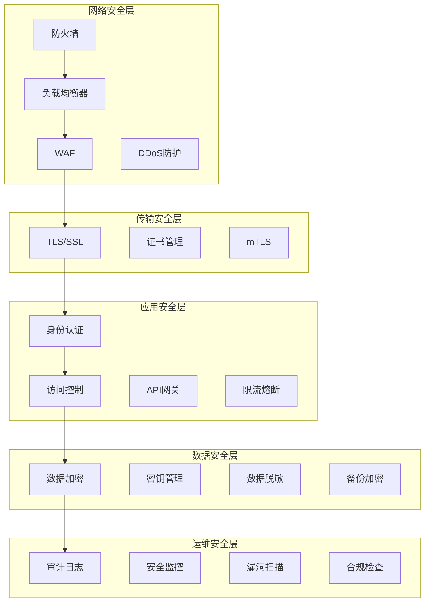

# 安全配置

VGO微服务的安全配置是生产环境部署的重要组成部分。本指南详细介绍了如何配置和加强VGO微服务的安全性，包括认证、授权、网络安全、数据保护等方面。

## 🔒 安全架构

### 安全层次图



### 安全威胁模型

| 威胁类型 | 风险等级 | 防护措施 | 检测方法 |
|----------|----------|----------|----------|
| 未授权访问 | 高 | 强认证、访问控制 | 登录监控、异常检测 |
| 数据泄露 | 高 | 数据加密、权限控制 | 数据访问审计 |
| DDoS攻击 | 中 | 限流、负载均衡 | 流量监控 |
| SQL注入 | 中 | 参数化查询、输入验证 | WAF日志分析 |
| 中间人攻击 | 中 | TLS加密、证书验证 | 证书监控 |
| 内部威胁 | 中 | 最小权限、审计日志 | 行为分析 |

## 🔐 身份认证与授权

### 1. JWT配置

#### JWT密钥管理

```yaml
# config/security.yaml
security:
  jwt:
    # 使用强随机密钥，至少32字符
    secret_key: "${JWT_SECRET_KEY}"
    # Token有效期
    access_token_ttl: 15m
    refresh_token_ttl: 7d
    # 签名算法
    algorithm: "HS256"
    # 发行者
    issuer: "vgo-iam"
    # 受众
    audience: "vgo-api"
    # 时钟偏移容忍度
    clock_skew: 5m
  
  # 密钥轮换配置
  key_rotation:
    enabled: true
    # 轮换间隔
    interval: 30d
    # 保留旧密钥数量
    keep_old_keys: 3
```

#### JWT中间件配置

```go
// internal/middleware/auth.go
package middleware

import (
	"context"
	"fmt"
	"strings"
	"time"

	"github.com/golang-jwt/jwt/v5"
	"google.golang.org/grpc"
	"google.golang.org/grpc/codes"
	"google.golang.org/grpc/metadata"
	"google.golang.org/grpc/status"
)

// JWTConfig JWT配置
type JWTConfig struct {
	SecretKey     string        `yaml:"secret_key"`
	AccessTTL     time.Duration `yaml:"access_token_ttl"`
	RefreshTTL    time.Duration `yaml:"refresh_token_ttl"`
	Algorithm     string        `yaml:"algorithm"`
	Issuer        string        `yaml:"issuer"`
	Audience      string        `yaml:"audience"`
	ClockSkew     time.Duration `yaml:"clock_skew"`
}

// Claims JWT声明
type Claims struct {
	UserID      string   `json:"user_id"`
	Username    string   `json:"username"`
	Email       string   `json:"email"`
	Roles       []string `json:"roles"`
	Permissions []string `json:"permissions"`
	jwt.RegisteredClaims
}

// JWTAuthInterceptor JWT认证拦截器
func JWTAuthInterceptor(config JWTConfig) grpc.UnaryServerInterceptor {
	return func(ctx context.Context, req interface{}, info *grpc.UnaryServerInfo, handler grpc.UnaryHandler) (interface{}, error) {
		// 跳过健康检查和公开接口
		if isPublicMethod(info.FullMethod) {
			return handler(ctx, req)
		}

		// 提取Token
		token, err := extractToken(ctx)
		if err != nil {
			return nil, status.Errorf(codes.Unauthenticated, "missing or invalid token: %v", err)
		}

		// 验证Token
		claims, err := validateToken(token, config)
		if err != nil {
			return nil, status.Errorf(codes.Unauthenticated, "invalid token: %v", err)
		}

		// 将用户信息添加到上下文
		ctx = context.WithValue(ctx, "user_id", claims.UserID)
		ctx = context.WithValue(ctx, "username", claims.Username)
		ctx = context.WithValue(ctx, "roles", claims.Roles)
		ctx = context.WithValue(ctx, "permissions", claims.Permissions)

		return handler(ctx, req)
	}
}

// extractToken 从请求中提取Token
func extractToken(ctx context.Context) (string, error) {
	md, ok := metadata.FromIncomingContext(ctx)
	if !ok {
		return "", fmt.Errorf("missing metadata")
	}

	authorization := md.Get("authorization")
	if len(authorization) == 0 {
		return "", fmt.Errorf("missing authorization header")
	}

	token := authorization[0]
	if !strings.HasPrefix(token, "Bearer ") {
		return "", fmt.Errorf("invalid authorization header format")
	}

	return strings.TrimPrefix(token, "Bearer "), nil
}

// validateToken 验证Token
func validateToken(tokenString string, config JWTConfig) (*Claims, error) {
	token, err := jwt.ParseWithClaims(tokenString, &Claims{}, func(token *jwt.Token) (interface{}, error) {
		// 验证签名算法
		if _, ok := token.Method.(*jwt.SigningMethodHMAC); !ok {
			return nil, fmt.Errorf("unexpected signing method: %v", token.Header["alg"])
		}
		return []byte(config.SecretKey), nil
	})

	if err != nil {
		return nil, err
	}

	claims, ok := token.Claims.(*Claims)
	if !ok || !token.Valid {
		return nil, fmt.Errorf("invalid token claims")
	}

	// 验证发行者和受众
	if claims.Issuer != config.Issuer {
		return nil, fmt.Errorf("invalid issuer")
	}

	if len(claims.Audience) == 0 || claims.Audience[0] != config.Audience {
		return nil, fmt.Errorf("invalid audience")
	}

	// 验证时间
	now := time.Now()
	if claims.ExpiresAt != nil && claims.ExpiresAt.Time.Before(now.Add(-config.ClockSkew)) {
		return nil, fmt.Errorf("token expired")
	}

	if claims.NotBefore != nil && claims.NotBefore.Time.After(now.Add(config.ClockSkew)) {
		return nil, fmt.Errorf("token not valid yet")
	}

	return claims, nil
}

// isPublicMethod 检查是否为公开方法
func isPublicMethod(method string) bool {
	publicMethods := []string{
		"/grpc.health.v1.Health/Check",
		"/grpc.health.v1.Health/Watch",
		"/vgo.iam.v1.AuthService/Login",
		"/vgo.iam.v1.AuthService/RefreshToken",
	}

	for _, publicMethod := range publicMethods {
		if method == publicMethod {
			return true
		}
	}
	return false
}
```

### 2. RBAC权限控制

#### 权限检查中间件

```go
// internal/middleware/rbac.go
package middleware

import (
	"context"
	"fmt"
	"strings"

	"google.golang.org/grpc"
	"google.golang.org/grpc/codes"
	"google.golang.org/grpc/status"
)

// Permission 权限定义
type Permission struct {
	Resource string `json:"resource"`
	Action   string `json:"action"`
}

// RBACConfig RBAC配置
type RBACConfig struct {
	// 方法权限映射
	MethodPermissions map[string]Permission `yaml:"method_permissions"`
	// 超级管理员角色
	SuperAdminRole string `yaml:"super_admin_role"`
	// 启用权限检查
	Enabled bool `yaml:"enabled"`
}

// RBACInterceptor RBAC权限检查拦截器
func RBACInterceptor(config RBACConfig) grpc.UnaryServerInterceptor {
	return func(ctx context.Context, req interface{}, info *grpc.UnaryServerInfo, handler grpc.UnaryHandler) (interface{}, error) {
		if !config.Enabled {
			return handler(ctx, req)
		}

		// 跳过公开方法
		if isPublicMethod(info.FullMethod) {
			return handler(ctx, req)
		}

		// 获取用户信息
		userRoles, ok := ctx.Value("roles").([]string)
		if !ok {
			return nil, status.Errorf(codes.PermissionDenied, "missing user roles")
		}

		userPermissions, ok := ctx.Value("permissions").([]string)
		if !ok {
			return nil, status.Errorf(codes.PermissionDenied, "missing user permissions")
		}

		// 检查超级管理员权限
		if contains(userRoles, config.SuperAdminRole) {
			return handler(ctx, req)
		}

		// 获取方法所需权限
		requiredPermission, exists := config.MethodPermissions[info.FullMethod]
		if !exists {
			// 如果没有配置权限，默认拒绝
			return nil, status.Errorf(codes.PermissionDenied, "method not configured: %s", info.FullMethod)
		}

		// 检查用户权限
		if !hasPermission(userPermissions, requiredPermission) {
			return nil, status.Errorf(codes.PermissionDenied, "insufficient permissions for %s", info.FullMethod)
		}

		return handler(ctx, req)
	}
}

// hasPermission 检查用户是否有指定权限
func hasPermission(userPermissions []string, required Permission) bool {
	requiredPerm := fmt.Sprintf("%s:%s", required.Resource, required.Action)
	
	for _, perm := range userPermissions {
		// 精确匹配
		if perm == requiredPerm {
			return true
		}
		
		// 通配符匹配
		if strings.HasSuffix(perm, ":*") {
			resource := strings.TrimSuffix(perm, ":*")
			if resource == required.Resource {
				return true
			}
		}
		
		// 全局权限
		if perm == "*:*" {
			return true
		}
	}
	
	return false
}

// contains 检查切片是否包含指定元素
func contains(slice []string, item string) bool {
	for _, s := range slice {
		if s == item {
			return true
		}
	}
	return false
}
```

## 🔒 TLS/SSL配置

### 1. 证书管理

#### 自签名证书生成

```bash
#!/bin/bash
# scripts/generate-certs.sh

set -e

CERT_DIR="certs"
CA_KEY="$CERT_DIR/ca-key.pem"
CA_CERT="$CERT_DIR/ca-cert.pem"
SERVER_KEY="$CERT_DIR/server-key.pem"
SERVER_CERT="$CERT_DIR/server-cert.pem"
CLIENT_KEY="$CERT_DIR/client-key.pem"
CLIENT_CERT="$CERT_DIR/client-cert.pem"

echo "🔐 生成TLS证书..."

# 创建证书目录
mkdir -p $CERT_DIR

# 生成CA私钥
echo "📝 生成CA私钥..."
openssl genrsa -out $CA_KEY 4096

# 生成CA证书
echo "📜 生成CA证书..."
openssl req -new -x509 -key $CA_KEY -sha256 -subj "/C=CN/ST=Beijing/L=Beijing/O=VGO/OU=Security/CN=VGO-CA" -days 3650 -out $CA_CERT

# 生成服务器私钥
echo "🔑 生成服务器私钥..."
openssl genrsa -out $SERVER_KEY 4096

# 生成服务器证书签名请求
echo "📋 生成服务器CSR..."
openssl req -new -key $SERVER_KEY -subj "/C=CN/ST=Beijing/L=Beijing/O=VGO/OU=Server/CN=vgo-iam" -out server.csr

# 创建服务器证书扩展文件
cat > server.ext << EOF
authorityKeyIdentifier=keyid,issuer
basicConstraints=CA:FALSE
keyUsage = digitalSignature, nonRepudiation, keyEncipherment, dataEncipherment
subjectAltName = @alt_names

[alt_names]
DNS.1 = vgo-iam
DNS.2 = localhost
DNS.3 = *.vgo.local
IP.1 = 127.0.0.1
IP.2 = ::1
EOF

# 生成服务器证书
echo "🏆 生成服务器证书..."
openssl x509 -req -in server.csr -CA $CA_CERT -CAkey $CA_KEY -CAcreateserial -out $SERVER_CERT -days 365 -sha256 -extfile server.ext

# 生成客户端私钥
echo "🔐 生成客户端私钥..."
openssl genrsa -out $CLIENT_KEY 4096

# 生成客户端证书签名请求
echo "📄 生成客户端CSR..."
openssl req -new -key $CLIENT_KEY -subj "/C=CN/ST=Beijing/L=Beijing/O=VGO/OU=Client/CN=vgo-client" -out client.csr

# 创建客户端证书扩展文件
cat > client.ext << EOF
authorityKeyIdentifier=keyid,issuer
basicConstraints=CA:FALSE
keyUsage = digitalSignature, nonRepudiation, keyEncipherment, dataEncipherment
extendedKeyUsage = clientAuth
EOF

# 生成客户端证书
echo "🎫 生成客户端证书..."
openssl x509 -req -in client.csr -CA $CA_CERT -CAkey $CA_KEY -CAcreateserial -out $CLIENT_CERT -days 365 -sha256 -extfile client.ext

# 清理临时文件
rm -f server.csr client.csr server.ext client.ext ca-cert.srl

# 设置权限
chmod 600 $CERT_DIR/*.pem

echo "✅ 证书生成完成！"
echo "📁 证书位置: $CERT_DIR/"
echo "📋 证书列表:"
ls -la $CERT_DIR/

# 验证证书
echo "🔍 验证证书..."
openssl x509 -in $SERVER_CERT -text -noout | grep -A 1 "Subject:"
openssl x509 -in $CLIENT_CERT -text -noout | grep -A 1 "Subject:"

echo "🎉 证书验证完成！"
```

#### TLS服务器配置

```go
// internal/server/tls.go
package server

import (
	"crypto/tls"
	"crypto/x509"
	"fmt"
	"io/ioutil"

	"google.golang.org/grpc"
	"google.golang.org/grpc/credentials"
)

// TLSConfig TLS配置
type TLSConfig struct {
	Enabled    bool   `yaml:"enabled"`
	CertFile   string `yaml:"cert_file"`
	KeyFile    string `yaml:"key_file"`
	CAFile     string `yaml:"ca_file"`
	ClientAuth bool   `yaml:"client_auth"`
	MinVersion string `yaml:"min_version"`
	MaxVersion string `yaml:"max_version"`
}

// LoadTLSCredentials 加载TLS凭据
func LoadTLSCredentials(config TLSConfig) (credentials.TransportCredentials, error) {
	if !config.Enabled {
		return nil, fmt.Errorf("TLS not enabled")
	}

	// 加载服务器证书
	serverCert, err := tls.LoadX509KeyPair(config.CertFile, config.KeyFile)
	if err != nil {
		return nil, fmt.Errorf("failed to load server certificate: %v", err)
	}

	// TLS配置
	tlsConfig := &tls.Config{
		Certificates: []tls.Certificate{serverCert},
		MinVersion:   getTLSVersion(config.MinVersion),
		MaxVersion:   getTLSVersion(config.MaxVersion),
		CipherSuites: getSecureCipherSuites(),
	}

	// 客户端证书验证
	if config.ClientAuth && config.CAFile != "" {
		caCert, err := ioutil.ReadFile(config.CAFile)
		if err != nil {
			return nil, fmt.Errorf("failed to read CA certificate: %v", err)
		}

		caCertPool := x509.NewCertPool()
		if !caCertPool.AppendCertsFromPEM(caCert) {
			return nil, fmt.Errorf("failed to parse CA certificate")
		}

		tlsConfig.ClientAuth = tls.RequireAndVerifyClientCert
		tlsConfig.ClientCAs = caCertPool
	}

	return credentials.NewTLS(tlsConfig), nil
}

// getTLSVersion 获取TLS版本
func getTLSVersion(version string) uint16 {
	switch version {
	case "1.0":
		return tls.VersionTLS10
	case "1.1":
		return tls.VersionTLS11
	case "1.2":
		return tls.VersionTLS12
	case "1.3":
		return tls.VersionTLS13
	default:
		return tls.VersionTLS12 // 默认使用TLS 1.2
	}
}

// getSecureCipherSuites 获取安全的密码套件
func getSecureCipherSuites() []uint16 {
	return []uint16{
		tls.TLS_ECDHE_RSA_WITH_AES_256_GCM_SHA384,
		tls.TLS_ECDHE_RSA_WITH_CHACHA20_POLY1305,
		tls.TLS_ECDHE_ECDSA_WITH_AES_256_GCM_SHA384,
		tls.TLS_ECDHE_ECDSA_WITH_CHACHA20_POLY1305,
		tls.TLS_ECDHE_RSA_WITH_AES_128_GCM_SHA256,
		tls.TLS_ECDHE_ECDSA_WITH_AES_128_GCM_SHA256,
	}
}
```

### 2. mTLS配置

```yaml
# config/tls.yaml
tls:
  enabled: true
  cert_file: "certs/server-cert.pem"
  key_file: "certs/server-key.pem"
  ca_file: "certs/ca-cert.pem"
  client_auth: true
  min_version: "1.2"
  max_version: "1.3"
  
  # 客户端配置
  client:
    cert_file: "certs/client-cert.pem"
    key_file: "certs/client-key.pem"
    ca_file: "certs/ca-cert.pem"
    server_name: "vgo-iam"
    insecure_skip_verify: false
```

## 🛡️ 数据保护

### 1. 数据加密

#### 敏感数据加密

```go
// internal/crypto/encryption.go
package crypto

import (
	"crypto/aes"
	"crypto/cipher"
	"crypto/rand"
	"crypto/sha256"
	"encoding/base64"
	"fmt"
	"io"

	"golang.org/x/crypto/pbkdf2"
)

// EncryptionConfig 加密配置
type EncryptionConfig struct {
	Key       string `yaml:"key"`
	Salt      string `yaml:"salt"`
	KeyLength int    `yaml:"key_length"`
	Iterations int   `yaml:"iterations"`
}

// Encryptor 加密器
type Encryptor struct {
	key []byte
}

// NewEncryptor 创建加密器
func NewEncryptor(config EncryptionConfig) (*Encryptor, error) {
	if len(config.Key) < 32 {
		return nil, fmt.Errorf("encryption key must be at least 32 characters")
	}

	// 使用PBKDF2派生密钥
	key := pbkdf2.Key([]byte(config.Key), []byte(config.Salt), config.Iterations, config.KeyLength, sha256.New)

	return &Encryptor{key: key}, nil
}

// Encrypt 加密数据
func (e *Encryptor) Encrypt(plaintext string) (string, error) {
	block, err := aes.NewCipher(e.key)
	if err != nil {
		return "", err
	}

	// 生成随机IV
	iv := make([]byte, aes.BlockSize)
	if _, err := io.ReadFull(rand.Reader, iv); err != nil {
		return "", err
	}

	// 使用GCM模式
	gcm, err := cipher.NewGCM(block)
	if err != nil {
		return "", err
	}

	// 加密
	ciphertext := gcm.Seal(nil, iv, []byte(plaintext), nil)

	// 将IV和密文组合
	result := append(iv, ciphertext...)

	return base64.StdEncoding.EncodeToString(result), nil
}

// Decrypt 解密数据
func (e *Encryptor) Decrypt(ciphertext string) (string, error) {
	data, err := base64.StdEncoding.DecodeString(ciphertext)
	if err != nil {
		return "", err
	}

	if len(data) < aes.BlockSize {
		return "", fmt.Errorf("ciphertext too short")
	}

	block, err := aes.NewCipher(e.key)
	if err != nil {
		return "", err
	}

	gcm, err := cipher.NewGCM(block)
	if err != nil {
		return "", err
	}

	// 分离IV和密文
	iv := data[:aes.BlockSize]
	cipherData := data[aes.BlockSize:]

	// 解密
	plaintext, err := gcm.Open(nil, iv, cipherData, nil)
	if err != nil {
		return "", err
	}

	return string(plaintext), nil
}

// HashPassword 密码哈希
func HashPassword(password string) (string, error) {
	// 生成随机盐
	salt := make([]byte, 16)
	if _, err := rand.Read(salt); err != nil {
		return "", err
	}

	// 使用PBKDF2哈希
	hash := pbkdf2.Key([]byte(password), salt, 10000, 32, sha256.New)

	// 组合盐和哈希
	result := append(salt, hash...)

	return base64.StdEncoding.EncodeToString(result), nil
}

// VerifyPassword 验证密码
func VerifyPassword(password, hashedPassword string) bool {
	data, err := base64.StdEncoding.DecodeString(hashedPassword)
	if err != nil {
		return false
	}

	if len(data) != 48 { // 16字节盐 + 32字节哈希
		return false
	}

	salt := data[:16]
	hash := data[16:]

	// 计算输入密码的哈希
	inputHash := pbkdf2.Key([]byte(password), salt, 10000, 32, sha256.New)

	// 比较哈希
	return compareHashes(hash, inputHash)
}

// compareHashes 安全比较哈希值
func compareHashes(a, b []byte) bool {
	if len(a) != len(b) {
		return false
	}

	result := byte(0)
	for i := 0; i < len(a); i++ {
		result |= a[i] ^ b[i]
	}

	return result == 0
}
```

### 2. 数据库安全

#### PostgreSQL安全配置

```sql
-- scripts/security-setup.sql

-- 创建只读用户
CREATE USER vgo_readonly WITH PASSWORD 'readonly_password';
GRANT CONNECT ON DATABASE vgo_db TO vgo_readonly;
GRANT USAGE ON SCHEMA public TO vgo_readonly;
GRANT SELECT ON ALL TABLES IN SCHEMA public TO vgo_readonly;
ALTER DEFAULT PRIVILEGES IN SCHEMA public GRANT SELECT ON TABLES TO vgo_readonly;

-- 创建应用用户（限制权限）
CREATE USER vgo_app WITH PASSWORD 'app_password';
GRANT CONNECT ON DATABASE vgo_db TO vgo_app;
GRANT USAGE ON SCHEMA public TO vgo_app;
GRANT SELECT, INSERT, UPDATE, DELETE ON ALL TABLES IN SCHEMA public TO vgo_app;
GRANT USAGE, SELECT ON ALL SEQUENCES IN SCHEMA public TO vgo_app;
ALTER DEFAULT PRIVILEGES IN SCHEMA public GRANT SELECT, INSERT, UPDATE, DELETE ON TABLES TO vgo_app;
ALTER DEFAULT PRIVILEGES IN SCHEMA public GRANT USAGE, SELECT ON SEQUENCES TO vgo_app;

-- 启用行级安全
ALTER TABLE users ENABLE ROW LEVEL SECURITY;
ALTER TABLE policies ENABLE ROW LEVEL SECURITY;
ALTER TABLE access_keys ENABLE ROW LEVEL SECURITY;

-- 创建行级安全策略
CREATE POLICY user_isolation ON users
    FOR ALL TO vgo_app
    USING (created_by = current_setting('app.current_user_id')::uuid OR 
           current_setting('app.current_user_role') = 'admin');

CREATE POLICY policy_isolation ON policies
    FOR ALL TO vgo_app
    USING (created_by = current_setting('app.current_user_id')::uuid OR 
           current_setting('app.current_user_role') = 'admin');

-- 创建审计表
CREATE TABLE audit_log (
    id SERIAL PRIMARY KEY,
    table_name VARCHAR(50) NOT NULL,
    operation VARCHAR(10) NOT NULL,
    old_values JSONB,
    new_values JSONB,
    user_id UUID,
    user_ip INET,
    created_at TIMESTAMP WITH TIME ZONE DEFAULT NOW()
);

-- 创建审计触发器函数
CREATE OR REPLACE FUNCTION audit_trigger_function()
RETURNS TRIGGER AS $$
BEGIN
    IF TG_OP = 'DELETE' THEN
        INSERT INTO audit_log (table_name, operation, old_values, user_id, user_ip)
        VALUES (TG_TABLE_NAME, TG_OP, row_to_json(OLD), 
                current_setting('app.current_user_id', true)::uuid,
                current_setting('app.current_user_ip', true)::inet);
        RETURN OLD;
    ELSIF TG_OP = 'UPDATE' THEN
        INSERT INTO audit_log (table_name, operation, old_values, new_values, user_id, user_ip)
        VALUES (TG_TABLE_NAME, TG_OP, row_to_json(OLD), row_to_json(NEW),
                current_setting('app.current_user_id', true)::uuid,
                current_setting('app.current_user_ip', true)::inet);
        RETURN NEW;
    ELSIF TG_OP = 'INSERT' THEN
        INSERT INTO audit_log (table_name, operation, new_values, user_id, user_ip)
        VALUES (TG_TABLE_NAME, TG_OP, row_to_json(NEW),
                current_setting('app.current_user_id', true)::uuid,
                current_setting('app.current_user_ip', true)::inet);
        RETURN NEW;
    END IF;
    RETURN NULL;
END;
$$ LANGUAGE plpgsql;

-- 为敏感表创建审计触发器
CREATE TRIGGER users_audit_trigger
    AFTER INSERT OR UPDATE OR DELETE ON users
    FOR EACH ROW EXECUTE FUNCTION audit_trigger_function();

CREATE TRIGGER policies_audit_trigger
    AFTER INSERT OR UPDATE OR DELETE ON policies
    FOR EACH ROW EXECUTE FUNCTION audit_trigger_function();

CREATE TRIGGER access_keys_audit_trigger
    AFTER INSERT OR UPDATE OR DELETE ON access_keys
    FOR EACH ROW EXECUTE FUNCTION audit_trigger_function();
```

## 🔥 防火墙和网络安全

### 1. iptables配置

```bash
#!/bin/bash
# scripts/setup-firewall.sh

set -e

echo "🔥 配置防火墙规则..."

# 清空现有规则
iptables -F
iptables -X
iptables -t nat -F
iptables -t nat -X
iptables -t mangle -F
iptables -t mangle -X

# 设置默认策略
iptables -P INPUT DROP
iptables -P FORWARD DROP
iptables -P OUTPUT ACCEPT

# 允许本地回环
iptables -A INPUT -i lo -j ACCEPT
iptables -A OUTPUT -o lo -j ACCEPT

# 允许已建立的连接
iptables -A INPUT -m state --state ESTABLISHED,RELATED -j ACCEPT

# 允许SSH（请根据实际端口修改）
iptables -A INPUT -p tcp --dport 22 -j ACCEPT

# 允许HTTP和HTTPS
iptables -A INPUT -p tcp --dport 80 -j ACCEPT
iptables -A INPUT -p tcp --dport 443 -j ACCEPT

# 允许VGO服务端口
iptables -A INPUT -p tcp --dport 8080 -j ACCEPT  # HTTP API
iptables -A INPUT -p tcp --dport 50051 -j ACCEPT # gRPC
iptables -A INPUT -p tcp --dport 8081 -j ACCEPT  # Health Check
iptables -A INPUT -p tcp --dport 8082 -j ACCEPT  # Metrics

# 允许数据库连接（仅限内网）
iptables -A INPUT -p tcp -s 10.0.0.0/8 --dport 5432 -j ACCEPT
iptables -A INPUT -p tcp -s 172.16.0.0/12 --dport 5432 -j ACCEPT
iptables -A INPUT -p tcp -s 192.168.0.0/16 --dport 5432 -j ACCEPT

# 允许Redis连接（仅限内网）
iptables -A INPUT -p tcp -s 10.0.0.0/8 --dport 6379 -j ACCEPT
iptables -A INPUT -p tcp -s 172.16.0.0/12 --dport 6379 -j ACCEPT
iptables -A INPUT -p tcp -s 192.168.0.0/16 --dport 6379 -j ACCEPT

# 允许监控端口（仅限内网）
iptables -A INPUT -p tcp -s 10.0.0.0/8 --dport 9090 -j ACCEPT  # Prometheus
iptables -A INPUT -p tcp -s 10.0.0.0/8 --dport 3000 -j ACCEPT  # Grafana
iptables -A INPUT -p tcp -s 10.0.0.0/8 --dport 9093 -j ACCEPT  # AlertManager

# 防止DDoS攻击
# 限制新连接速率
iptables -A INPUT -p tcp --dport 80 -m limit --limit 25/minute --limit-burst 100 -j ACCEPT
iptables -A INPUT -p tcp --dport 443 -m limit --limit 25/minute --limit-burst 100 -j ACCEPT
iptables -A INPUT -p tcp --dport 8080 -m limit --limit 25/minute --limit-burst 100 -j ACCEPT
iptables -A INPUT -p tcp --dport 50051 -m limit --limit 25/minute --limit-burst 100 -j ACCEPT

# 防止端口扫描
iptables -A INPUT -m recent --name portscan --rcheck --seconds 86400 -j DROP
iptables -A INPUT -m recent --name portscan --remove
iptables -A INPUT -p tcp -m tcp --dport 139 -m recent --name portscan --set -j LOG --log-prefix "portscan:"
iptables -A INPUT -p tcp -m tcp --dport 139 -m recent --name portscan --set -j DROP

# 防止SYN洪水攻击
iptables -A INPUT -p tcp --syn -m limit --limit 1/s --limit-burst 3 -j RETURN
iptables -A INPUT -p tcp --syn -j DROP

# 防止ping洪水攻击
iptables -A INPUT -p icmp --icmp-type echo-request -m limit --limit 1/s --limit-burst 1 -j ACCEPT
iptables -A INPUT -p icmp --icmp-type echo-request -j DROP

# 记录被丢弃的包
iptables -A INPUT -m limit --limit 5/min -j LOG --log-prefix "iptables denied: " --log-level 7

# 保存规则
if command -v iptables-save &> /dev/null; then
    iptables-save > /etc/iptables/rules.v4
fi

echo "✅ 防火墙配置完成！"
echo "📋 当前规则："
iptables -L -n
```

### 2. fail2ban配置

```ini
# /etc/fail2ban/jail.local
[DEFAULT]
bantime = 3600
findtime = 600
maxretry = 5
backend = systemd

[sshd]
enabled = true
port = ssh
logpath = /var/log/auth.log
maxretry = 3
bantime = 86400

[vgo-auth]
enabled = true
port = 8080,50051
logpath = /var/log/vgo/auth.log
failregex = .*authentication failed.*from <HOST>
maxretry = 5
bantime = 3600

[vgo-api]
enabled = true
port = 8080,50051
logpath = /var/log/vgo/access.log
failregex = .*"(GET|POST|PUT|DELETE).*" (4[0-9]{2}|5[0-9]{2}) .*<HOST>
maxretry = 20
bantime = 1800

[nginx-http-auth]
enabled = true
port = http,https
logpath = /var/log/nginx/error.log
failregex = no user/password was provided for basic authentication.*client: <HOST>
            user .* was not found in.*client: <HOST>
            user .* password mismatch.*client: <HOST>
maxretry = 3
bantime = 3600
```

## 🔍 安全监控和审计

### 1. 安全事件监控

```go
// internal/security/monitor.go
package security

import (
	"context"
	"fmt"
	"log"
	"net"
	"strings"
	"time"

	"google.golang.org/grpc"
	"google.golang.org/grpc/metadata"
	"google.golang.org/grpc/peer"
)

// SecurityEvent 安全事件
type SecurityEvent struct {
	Type        string            `json:"type"`
	Severity    string            `json:"severity"`
	Message     string            `json:"message"`
	UserID      string            `json:"user_id,omitempty"`
	ClientIP    string            `json:"client_ip"`
	UserAgent   string            `json:"user_agent,omitempty"`
	Method      string            `json:"method"`
	Timestamp   time.Time         `json:"timestamp"`
	Metadata    map[string]string `json:"metadata,omitempty"`
}

// SecurityMonitor 安全监控器
type SecurityMonitor struct {
	events chan SecurityEvent
	logger *log.Logger
}

// NewSecurityMonitor 创建安全监控器
func NewSecurityMonitor(logger *log.Logger) *SecurityMonitor {
	m := &SecurityMonitor{
		events: make(chan SecurityEvent, 1000),
		logger: logger,
	}
	
	// 启动事件处理器
	go m.processEvents()
	
	return m
}

// SecurityMonitorInterceptor 安全监控拦截器
func (m *SecurityMonitor) SecurityMonitorInterceptor() grpc.UnaryServerInterceptor {
	return func(ctx context.Context, req interface{}, info *grpc.UnaryServerInfo, handler grpc.UnaryHandler) (interface{}, error) {
		start := time.Now()
		
		// 获取客户端信息
		clientIP := m.getClientIP(ctx)
		userAgent := m.getUserAgent(ctx)
		userID := m.getUserID(ctx)
		
		// 检测可疑活动
		m.detectSuspiciousActivity(ctx, info.FullMethod, clientIP, userID)
		
		// 执行请求
		resp, err := handler(ctx, req)
		
		duration := time.Since(start)
		
		// 记录安全事件
		if err != nil {
			m.logSecurityEvent(SecurityEvent{
				Type:      "request_failed",
				Severity:  "warning",
				Message:   fmt.Sprintf("Request failed: %v", err),
				UserID:    userID,
				ClientIP:  clientIP,
				UserAgent: userAgent,
				Method:    info.FullMethod,
				Timestamp: time.Now(),
				Metadata: map[string]string{
					"duration": duration.String(),
					"error":    err.Error(),
				},
			})
		}
		
		return resp, err
	}
}

// detectSuspiciousActivity 检测可疑活动
func (m *SecurityMonitor) detectSuspiciousActivity(ctx context.Context, method, clientIP, userID string) {
	// 检测暴力破解
	if strings.Contains(method, "Login") || strings.Contains(method, "Auth") {
		// 这里可以实现更复杂的检测逻辑
		// 例如：检查IP的登录失败次数、频率等
	}
	
	// 检测异常IP
	if m.isAnomalousIP(clientIP) {
		m.logSecurityEvent(SecurityEvent{
			Type:      "anomalous_ip",
			Severity:  "warning",
			Message:   fmt.Sprintf("Request from anomalous IP: %s", clientIP),
			UserID:    userID,
			ClientIP:  clientIP,
			Method:    method,
			Timestamp: time.Now(),
		})
	}
	
	// 检测权限提升尝试
	if m.isPrivilegeEscalationAttempt(method, userID) {
		m.logSecurityEvent(SecurityEvent{
			Type:      "privilege_escalation",
			Severity:  "critical",
			Message:   fmt.Sprintf("Privilege escalation attempt detected"),
			UserID:    userID,
			ClientIP:  clientIP,
			Method:    method,
			Timestamp: time.Now(),
		})
	}
}

// getClientIP 获取客户端IP
func (m *SecurityMonitor) getClientIP(ctx context.Context) string {
	p, ok := peer.FromContext(ctx)
	if !ok {
		return "unknown"
	}
	
	if addr, ok := p.Addr.(*net.TCPAddr); ok {
		return addr.IP.String()
	}
	
	return p.Addr.String()
}

// getUserAgent 获取用户代理
func (m *SecurityMonitor) getUserAgent(ctx context.Context) string {
	md, ok := metadata.FromIncomingContext(ctx)
	if !ok {
		return ""
	}
	
	userAgent := md.Get("user-agent")
	if len(userAgent) > 0 {
		return userAgent[0]
	}
	
	return ""
}

// getUserID 获取用户ID
func (m *SecurityMonitor) getUserID(ctx context.Context) string {
	if userID, ok := ctx.Value("user_id").(string); ok {
		return userID
	}
	return ""
}

// isAnomalousIP 检查是否为异常IP
func (m *SecurityMonitor) isAnomalousIP(ip string) bool {
	// 这里可以实现IP信誉检查、地理位置检查等
	// 例如：检查是否来自已知的恶意IP段、Tor网络等
	return false
}

// isPrivilegeEscalationAttempt 检查是否为权限提升尝试
func (m *SecurityMonitor) isPrivilegeEscalationAttempt(method, userID string) bool {
	// 检查用户是否尝试访问超出其权限的方法
	// 这里需要结合用户角色和方法权限进行判断
	return false
}

// logSecurityEvent 记录安全事件
func (m *SecurityMonitor) logSecurityEvent(event SecurityEvent) {
	select {
	case m.events <- event:
	default:
		m.logger.Printf("Security event channel full, dropping event: %+v", event)
	}
}

// processEvents 处理安全事件
func (m *SecurityMonitor) processEvents() {
	for event := range m.events {
		// 记录到日志
		m.logger.Printf("Security Event: %+v", event)
		
		// 发送到SIEM系统
		m.sendToSIEM(event)
		
		// 触发告警
		if event.Severity == "critical" {
			m.triggerAlert(event)
		}
	}
}

// sendToSIEM 发送到SIEM系统
func (m *SecurityMonitor) sendToSIEM(event SecurityEvent) {
	// 实现发送到SIEM系统的逻辑
	// 例如：发送到Elasticsearch、Splunk等
}

// triggerAlert 触发告警
func (m *SecurityMonitor) triggerAlert(event SecurityEvent) {
	// 实现告警逻辑
	// 例如：发送邮件、Slack通知、调用Webhook等
}
```

### 2. 审计日志配置

```go
// internal/audit/logger.go
package audit

import (
	"context"
	"encoding/json"
	"fmt"
	"log"
	"time"

	"google.golang.org/grpc"
	"google.golang.org/grpc/metadata"
	"google.golang.org/grpc/peer"
)

// AuditLog 审计日志
type AuditLog struct {
	ID          string            `json:"id"`
	Timestamp   time.Time         `json:"timestamp"`
	UserID      string            `json:"user_id"`
	Username    string            `json:"username"`
	ClientIP    string            `json:"client_ip"`
	UserAgent   string            `json:"user_agent"`
	Method      string            `json:"method"`
	Request     interface{}       `json:"request,omitempty"`
	Response    interface{}       `json:"response,omitempty"`
	Error       string            `json:"error,omitempty"`
	Duration    time.Duration     `json:"duration"`
	Metadata    map[string]string `json:"metadata,omitempty"`
}

// AuditLogger 审计日志记录器
type AuditLogger struct {
	logger *log.Logger
	config AuditConfig
}

// AuditConfig 审计配置
type AuditConfig struct {
	Enabled         bool     `yaml:"enabled"`
	LogRequests     bool     `yaml:"log_requests"`
	LogResponses    bool     `yaml:"log_responses"`
	SensitiveFields []string `yaml:"sensitive_fields"`
	ExcludeMethods  []string `yaml:"exclude_methods"`
}

// NewAuditLogger 创建审计日志记录器
func NewAuditLogger(logger *log.Logger, config AuditConfig) *AuditLogger {
	return &AuditLogger{
		logger: logger,
		config: config,
	}
}

// AuditInterceptor 审计拦截器
func (a *AuditLogger) AuditInterceptor() grpc.UnaryServerInterceptor {
	return func(ctx context.Context, req interface{}, info *grpc.UnaryServerInfo, handler grpc.UnaryHandler) (interface{}, error) {
		if !a.config.Enabled {
			return handler(ctx, req)
		}
		
		// 检查是否需要排除此方法
		for _, excludeMethod := range a.config.ExcludeMethods {
			if info.FullMethod == excludeMethod {
				return handler(ctx, req)
			}
		}
		
		start := time.Now()
		
		// 创建审计日志
		auditLog := AuditLog{
			ID:        generateAuditID(),
			Timestamp: start,
			UserID:    a.getUserID(ctx),
			Username:  a.getUsername(ctx),
			ClientIP:  a.getClientIP(ctx),
			UserAgent: a.getUserAgent(ctx),
			Method:    info.FullMethod,
		}
		
		// 记录请求
		if a.config.LogRequests {
			auditLog.Request = a.sanitizeData(req)
		}
		
		// 执行请求
		resp, err := handler(ctx, req)
		
		auditLog.Duration = time.Since(start)
		
		// 记录响应
		if a.config.LogResponses && resp != nil {
			auditLog.Response = a.sanitizeData(resp)
		}
		
		// 记录错误
		if err != nil {
			auditLog.Error = err.Error()
		}
		
		// 输出审计日志
		a.writeAuditLog(auditLog)
		
		return resp, err
	}
}

// sanitizeData 清理敏感数据
func (a *AuditLogger) sanitizeData(data interface{}) interface{} {
	// 将数据转换为JSON，然后清理敏感字段
	jsonData, err := json.Marshal(data)
	if err != nil {
		return data
	}
	
	var result map[string]interface{}
	if err := json.Unmarshal(jsonData, &result); err != nil {
		return data
	}
	
	// 清理敏感字段
	for _, field := range a.config.SensitiveFields {
		if _, exists := result[field]; exists {
			result[field] = "[REDACTED]"
		}
	}
	
	return result
}

// writeAuditLog 写入审计日志
func (a *AuditLogger) writeAuditLog(auditLog AuditLog) {
	jsonData, err := json.Marshal(auditLog)
	if err != nil {
		a.logger.Printf("Failed to marshal audit log: %v", err)
		return
	}
	
	a.logger.Printf("AUDIT: %s", string(jsonData))
}

// 辅助方法
func (a *AuditLogger) getUserID(ctx context.Context) string {
	if userID, ok := ctx.Value("user_id").(string); ok {
		return userID
	}
	return ""
}

func (a *AuditLogger) getUsername(ctx context.Context) string {
	if username, ok := ctx.Value("username").(string); ok {
		return username
	}
	return ""
}

func (a *AuditLogger) getClientIP(ctx context.Context) string {
	p, ok := peer.FromContext(ctx)
	if !ok {
		return "unknown"
	}
	
	if addr, ok := p.Addr.(*net.TCPAddr); ok {
		return addr.IP.String()
	}
	
	return p.Addr.String()
}

func (a *AuditLogger) getUserAgent(ctx context.Context) string {
	md, ok := metadata.FromIncomingContext(ctx)
	if !ok {
		return ""
	}
	
	userAgent := md.Get("user-agent")
	if len(userAgent) > 0 {
		return userAgent[0]
	}
	
	return ""
}

func generateAuditID() string {
	return fmt.Sprintf("%d", time.Now().UnixNano())
}
```

## 🚨 安全告警配置

### 1. AlertManager配置

```yaml
# config/alertmanager.yml
global:
  smtp_smarthost: 'localhost:587'
  smtp_from: 'alerts@vgo.local'
  smtp_auth_username: 'alerts@vgo.local'
  smtp_auth_password: 'password'

route:
  group_by: ['alertname']
  group_wait: 10s
  group_interval: 10s
  repeat_interval: 1h
  receiver: 'web.hook'
  routes:
  - match:
      severity: critical
    receiver: 'critical-alerts'
  - match:
      severity: warning
    receiver: 'warning-alerts'

receivers:
- name: 'web.hook'
  webhook_configs:
  - url: 'http://127.0.0.1:5001/'

- name: 'critical-alerts'
  email_configs:
  - to: 'security@vgo.local'
    subject: '🚨 VGO Critical Security Alert'
    body: |
      Alert: {{ .GroupLabels.alertname }}
      Severity: {{ .CommonLabels.severity }}
      Instance: {{ .CommonLabels.instance }}
      Description: {{ .CommonAnnotations.description }}
      
      Time: {{ .CommonAnnotations.timestamp }}
  slack_configs:
  - api_url: 'YOUR_SLACK_WEBHOOK_URL'
    channel: '#security-alerts'
    title: '🚨 Critical Security Alert'
    text: '{{ .CommonAnnotations.description }}'

- name: 'warning-alerts'
  email_configs:
  - to: 'ops@vgo.local'
    subject: '⚠️ VGO Security Warning'
    body: |
      Alert: {{ .GroupLabels.alertname }}
      Severity: {{ .CommonLabels.severity }}
      Instance: {{ .CommonLabels.instance }}
      Description: {{ .CommonAnnotations.description }}
```

### 2. Prometheus告警规则

```yaml
# config/security-alerts.yml
groups:
- name: security.rules
  rules:
  # 认证失败告警
  - alert: HighAuthenticationFailureRate
    expr: rate(vgo_auth_failures_total[5m]) > 0.1
    for: 2m
    labels:
      severity: warning
    annotations:
      summary: "High authentication failure rate detected"
      description: "Authentication failure rate is {{ $value }} failures/sec"

  # 权限拒绝告警
  - alert: HighPermissionDeniedRate
    expr: rate(vgo_permission_denied_total[5m]) > 0.05
    for: 2m
    labels:
      severity: warning
    annotations:
      summary: "High permission denied rate detected"
      description: "Permission denied rate is {{ $value }} denials/sec"

  # 异常IP访问
  - alert: AnomalousIPAccess
    expr: vgo_anomalous_ip_access_total > 0
    for: 0m
    labels:
      severity: critical
    annotations:
      summary: "Anomalous IP access detected"
      description: "Access from anomalous IP: {{ $labels.client_ip }}"

  # 权限提升尝试
  - alert: PrivilegeEscalationAttempt
    expr: vgo_privilege_escalation_attempts_total > 0
    for: 0m
    labels:
      severity: critical
    annotations:
      summary: "Privilege escalation attempt detected"
      description: "User {{ $labels.user_id }} attempted privilege escalation"

  # 服务不可用
  - alert: ServiceDown
    expr: up{job="vgo-iam"} == 0
    for: 1m
    labels:
      severity: critical
    annotations:
      summary: "VGO IAM service is down"
      description: "VGO IAM service has been down for more than 1 minute"

  # 高错误率
  - alert: HighErrorRate
    expr: rate(vgo_requests_total{status=~"5.."}[5m]) > 0.1
    for: 2m
    labels:
      severity: warning
    annotations:
      summary: "High error rate detected"
      description: "Error rate is {{ $value }} errors/sec"

  # 数据库连接失败
  - alert: DatabaseConnectionFailure
    expr: vgo_database_connection_failures_total > 0
    for: 0m
    labels:
      severity: critical
    annotations:
      summary: "Database connection failure"
      description: "Failed to connect to database"

  # 磁盘空间不足
  - alert: DiskSpaceLow
    expr: (node_filesystem_avail_bytes / node_filesystem_size_bytes) * 100 < 10
    for: 5m
    labels:
      severity: warning
    annotations:
      summary: "Disk space is running low"
      description: "Disk space is {{ $value }}% full"

  # 内存使用率过高
  - alert: HighMemoryUsage
    expr: (1 - (node_memory_MemAvailable_bytes / node_memory_MemTotal_bytes)) * 100 > 90
    for: 5m
    labels:
      severity: warning
    annotations:
      summary: "High memory usage detected"
      description: "Memory usage is {{ $value }}%"
```

## 🔐 密钥管理

### 1. HashiCorp Vault集成

```go
// internal/vault/client.go
package vault

import (
	"context"
	"fmt"
	"time"

	vaultapi "github.com/hashicorp/vault/api"
)

// VaultConfig Vault配置
type VaultConfig struct {
	Address   string `yaml:"address"`
	Token     string `yaml:"token"`
	Namespace string `yaml:"namespace"`
	Timeout   time.Duration `yaml:"timeout"`
}

// VaultClient Vault客户端
type VaultClient struct {
	client *vaultapi.Client
	config VaultConfig
}

// NewVaultClient 创建Vault客户端
func NewVaultClient(config VaultConfig) (*VaultClient, error) {
	vaultConfig := vaultapi.DefaultConfig()
	vaultConfig.Address = config.Address
	vaultConfig.Timeout = config.Timeout

	client, err := vaultapi.NewClient(vaultConfig)
	if err != nil {
		return nil, fmt.Errorf("failed to create vault client: %v", err)
	}

	client.SetToken(config.Token)
	if config.Namespace != "" {
		client.SetNamespace(config.Namespace)
	}

	return &VaultClient{
		client: client,
		config: config,
	}, nil
}

// GetSecret 获取密钥
func (v *VaultClient) GetSecret(ctx context.Context, path string) (map[string]interface{}, error) {
	secret, err := v.client.Logical().ReadWithContext(ctx, path)
	if err != nil {
		return nil, fmt.Errorf("failed to read secret: %v", err)
	}

	if secret == nil {
		return nil, fmt.Errorf("secret not found at path: %s", path)
	}

	return secret.Data, nil
}

// PutSecret 存储密钥
func (v *VaultClient) PutSecret(ctx context.Context, path string, data map[string]interface{}) error {
	_, err := v.client.Logical().WriteWithContext(ctx, path, data)
	if err != nil {
		return fmt.Errorf("failed to write secret: %v", err)
	}

	return nil
}

// DeleteSecret 删除密钥
func (v *VaultClient) DeleteSecret(ctx context.Context, path string) error {
	_, err := v.client.Logical().DeleteWithContext(ctx, path)
	if err != nil {
		return fmt.Errorf("failed to delete secret: %v", err)
	}

	return nil
}

// RenewToken 续期Token
func (v *VaultClient) RenewToken(ctx context.Context) error {
	_, err := v.client.Auth().Token().RenewSelfWithContext(ctx, 0)
	if err != nil {
		return fmt.Errorf("failed to renew token: %v", err)
	}

	return nil
}
```

### 2. 密钥轮换脚本

```bash
#!/bin/bash
# scripts/rotate-keys.sh

set -e

VAULT_ADDR="${VAULT_ADDR:-http://localhost:8200}"
VAULT_TOKEN="${VAULT_TOKEN}"
KEY_PATH="${KEY_PATH:-secret/vgo}"

echo "🔄 开始密钥轮换..."

# 检查Vault连接
if ! vault status > /dev/null 2>&1; then
    echo "❌ 无法连接到Vault服务器"
    exit 1
fi

# 生成新的JWT密钥
echo "🔑 生成新的JWT密钥..."
NEW_JWT_SECRET=$(openssl rand -base64 32)

# 生成新的加密密钥
echo "🔐 生成新的加密密钥..."
NEW_ENCRYPTION_KEY=$(openssl rand -base64 32)

# 备份当前密钥
echo "💾 备份当前密钥..."
BACKUP_PATH="${KEY_PATH}/backup/$(date +%Y%m%d_%H%M%S)"
vault kv put "${BACKUP_PATH}" \
    jwt_secret="$(vault kv get -field=jwt_secret ${KEY_PATH})" \
    encryption_key="$(vault kv get -field=encryption_key ${KEY_PATH})"

# 更新密钥
echo "🔄 更新密钥..."
vault kv put "${KEY_PATH}" \
    jwt_secret="${NEW_JWT_SECRET}" \
    encryption_key="${NEW_ENCRYPTION_KEY}" \
    rotated_at="$(date -u +%Y-%m-%dT%H:%M:%SZ)"

# 通知应用重新加载配置
echo "📡 通知应用重新加载配置..."
if command -v kubectl &> /dev/null; then
    kubectl rollout restart deployment/vgo-iam
else
    # 发送SIGHUP信号重新加载配置
    pkill -HUP vgo-iam || true
fi

echo "✅ 密钥轮换完成！"
echo "📋 备份路径: ${BACKUP_PATH}"
```

## 🛡️ 安全最佳实践

### 1. 生产环境安全清单

- [ ] **认证和授权**
  - [ ] 启用强密码策略
  - [ ] 配置多因素认证（MFA）
  - [ ] 实施最小权限原则
  - [ ] 定期审查用户权限
  - [ ] 配置会话超时

- [ ] **网络安全**
  - [ ] 配置防火墙规则
  - [ ] 启用TLS/SSL加密
  - [ ] 实施网络分段
  - [ ] 配置DDoS防护
  - [ ] 启用入侵检测系统

- [ ] **数据保护**
  - [ ] 加密敏感数据
  - [ ] 配置数据备份
  - [ ] 实施数据脱敏
  - [ ] 配置访问日志
  - [ ] 定期数据清理

- [ ] **系统安全**
  - [ ] 定期安全更新
  - [ ] 配置安全监控
  - [ ] 实施漏洞扫描
  - [ ] 配置安全告警
  - [ ] 定期安全审计

- [ ] **运维安全**
  - [ ] 限制管理员权限
  - [ ] 配置审计日志
  - [ ] 实施变更管理
  - [ ] 配置备份验证
  - [ ] 制定应急响应计划

### 2. 安全配置验证

```bash
#!/bin/bash
# scripts/security-check.sh

set -e

echo "🔍 开始安全配置检查..."

# 检查TLS配置
echo "📋 检查TLS配置..."
if [ -f "certs/server-cert.pem" ]; then
    echo "✅ 服务器证书存在"
    # 检查证书有效期
    EXPIRY=$(openssl x509 -in certs/server-cert.pem -noout -enddate | cut -d= -f2)
    echo "📅 证书过期时间: $EXPIRY"
else
    echo "❌ 服务器证书不存在"
fi

# 检查密钥权限
echo "🔐 检查密钥文件权限..."
for file in certs/*.pem; do
    if [ -f "$file" ]; then
        PERMS=$(stat -c "%a" "$file")
        if [ "$PERMS" = "600" ]; then
            echo "✅ $file 权限正确 ($PERMS)"
        else
            echo "⚠️ $file 权限不安全 ($PERMS)，建议设置为600"
        fi
    fi
done

# 检查防火墙状态
echo "🔥 检查防火墙状态..."
if command -v ufw &> /dev/null; then
    UFW_STATUS=$(ufw status | head -1)
    echo "📊 UFW状态: $UFW_STATUS"
elif command -v iptables &> /dev/null; then
    IPTABLES_RULES=$(iptables -L | wc -l)
    echo "📊 iptables规则数量: $IPTABLES_RULES"
fi

# 检查服务状态
echo "🚀 检查服务状态..."
SERVICES=("vgo-iam" "postgresql" "redis")
for service in "${SERVICES[@]}"; do
    if systemctl is-active --quiet "$service"; then
        echo "✅ $service 服务运行正常"
    else
        echo "❌ $service 服务未运行"
    fi
done

# 检查日志配置
echo "📝 检查日志配置..."
LOG_DIRS=("/var/log/vgo" "/var/log/audit")
for dir in "${LOG_DIRS[@]}"; do
    if [ -d "$dir" ]; then
        echo "✅ 日志目录存在: $dir"
    else
        echo "⚠️ 日志目录不存在: $dir"
    fi
done

# 检查备份配置
echo "💾 检查备份配置..."
if [ -f "/etc/cron.d/vgo-backup" ]; then
    echo "✅ 备份计划任务已配置"
else
    echo "⚠️ 备份计划任务未配置"
fi

echo "🎉 安全配置检查完成！"
```

## 📚 相关文档

- [部署指南](./README.md)
- [Docker Compose部署](./docker-compose.md)
- [Kubernetes部署](./kubernetes.md)
- [监控配置](./monitoring.md)
- [API文档](../api/README.md)
- [快速开始](../guide/quick-start.md)