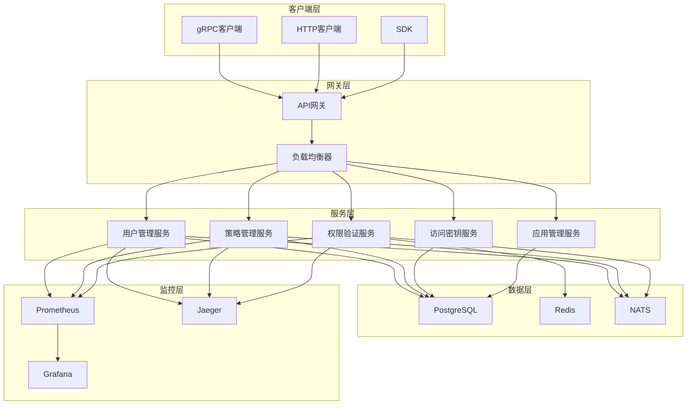

# 开发指南

欢迎来到VGO微服务开发指南！本指南将帮助您了解如何参与VGO微服务的开发，包括环境搭建、代码规范、测试流程、调试技巧等内容。

## 📋 开发概览

### 技术栈

| 组件 | 技术 | 版本 | 说明 |
|------|------|------|------|
| 后端语言 | Go | 1.21+ | 主要开发语言 |
| RPC框架 | gRPC | v1.58+ | 服务间通信 |
| 数据库 | PostgreSQL | 17+ | 主数据库 |
| 缓存 | Redis | 7+ | 缓存和会话存储 |
| 消息队列 | NATS | 2.9+ | 异步消息处理 |
| 监控 | Prometheus | 2.45+ | 指标收集 |
| 日志 | Zap | 1.25+ | 结构化日志 |
| 测试 | Testify | 1.8+ | 单元测试框架 |
| 构建工具 | Make | - | 构建自动化 |
| 容器化 | Docker | 24+ | 容器化部署 |

### 项目架构



### 目录结构

```
vgo_micro_service/
├── api/                    # API定义
│   ├── proto/             # Protocol Buffers定义
│   └── openapi/           # OpenAPI规范
├── cmd/                   # 应用程序入口
│   ├── server/           # 服务器启动代码
│   └── client/           # 客户端工具
├── internal/              # 内部代码
│   ├── config/           # 配置管理
│   ├── server/           # 服务器实现
│   ├── service/          # 业务逻辑
│   ├── repository/       # 数据访问层
│   ├── middleware/       # 中间件
│   ├── auth/             # 认证授权
│   ├── crypto/           # 加密解密
│   └── utils/            # 工具函数
├── pkg/                   # 公共库
│   ├── client/           # 客户端SDK
│   ├── errors/           # 错误定义
│   └── logger/           # 日志工具
├── scripts/               # 脚本文件
│   ├── build.sh          # 构建脚本
│   ├── test.sh           # 测试脚本
│   └── deploy.sh         # 部署脚本
├── configs/               # 配置文件
├── deployments/           # 部署配置
├── docs/                  # 文档
├── tests/                 # 测试文件
├── tools/                 # 开发工具
├── go.mod                 # Go模块定义
├── go.sum                 # Go模块校验
├── Makefile              # 构建配置
├── Dockerfile            # Docker镜像
└── docker-compose.yml    # Docker Compose配置
```

## 🚀 快速开始

### 1. 环境准备

#### 必需软件

```bash
# 安装Go（版本1.21+）
wget https://go.dev/dl/go1.21.5.linux-amd64.tar.gz
sudo tar -C /usr/local -xzf go1.21.5.linux-amd64.tar.gz
export PATH=$PATH:/usr/local/go/bin

# 安装Protocol Buffers编译器
sudo apt-get update
sudo apt-get install -y protobuf-compiler

# 安装Go插件
go install google.golang.org/protobuf/cmd/protoc-gen-go@latest
go install google.golang.org/grpc/cmd/protoc-gen-go-grpc@latest

# 安装开发工具
go install github.com/golangci/golangci-lint/cmd/golangci-lint@latest
go install github.com/swaggo/swag/cmd/swag@latest
go install github.com/air-verse/air@latest
```

#### 数据库准备

```bash
# 启动PostgreSQL和Redis
docker-compose up -d postgres redis

# 等待服务启动
sleep 10

# 运行数据库迁移
make migrate-up
```

### 2. 克隆和构建

```bash
# 克隆项目
git clone https://github.com/your-org/vgo_micro_service.git
cd vgo_micro_service

# 安装依赖
go mod download

# 生成代码
make generate

# 构建项目
make build

# 运行测试
make test
```

### 3. 启动开发服务器

```bash
# 启动开发服务器（热重载）
make dev

# 或者直接运行
air
```

### 4. 验证安装

```bash
# 检查服务健康状态
curl http://localhost:8081/health

# 测试gRPC接口
grpcurl -plaintext localhost:50051 grpc.health.v1.Health/Check
```

## 🛠️ 开发工作流

### 1. 分支管理

我们使用Git Flow工作流：

```bash
# 创建功能分支
git checkout -b feature/user-management

# 开发完成后提交
git add .
git commit -m "feat: add user management API"

# 推送到远程
git push origin feature/user-management

# 创建Pull Request
```

### 2. 代码提交规范

我们使用[Conventional Commits](https://www.conventionalcommits.org/)规范：

```
<type>[optional scope]: <description>

[optional body]

[optional footer(s)]
```

**类型说明：**
- `feat`: 新功能
- `fix`: 修复bug
- `docs`: 文档更新
- `style`: 代码格式化
- `refactor`: 代码重构
- `test`: 测试相关
- `chore`: 构建过程或辅助工具的变动

**示例：**
```
feat(auth): add JWT token validation

Implement JWT token validation middleware with:
- Token signature verification
- Expiration time checking
- User permission extraction

Closes #123
```

### 3. 代码审查

每个Pull Request都需要经过代码审查：

- [ ] 代码符合项目规范
- [ ] 包含适当的测试
- [ ] 文档已更新
- [ ] 通过所有CI检查
- [ ] 至少一个团队成员审查通过

## 📝 代码规范

### 1. Go代码规范

我们遵循[Go Code Review Comments](https://github.com/golang/go/wiki/CodeReviewComments)和[Effective Go](https://golang.org/doc/effective_go.html)：

#### 命名规范

```go
// ✅ 好的命名
type UserService struct {
    repo UserRepository
    logger *zap.Logger
}

func (s *UserService) CreateUser(ctx context.Context, req *CreateUserRequest) (*User, error) {
    // 实现逻辑
}

// ❌ 不好的命名
type usrSvc struct {
    r UserRepository
    l *zap.Logger
}

func (s *usrSvc) create(ctx context.Context, req *CreateUserRequest) (*User, error) {
    // 实现逻辑
}
```

#### 错误处理

```go
// ✅ 好的错误处理
func (s *UserService) GetUser(ctx context.Context, id string) (*User, error) {
    user, err := s.repo.GetByID(ctx, id)
    if err != nil {
        if errors.Is(err, repository.ErrNotFound) {
            return nil, status.Errorf(codes.NotFound, "user not found: %s", id)
        }
        return nil, status.Errorf(codes.Internal, "failed to get user: %v", err)
    }
    return user, nil
}

// ❌ 不好的错误处理
func (s *UserService) GetUser(ctx context.Context, id string) (*User, error) {
    user, err := s.repo.GetByID(ctx, id)
    if err != nil {
        return nil, err // 直接返回底层错误
    }
    return user, nil
}
```

#### 上下文使用

```go
// ✅ 正确使用context
func (s *UserService) CreateUser(ctx context.Context, req *CreateUserRequest) (*User, error) {
    // 检查上下文是否已取消
    select {
    case <-ctx.Done():
        return nil, ctx.Err()
    default:
    }
    
    // 传递上下文到下层调用
    user, err := s.repo.Create(ctx, req)
    if err != nil {
        return nil, err
    }
    
    return user, nil
}
```

### 2. 项目结构规范

#### 包组织

```go
// internal/service/user.go
package service

import (
    "context"
    
    "github.com/your-org/vgo/internal/repository"
    "github.com/your-org/vgo/pkg/errors"
    pb "github.com/your-org/vgo/api/proto/user/v1"
)

type UserService struct {
    repo repository.UserRepository
}

func NewUserService(repo repository.UserRepository) *UserService {
    return &UserService{repo: repo}
}
```

#### 接口定义

```go
// internal/repository/user.go
package repository

import (
    "context"
    
    "github.com/your-org/vgo/internal/model"
)

// UserRepository 用户数据访问接口
type UserRepository interface {
    Create(ctx context.Context, user *model.User) error
    GetByID(ctx context.Context, id string) (*model.User, error)
    GetByEmail(ctx context.Context, email string) (*model.User, error)
    Update(ctx context.Context, user *model.User) error
    Delete(ctx context.Context, id string) error
    List(ctx context.Context, opts ListOptions) ([]*model.User, error)
}
```

### 3. 测试规范

#### 单元测试

```go
// internal/service/user_test.go
package service

import (
    "context"
    "testing"
    
    "github.com/stretchr/testify/assert"
    "github.com/stretchr/testify/mock"
    
    "github.com/your-org/vgo/internal/model"
    "github.com/your-org/vgo/internal/repository/mocks"
)

func TestUserService_CreateUser(t *testing.T) {
    tests := []struct {
        name    string
        setup   func(*mocks.UserRepository)
        input   *model.User
        want    *model.User
        wantErr bool
    }{
        {
            name: "successful creation",
            setup: func(repo *mocks.UserRepository) {
                repo.On("Create", mock.Anything, mock.AnythingOfType("*model.User")).Return(nil)
            },
            input: &model.User{
                Email:    "test@example.com",
                Username: "testuser",
            },
            want: &model.User{
                Email:    "test@example.com",
                Username: "testuser",
            },
            wantErr: false,
        },
        {
            name: "repository error",
            setup: func(repo *mocks.UserRepository) {
                repo.On("Create", mock.Anything, mock.AnythingOfType("*model.User")).Return(errors.New("db error"))
            },
            input: &model.User{
                Email:    "test@example.com",
                Username: "testuser",
            },
            want:    nil,
            wantErr: true,
        },
    }
    
    for _, tt := range tests {
        t.Run(tt.name, func(t *testing.T) {
            repo := &mocks.UserRepository{}
            tt.setup(repo)
            
            service := NewUserService(repo)
            
            got, err := service.CreateUser(context.Background(), tt.input)
            
            if tt.wantErr {
                assert.Error(t, err)
                assert.Nil(t, got)
            } else {
                assert.NoError(t, err)
                assert.Equal(t, tt.want.Email, got.Email)
                assert.Equal(t, tt.want.Username, got.Username)
            }
            
            repo.AssertExpectations(t)
        })
    }
}
```

#### 集成测试

```go
// tests/integration/user_test.go
package integration

import (
    "context"
    "testing"
    
    "github.com/stretchr/testify/assert"
    "github.com/stretchr/testify/suite"
    
    "github.com/your-org/vgo/internal/config"
    "github.com/your-org/vgo/internal/server"
    pb "github.com/your-org/vgo/api/proto/user/v1"
)

type UserIntegrationTestSuite struct {
    suite.Suite
    server *server.Server
    client pb.UserServiceClient
}

func (suite *UserIntegrationTestSuite) SetupSuite() {
    cfg := config.LoadTestConfig()
    suite.server = server.New(cfg)
    
    go suite.server.Start()
    
    conn, err := grpc.Dial("localhost:50051", grpc.WithInsecure())
    suite.Require().NoError(err)
    
    suite.client = pb.NewUserServiceClient(conn)
}

func (suite *UserIntegrationTestSuite) TearDownSuite() {
    suite.server.Stop()
}

func (suite *UserIntegrationTestSuite) TestCreateUser() {
    req := &pb.CreateUserRequest{
        Email:    "test@example.com",
        Username: "testuser",
        Password: "password123",
    }
    
    resp, err := suite.client.CreateUser(context.Background(), req)
    
    assert.NoError(suite.T(), err)
    assert.NotEmpty(suite.T(), resp.User.Id)
    assert.Equal(suite.T(), req.Email, resp.User.Email)
    assert.Equal(suite.T(), req.Username, resp.User.Username)
}

func TestUserIntegrationTestSuite(t *testing.T) {
    suite.Run(t, new(UserIntegrationTestSuite))
}
```

## 🔧 开发工具

### 1. Makefile命令

```makefile
# 查看所有可用命令
make help

# 开发相关
make dev          # 启动开发服务器（热重载）
make build        # 构建项目
make clean        # 清理构建文件

# 代码生成
make generate     # 生成所有代码
make proto        # 生成Protocol Buffers代码
make mock         # 生成Mock代码
make swagger      # 生成Swagger文档

# 测试相关
make test         # 运行所有测试
make test-unit    # 运行单元测试
make test-integration # 运行集成测试
make test-coverage    # 生成测试覆盖率报告

# 代码质量
make lint         # 运行代码检查
make fmt          # 格式化代码
make vet          # 运行go vet

# 数据库相关
make migrate-up   # 运行数据库迁移
make migrate-down # 回滚数据库迁移
make migrate-create # 创建新的迁移文件

# Docker相关
make docker-build # 构建Docker镜像
make docker-run   # 运行Docker容器
make docker-push  # 推送Docker镜像
```

### 2. 开发环境配置

#### VS Code配置

```json
// .vscode/settings.json
{
    "go.useLanguageServer": true,
    "go.lintTool": "golangci-lint",
    "go.lintFlags": [
        "--fast"
    ],
    "go.testFlags": [
        "-v",
        "-race"
    ],
    "go.testTimeout": "30s",
    "go.coverOnSave": true,
    "go.coverOnSingleTest": true,
    "editor.formatOnSave": true,
    "editor.codeActionsOnSave": {
        "source.organizeImports": true
    }
}
```

```json
// .vscode/launch.json
{
    "version": "0.2.0",
    "configurations": [
        {
            "name": "Launch Server",
            "type": "go",
            "request": "launch",
            "mode": "auto",
            "program": "${workspaceFolder}/cmd/server",
            "env": {
                "VGO_ENV": "development",
                "VGO_CONFIG_PATH": "${workspaceFolder}/configs/development.yaml"
            },
            "args": []
        },
        {
            "name": "Debug Test",
            "type": "go",
            "request": "launch",
            "mode": "test",
            "program": "${workspaceFolder}",
            "env": {
                "VGO_ENV": "test"
            },
            "args": [
                "-test.v"
            ]
        }
    ]
}
```

#### golangci-lint配置

```yaml
# .golangci.yml
run:
  timeout: 5m
  modules-download-mode: readonly

linters-settings:
  gocyclo:
    min-complexity: 15
  goconst:
    min-len: 2
    min-occurrences: 2
  gocritic:
    enabled-tags:
      - diagnostic
      - experimental
      - opinionated
      - performance
      - style
  gofumpt:
    extra-rules: true
  gomnd:
    settings:
      mnd:
        checks: argument,case,condition,operation,return,assign
  govet:
    check-shadowing: true
  lll:
    line-length: 120
  misspell:
    locale: US
  nolintlint:
    allow-leading-space: true
    allow-unused: false
    require-explanation: false
    require-specific: false

linters:
  disable-all: true
  enable:
    - bodyclose
    - deadcode
    - depguard
    - dogsled
    - dupl
    - errcheck
    - exportloopref
    - exhaustive
    - gochecknoinits
    - goconst
    - gocritic
    - gocyclo
    - gofmt
    - gofumpt
    - gomnd
    - goprintffuncname
    - gosec
    - gosimple
    - govet
    - ineffassign
    - lll
    - misspell
    - nakedret
    - noctx
    - nolintlint
    - rowserrcheck
    - staticcheck
    - structcheck
    - stylecheck
    - typecheck
    - unconvert
    - unparam
    - unused
    - varcheck
    - whitespace

issues:
  exclude-rules:
    - path: _test\.go
      linters:
        - gomnd
        - goconst
        - dupl
    - path: internal/mocks/
      linters:
        - gomnd
        - goconst
        - dupl
        - unused
```

## 📚 相关文档

- [API文档](../api/README.md)
- [部署指南](../deployment/README.md)
- [快速开始](../guide/quick-start.md)
- [架构设计](./architecture.md)
- [测试指南](./testing.md)
- [调试指南](./debugging.md)
- [性能优化](./performance.md)
- [故障排除](./troubleshooting.md)