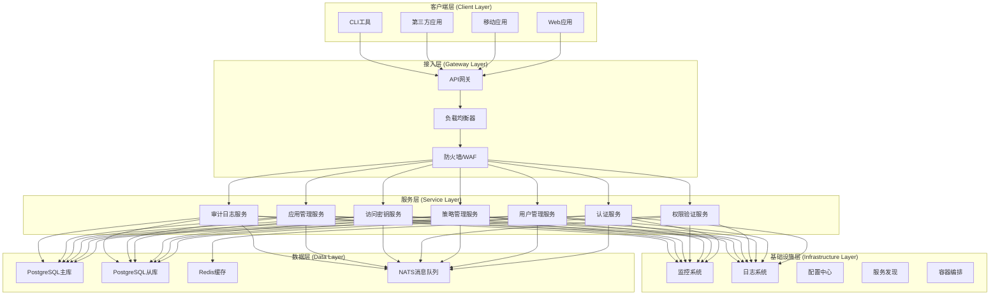
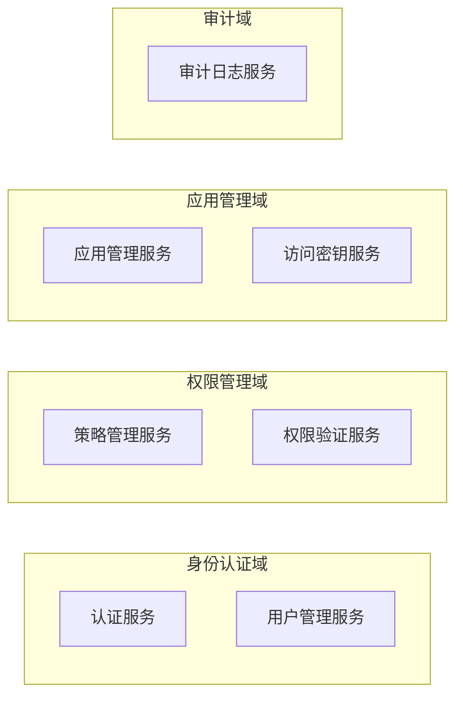
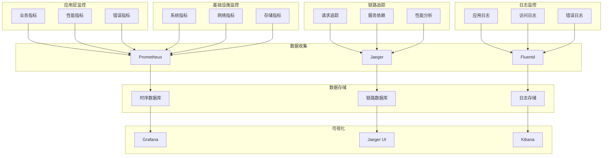

# 架构设计

VGO微服务采用现代化的微服务架构设计，本文档详细介绍了系统的整体架构、设计原则、技术选型和各个组件的职责。

## 🏗️ 整体架构

### 系统架构图



### 架构分层

| 层级 | 职责 | 技术栈 |
|------|------|--------|
| 客户端层 | 用户交互界面 | Web/Mobile/CLI |
| 接入层 | 流量接入、路由、安全 | Nginx, Envoy, Istio |
| 服务层 | 业务逻辑处理 | Go, gRPC, HTTP |
| 数据层 | 数据存储和消息传递 | PostgreSQL, Redis, NATS |
| 基础设施层 | 运维支撑服务 | Kubernetes, Prometheus, ELK |

## 🎯 设计原则

### 1. 单一职责原则 (SRP)

每个微服务只负责一个业务领域：

- **用户管理服务**: 用户的CRUD操作
- **策略管理服务**: 权限策略的管理
- **权限验证服务**: 权限检查和决策
- **访问密钥服务**: API密钥的生命周期管理
- **应用管理服务**: 应用注册和配置

### 2. 开闭原则 (OCP)

系统对扩展开放，对修改关闭：

```go
// 权限验证接口，支持多种验证策略
type PermissionChecker interface {
    CheckPermission(ctx context.Context, req *CheckPermissionRequest) (*CheckPermissionResponse, error)
}

// RBAC权限检查器
type RBACChecker struct {
    policyRepo PolicyRepository
}

// ABAC权限检查器
type ABACChecker struct {
    ruleEngine RuleEngine
}

// 可以轻松添加新的权限检查策略
type CustomChecker struct {
    customLogic CustomLogic
}
```

### 3. 依赖倒置原则 (DIP)

高层模块不依赖低层模块，都依赖抽象：

```go
// 服务层依赖抽象接口
type UserService struct {
    repo   UserRepository    // 抽象接口
    cache  CacheService     // 抽象接口
    logger Logger           // 抽象接口
}

// 具体实现在基础设施层
type PostgreSQLUserRepository struct {
    db *sql.DB
}

type RedisCache struct {
    client *redis.Client
}
```

### 4. 接口隔离原则 (ISP)

客户端不应该依赖它不需要的接口：

```go
// 细粒度接口设计
type UserReader interface {
    GetUser(ctx context.Context, id string) (*User, error)
    ListUsers(ctx context.Context, opts ListOptions) ([]*User, error)
}

type UserWriter interface {
    CreateUser(ctx context.Context, user *User) error
    UpdateUser(ctx context.Context, user *User) error
    DeleteUser(ctx context.Context, id string) error
}

// 组合接口
type UserRepository interface {
    UserReader
    UserWriter
}
```

## 🔧 技术选型

### 编程语言和框架

| 技术 | 版本 | 选择理由 |
|------|------|----------|
| Go | 1.21+ | 高性能、并发友好、生态丰富 |
| gRPC | 1.58+ | 高效的RPC框架，支持多语言 |
| Protocol Buffers | 3.21+ | 高效的序列化协议 |
| Gin | 1.9+ | 轻量级HTTP框架 |
| Zap | 1.25+ | 高性能结构化日志 |

### 数据存储

| 技术 | 版本 | 用途 | 选择理由 |
|------|------|------|----------|
| PostgreSQL | 17+ | 主数据库 | ACID特性、JSON支持、扩展性好 |
| Redis | 7+ | 缓存、会话 | 高性能、丰富的数据结构 |
| NATS | 2.9+ | 消息队列 | 轻量级、高性能、云原生 |

### 基础设施

| 技术 | 版本 | 用途 | 选择理由 |
|------|------|------|----------|
| Docker | 24+ | 容器化 | 标准化部署、环境一致性 |
| Kubernetes | 1.28+ | 容器编排 | 自动化运维、弹性伸缩 |
| Prometheus | 2.45+ | 监控 | 云原生监控标准 |
| Grafana | 10+ | 可视化 | 丰富的图表和仪表板 |
| Jaeger | 1.49+ | 链路追踪 | 分布式追踪标准 |

## 🏛️ 服务架构

### 服务拆分策略

#### 按业务领域拆分



#### 服务职责矩阵

| 服务 | 核心职责 | 数据模型 | 依赖服务 |
|------|----------|----------|----------|
| 认证服务 | 用户登录、Token管理 | Session, Token | 用户管理服务 |
| 用户管理服务 | 用户CRUD、用户信息 | User, Profile | - |
| 策略管理服务 | 策略CRUD、策略解析 | Policy, Rule | - |
| 权限验证服务 | 权限检查、决策引擎 | Permission, Decision | 策略管理服务 |
| 应用管理服务 | 应用注册、配置管理 | Application, Config | - |
| 访问密钥服务 | 密钥生成、生命周期 | AccessKey, Secret | 用户管理服务 |
| 审计日志服务 | 操作记录、合规审计 | AuditLog, Event | 所有服务 |

### 数据一致性策略

#### 1. 强一致性场景

使用数据库事务保证ACID特性：

```go
// 用户创建时同时创建默认策略
func (s *UserService) CreateUserWithDefaultPolicy(ctx context.Context, req *CreateUserRequest) error {
    return s.db.WithTransaction(ctx, func(tx *sql.Tx) error {
        // 创建用户
        user, err := s.userRepo.CreateWithTx(ctx, tx, req.User)
        if err != nil {
            return err
        }
        
        // 创建默认策略
        policy := &Policy{
            UserID: user.ID,
            Name:   "default",
            Rules:  defaultRules,
        }
        
        return s.policyRepo.CreateWithTx(ctx, tx, policy)
    })
}
```

#### 2. 最终一致性场景

使用事件驱动架构：

```go
// 用户状态变更事件
type UserStatusChangedEvent struct {
    UserID    string    `json:"user_id"`
    OldStatus string    `json:"old_status"`
    NewStatus string    `json:"new_status"`
    Timestamp time.Time `json:"timestamp"`
}

// 发布事件
func (s *UserService) UpdateUserStatus(ctx context.Context, userID, status string) error {
    // 更新用户状态
    err := s.repo.UpdateStatus(ctx, userID, status)
    if err != nil {
        return err
    }
    
    // 发布状态变更事件
    event := UserStatusChangedEvent{
        UserID:    userID,
        NewStatus: status,
        Timestamp: time.Now(),
    }
    
    return s.eventBus.Publish(ctx, "user.status.changed", event)
}

// 其他服务订阅事件
func (s *PolicyService) HandleUserStatusChanged(ctx context.Context, event UserStatusChangedEvent) error {
    if event.NewStatus == "disabled" {
        // 禁用用户的所有策略
        return s.repo.DisableUserPolicies(ctx, event.UserID)
    }
    return nil
}
```

## 🔄 通信模式

### 1. 同步通信 (gRPC)

用于需要立即响应的场景：

```go
// 权限检查 - 同步调用
func (s *AuthMiddleware) CheckPermission(ctx context.Context, userID, resource, action string) error {
    req := &pb.CheckPermissionRequest{
        UserId:   userID,
        Resource: resource,
        Action:   action,
    }
    
    resp, err := s.permissionClient.CheckPermission(ctx, req)
    if err != nil {
        return err
    }
    
    if !resp.Allowed {
        return errors.New("permission denied")
    }
    
    return nil
}
```

### 2. 异步通信 (消息队列)

用于事件通知和后台处理：

```go
// 审计日志 - 异步处理
func (s *AuditService) LogUserAction(ctx context.Context, action UserAction) {
    event := AuditEvent{
        UserID:    action.UserID,
        Action:    action.Type,
        Resource:  action.Resource,
        Timestamp: time.Now(),
        Metadata:  action.Metadata,
    }
    
    // 异步发送到消息队列
    go func() {
        if err := s.messageQueue.Publish("audit.user.action", event); err != nil {
            s.logger.Error("Failed to publish audit event", zap.Error(err))
        }
    }()
}
```

### 3. 请求-响应模式

```go
// 用户信息查询
func (s *UserService) GetUser(ctx context.Context, req *pb.GetUserRequest) (*pb.GetUserResponse, error) {
    // 参数验证
    if req.UserId == "" {
        return nil, status.Errorf(codes.InvalidArgument, "user_id is required")
    }
    
    // 从缓存获取
    if user, err := s.cache.GetUser(ctx, req.UserId); err == nil {
        return &pb.GetUserResponse{User: user}, nil
    }
    
    // 从数据库获取
    user, err := s.repo.GetByID(ctx, req.UserId)
    if err != nil {
        if errors.Is(err, repository.ErrNotFound) {
            return nil, status.Errorf(codes.NotFound, "user not found")
        }
        return nil, status.Errorf(codes.Internal, "failed to get user: %v", err)
    }
    
    // 更新缓存
    go s.cache.SetUser(context.Background(), user)
    
    return &pb.GetUserResponse{User: user}, nil
}
```

## 🗄️ 数据架构

### 数据库设计

#### 1. 用户管理数据模型

```sql
-- 用户表
CREATE TABLE users (
    id UUID PRIMARY KEY DEFAULT gen_random_uuid(),
    username VARCHAR(50) UNIQUE NOT NULL,
    email VARCHAR(255) UNIQUE NOT NULL,
    password_hash VARCHAR(255) NOT NULL,
    status VARCHAR(20) DEFAULT 'active',
    profile JSONB,
    created_at TIMESTAMP WITH TIME ZONE DEFAULT NOW(),
    updated_at TIMESTAMP WITH TIME ZONE DEFAULT NOW(),
    deleted_at TIMESTAMP WITH TIME ZONE
);

-- 用户角色关联表
CREATE TABLE user_roles (
    id UUID PRIMARY KEY DEFAULT gen_random_uuid(),
    user_id UUID NOT NULL REFERENCES users(id),
    role_id UUID NOT NULL REFERENCES roles(id),
    granted_by UUID REFERENCES users(id),
    granted_at TIMESTAMP WITH TIME ZONE DEFAULT NOW(),
    expires_at TIMESTAMP WITH TIME ZONE,
    UNIQUE(user_id, role_id)
);
```

#### 2. 策略管理数据模型

```sql
-- 策略表
CREATE TABLE policies (
    id UUID PRIMARY KEY DEFAULT gen_random_uuid(),
    name VARCHAR(100) NOT NULL,
    description TEXT,
    document JSONB NOT NULL,
    version INTEGER DEFAULT 1,
    status VARCHAR(20) DEFAULT 'active',
    created_by UUID REFERENCES users(id),
    created_at TIMESTAMP WITH TIME ZONE DEFAULT NOW(),
    updated_at TIMESTAMP WITH TIME ZONE DEFAULT NOW()
);

-- 策略附加表
CREATE TABLE policy_attachments (
    id UUID PRIMARY KEY DEFAULT gen_random_uuid(),
    policy_id UUID NOT NULL REFERENCES policies(id),
    principal_type VARCHAR(20) NOT NULL, -- 'user', 'role', 'group'
    principal_id UUID NOT NULL,
    attached_by UUID REFERENCES users(id),
    attached_at TIMESTAMP WITH TIME ZONE DEFAULT NOW(),
    UNIQUE(policy_id, principal_type, principal_id)
);
```

#### 3. 访问密钥数据模型

```sql
-- 访问密钥表
CREATE TABLE access_keys (
    id UUID PRIMARY KEY DEFAULT gen_random_uuid(),
    access_key_id VARCHAR(20) UNIQUE NOT NULL,
    secret_access_key_hash VARCHAR(255) NOT NULL,
    user_id UUID NOT NULL REFERENCES users(id),
    status VARCHAR(20) DEFAULT 'active',
    description TEXT,
    last_used_at TIMESTAMP WITH TIME ZONE,
    expires_at TIMESTAMP WITH TIME ZONE,
    created_at TIMESTAMP WITH TIME ZONE DEFAULT NOW(),
    updated_at TIMESTAMP WITH TIME ZONE DEFAULT NOW()
);

-- 访问密钥使用记录表
CREATE TABLE access_key_usage (
    id UUID PRIMARY KEY DEFAULT gen_random_uuid(),
    access_key_id VARCHAR(20) NOT NULL REFERENCES access_keys(access_key_id),
    service VARCHAR(50) NOT NULL,
    action VARCHAR(100) NOT NULL,
    resource VARCHAR(255),
    client_ip INET,
    user_agent TEXT,
    success BOOLEAN NOT NULL,
    error_message TEXT,
    created_at TIMESTAMP WITH TIME ZONE DEFAULT NOW()
);
```

### 缓存策略

#### 1. 多级缓存架构

```go
// 缓存接口
type CacheService interface {
    Get(ctx context.Context, key string) ([]byte, error)
    Set(ctx context.Context, key string, value []byte, ttl time.Duration) error
    Delete(ctx context.Context, key string) error
    Exists(ctx context.Context, key string) (bool, error)
}

// 多级缓存实现
type MultiLevelCache struct {
    l1Cache *sync.Map        // 内存缓存
    l2Cache *redis.Client    // Redis缓存
    l3Cache Database         // 数据库
}

func (c *MultiLevelCache) Get(ctx context.Context, key string) ([]byte, error) {
    // L1: 内存缓存
    if value, ok := c.l1Cache.Load(key); ok {
        return value.([]byte), nil
    }
    
    // L2: Redis缓存
    value, err := c.l2Cache.Get(ctx, key).Bytes()
    if err == nil {
        // 回填L1缓存
        c.l1Cache.Store(key, value)
        return value, nil
    }
    
    // L3: 数据库
    value, err = c.l3Cache.Get(ctx, key)
    if err != nil {
        return nil, err
    }
    
    // 回填缓存
    c.l1Cache.Store(key, value)
    c.l2Cache.Set(ctx, key, value, time.Hour)
    
    return value, nil
}
```

#### 2. 缓存更新策略

```go
// 写入时更新缓存
func (s *UserService) UpdateUser(ctx context.Context, user *User) error {
    // 更新数据库
    err := s.repo.Update(ctx, user)
    if err != nil {
        return err
    }
    
    // 更新缓存
    cacheKey := fmt.Sprintf("user:%s", user.ID)
    userData, _ := json.Marshal(user)
    
    // 异步更新缓存，避免影响主流程
    go func() {
        if err := s.cache.Set(context.Background(), cacheKey, userData, time.Hour); err != nil {
            s.logger.Error("Failed to update cache", zap.Error(err))
        }
    }()
    
    return nil
}

// 缓存失效策略
func (s *UserService) InvalidateUserCache(ctx context.Context, userID string) error {
    keys := []string{
        fmt.Sprintf("user:%s", userID),
        fmt.Sprintf("user:profile:%s", userID),
        fmt.Sprintf("user:permissions:%s", userID),
    }
    
    for _, key := range keys {
        if err := s.cache.Delete(ctx, key); err != nil {
            s.logger.Warn("Failed to delete cache key", zap.String("key", key), zap.Error(err))
        }
    }
    
    return nil
}
```

## 🔒 安全架构

### 认证流程

```mermaid
sequenceDiagram
    participant C as 客户端
    participant G as API网关
    participant A as 认证服务
    participant U as 用户服务
    participant R as Redis
    
    C->>G: 登录请求 (username/password)
    G->>A: 转发认证请求
    A->>U: 验证用户凭据
    U-->>A: 返回用户信息
    A->>R: 创建会话
    A->>A: 生成JWT Token
    A-->>G: 返回Token
    G-->>C: 返回认证结果
    
    Note over C,R: 后续API调用
    C->>G: API请求 (Bearer Token)
    G->>G: 验证JWT Token
    G->>A: 检查会话状态
    A->>R: 查询会话
    R-->>A: 返回会话信息
    A-->>G: 会话有效
    G->>G: 提取用户信息
    G->>+: 转发到目标服务
```

### 授权流程

```mermaid
sequenceDiagram
    participant C as 客户端
    participant G as API网关
    participant P as 权限服务
    participant S as 策略服务
    participant Cache as Redis缓存
    
    C->>G: API请求 (已认证)
    G->>P: 权限检查请求
    P->>Cache: 查询权限缓存
    
    alt 缓存命中
        Cache-->>P: 返回权限结果
    else 缓存未命中
        P->>S: 获取用户策略
        S-->>P: 返回策略列表
        P->>P: 执行权限决策
        P->>Cache: 缓存权限结果
    end
    
    P-->>G: 返回权限决策
    
    alt 权限允许
        G->>+: 转发到目标服务
    else 权限拒绝
        G-->>C: 返回403错误
    end
```

## 📊 监控架构

### 监控体系



### 指标体系

#### 1. 业务指标

```go
// 业务指标定义
var (
    // 用户相关指标
    userRegistrations = prometheus.NewCounterVec(
        prometheus.CounterOpts{
            Name: "vgo_user_registrations_total",
            Help: "Total number of user registrations",
        },
        []string{"status"},
    )
    
    // 认证相关指标
    authenticationAttempts = prometheus.NewCounterVec(
        prometheus.CounterOpts{
            Name: "vgo_authentication_attempts_total",
            Help: "Total number of authentication attempts",
        },
        []string{"method", "status"},
    )
    
    // 权限检查指标
    permissionChecks = prometheus.NewCounterVec(
        prometheus.CounterOpts{
            Name: "vgo_permission_checks_total",
            Help: "Total number of permission checks",
        },
        []string{"resource", "action", "result"},
    )
    
    // API调用指标
    apiRequests = prometheus.NewCounterVec(
        prometheus.CounterOpts{
            Name: "vgo_api_requests_total",
            Help: "Total number of API requests",
        },
        []string{"method", "endpoint", "status"},
    )
    
    // 响应时间指标
    apiDuration = prometheus.NewHistogramVec(
        prometheus.HistogramOpts{
            Name:    "vgo_api_duration_seconds",
            Help:    "API request duration in seconds",
            Buckets: prometheus.DefBuckets,
        },
        []string{"method", "endpoint"},
    )
)
```

#### 2. 系统指标

```go
// 系统指标收集
func (s *MetricsCollector) CollectSystemMetrics() {
    // CPU使用率
    cpuUsage, _ := cpu.Percent(time.Second, false)
    cpuUsageGauge.Set(cpuUsage[0])
    
    // 内存使用率
    memInfo, _ := mem.VirtualMemory()
    memoryUsageGauge.Set(memInfo.UsedPercent)
    
    // 磁盘使用率
    diskInfo, _ := disk.Usage("/")
    diskUsageGauge.Set(diskInfo.UsedPercent)
    
    // 网络流量
    netInfo, _ := net.IOCounters(false)
    if len(netInfo) > 0 {
        networkBytesReceivedCounter.Add(float64(netInfo[0].BytesRecv))
        networkBytesSentCounter.Add(float64(netInfo[0].BytesSent))
    }
    
    // Goroutine数量
    goroutineGauge.Set(float64(runtime.NumGoroutine()))
    
    // GC统计
    var gcStats runtime.MemStats
    runtime.ReadMemStats(&gcStats)
    gcDurationGauge.Set(float64(gcStats.PauseTotalNs) / 1e9)
}
```

## 📚 相关文档

- [开发指南](./README.md)
- [测试指南](./testing.md)
- [调试指南](./debugging.md)
- [性能优化](./performance.md)
- [API文档](../api/README.md)
- [部署指南](../deployment/README.md)