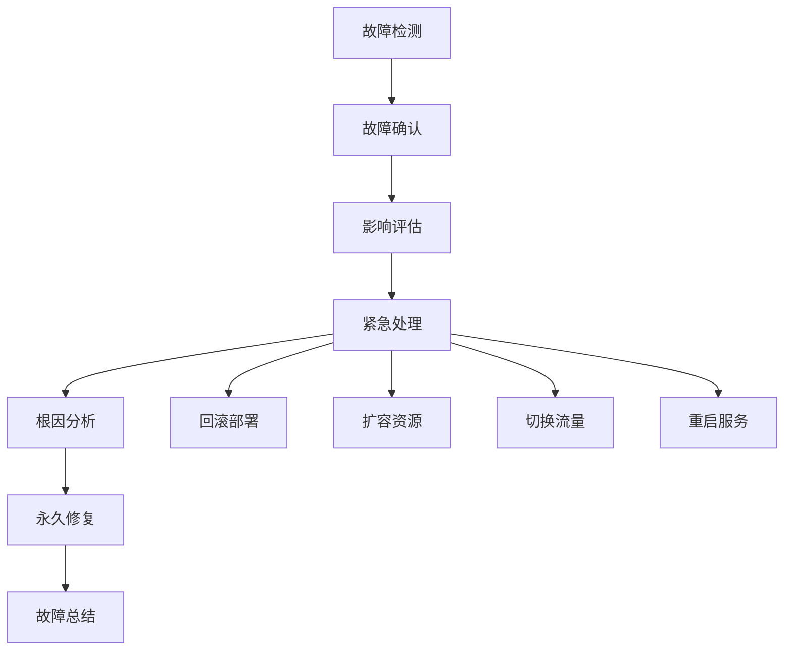

# 调试指南

本文档详细介绍了VGO微服务的调试技巧、工具使用和问题排查方法。

## 🔍 调试策略

### 调试层次


### 调试流程

1. **问题识别** - 确定问题的症状和影响范围
2. **信息收集** - 收集日志、指标和追踪信息
3. **假设形成** - 基于信息分析可能的原因
4. **验证测试** - 通过实验验证假设
5. **问题修复** - 实施解决方案
6. **验证修复** - 确认问题已解决

## 🛠️ 调试工具

### 1. 日志调试

#### 结构化日志

```go
package logger

import (
    "context"
    "os"
    
    "go.uber.org/zap"
    "go.uber.org/zap/zapcore"
)

// 日志配置
type Config struct {
    Level      string `json:"level"`
    Format     string `json:"format"` // json, console
    Output     string `json:"output"` // stdout, file
    Filename   string `json:"filename"`
    MaxSize    int    `json:"max_size"`    // MB
    MaxBackups int    `json:"max_backups"`
    MaxAge     int    `json:"max_age"`     // days
}

// 创建日志器
func NewLogger(cfg Config) (*zap.Logger, error) {
    // 设置日志级别
    level, err := zapcore.ParseLevel(cfg.Level)
    if err != nil {
        return nil, err
    }
    
    // 配置编码器
    var encoderConfig zapcore.EncoderConfig
    if cfg.Format == "json" {
        encoderConfig = zap.NewProductionEncoderConfig()
    } else {
        encoderConfig = zap.NewDevelopmentEncoderConfig()
        encoderConfig.EncodeLevel = zapcore.CapitalColorLevelEncoder
    }
    
    encoderConfig.TimeKey = "timestamp"
    encoderConfig.EncodeTime = zapcore.ISO8601TimeEncoder
    
    // 配置输出
    var writeSyncer zapcore.WriteSyncer
    if cfg.Output == "file" {
        writeSyncer = getLogWriter(cfg)
    } else {
        writeSyncer = zapcore.AddSync(os.Stdout)
    }
    
    // 创建核心
    var encoder zapcore.Encoder
    if cfg.Format == "json" {
        encoder = zapcore.NewJSONEncoder(encoderConfig)
    } else {
        encoder = zapcore.NewConsoleEncoder(encoderConfig)
    }
    
    core := zapcore.NewCore(encoder, writeSyncer, level)
    
    // 创建日志器
    logger := zap.New(core, zap.AddCaller(), zap.AddStacktrace(zapcore.ErrorLevel))
    
    return logger, nil
}

// 带上下文的日志
func WithContext(ctx context.Context, logger *zap.Logger) *zap.Logger {
    if requestID := ctx.Value("request_id"); requestID != nil {
        logger = logger.With(zap.String("request_id", requestID.(string)))
    }
    
    if userID := ctx.Value("user_id"); userID != nil {
        logger = logger.With(zap.String("user_id", userID.(string)))
    }
    
    if traceID := ctx.Value("trace_id"); traceID != nil {
        logger = logger.With(zap.String("trace_id", traceID.(string)))
    }
    
    return logger
}

// 使用示例
func (s *UserService) CreateUser(ctx context.Context, req *CreateUserRequest) (*User, error) {
    logger := WithContext(ctx, s.logger)
    
    logger.Info("Creating user",
        zap.String("username", req.Username),
        zap.String("email", req.Email),
    )
    
    // 验证输入
    if err := s.validateCreateUserRequest(req); err != nil {
        logger.Error("Invalid create user request",
            zap.Error(err),
            zap.Any("request", req),
        )
        return nil, err
    }
    
    // 创建用户
    user, err := s.repo.Create(ctx, &User{
        Username: req.Username,
        Email:    req.Email,
    })
    
    if err != nil {
        logger.Error("Failed to create user",
            zap.Error(err),
            zap.String("username", req.Username),
        )
        return nil, err
    }
    
    logger.Info("User created successfully",
        zap.String("user_id", user.ID),
        zap.String("username", user.Username),
    )
    
    return user, nil
}
```

#### 日志查询和分析

```bash
#!/bin/bash
# scripts/log-analysis.sh

# 查看最近的错误日志
echo "Recent errors:"
jq 'select(.level == "error")' logs/app.log | tail -10

# 按用户ID查询日志
echo "Logs for user $1:"
jq "select(.user_id == \"$1\")" logs/app.log

# 查看API响应时间统计
echo "API response time statistics:"
jq 'select(.msg == "HTTP request completed") | .duration' logs/app.log | \
    awk '{sum+=$1; count++} END {print "Avg:", sum/count, "Count:", count}'

# 查看错误率
echo "Error rate in last hour:"
total=$(jq 'select(.timestamp > (now - 3600))' logs/app.log | wc -l)
errors=$(jq 'select(.timestamp > (now - 3600) and .level == "error")' logs/app.log | wc -l)
echo "Errors: $errors / $total ($(echo "scale=2; $errors * 100 / $total" | bc)%)"
```

### 2. 性能分析

#### Go pprof集成

```go
package debug

import (
    "context"
    "net/http"
    _ "net/http/pprof"
    "runtime"
    "time"
    
    "go.uber.org/zap"
)

// 性能分析服务
type ProfilerService struct {
    logger *zap.Logger
    server *http.Server
}

func NewProfilerService(addr string, logger *zap.Logger) *ProfilerService {
    mux := http.NewServeMux()
    
    // 注册pprof处理器
    mux.HandleFunc("/debug/pprof/", http.HandlerFunc(func(w http.ResponseWriter, r *http.Request) {
        http.DefaultServeMux.ServeHTTP(w, r)
    }))
    
    // 自定义性能指标
    mux.HandleFunc("/debug/stats", func(w http.ResponseWriter, r *http.Request) {
        var m runtime.MemStats
        runtime.ReadMemStats(&m)
        
        stats := map[string]interface{}{
            "goroutines":     runtime.NumGoroutine(),
            "memory_alloc":   m.Alloc,
            "memory_total":   m.TotalAlloc,
            "memory_sys":     m.Sys,
            "gc_runs":        m.NumGC,
            "gc_pause_total": m.PauseTotalNs,
        }
        
        w.Header().Set("Content-Type", "application/json")
        json.NewEncoder(w).Encode(stats)
    })
    
    server := &http.Server{
        Addr:    addr,
        Handler: mux,
    }
    
    return &ProfilerService{
        logger: logger,
        server: server,
    }
}

func (p *ProfilerService) Start() error {
    p.logger.Info("Starting profiler server", zap.String("addr", p.server.Addr))
    return p.server.ListenAndServe()
}

func (p *ProfilerService) Stop(ctx context.Context) error {
    p.logger.Info("Stopping profiler server")
    return p.server.Shutdown(ctx)
}

// 性能监控中间件
func PerformanceMiddleware(logger *zap.Logger) func(http.Handler) http.Handler {
    return func(next http.Handler) http.Handler {
        return http.HandlerFunc(func(w http.ResponseWriter, r *http.Request) {
            start := time.Now()
            
            // 记录请求开始时的内存状态
            var startMem runtime.MemStats
            runtime.ReadMemStats(&startMem)
            
            // 执行请求
            next.ServeHTTP(w, r)
            
            // 记录请求结束时的内存状态
            var endMem runtime.MemStats
            runtime.ReadMemStats(&endMem)
            
            duration := time.Since(start)
            memoryUsed := endMem.Alloc - startMem.Alloc
            
            logger.Info("HTTP request completed",
                zap.String("method", r.Method),
                zap.String("path", r.URL.Path),
                zap.Duration("duration", duration),
                zap.Uint64("memory_used", memoryUsed),
                zap.Int("goroutines", runtime.NumGoroutine()),
            )
            
            // 如果请求时间过长，记录警告
            if duration > 5*time.Second {
                logger.Warn("Slow request detected",
                    zap.String("method", r.Method),
                    zap.String("path", r.URL.Path),
                    zap.Duration("duration", duration),
                )
            }
        })
    }
}
```

#### 性能分析脚本

```bash
#!/bin/bash
# scripts/profile.sh

SERVICE_URL="http://localhost:8080"
PROFILE_DURATION="30s"
OUTPUT_DIR="./profiles"

mkdir -p $OUTPUT_DIR

echo "Collecting CPU profile for $PROFILE_DURATION..."
curl -s "$SERVICE_URL/debug/pprof/profile?seconds=30" > "$OUTPUT_DIR/cpu.prof"

echo "Collecting memory profile..."
curl -s "$SERVICE_URL/debug/pprof/heap" > "$OUTPUT_DIR/heap.prof"

echo "Collecting goroutine profile..."
curl -s "$SERVICE_URL/debug/pprof/goroutine" > "$OUTPUT_DIR/goroutine.prof"

echo "Collecting mutex profile..."
curl -s "$SERVICE_URL/debug/pprof/mutex" > "$OUTPUT_DIR/mutex.prof"

echo "Collecting block profile..."
curl -s "$SERVICE_URL/debug/pprof/block" > "$OUTPUT_DIR/block.prof"

echo "Profiles saved to $OUTPUT_DIR"
echo "Analyze with: go tool pprof $OUTPUT_DIR/cpu.prof"
```

### 3. 分布式追踪

#### Jaeger集成

```go
package tracing

import (
    "context"
    "io"
    
    "github.com/opentracing/opentracing-go"
    "github.com/opentracing/opentracing-go/ext"
    "github.com/uber/jaeger-client-go"
    "github.com/uber/jaeger-client-go/config"
    "go.uber.org/zap"
)

// 追踪配置
type TracingConfig struct {
    ServiceName string  `json:"service_name"`
    AgentHost   string  `json:"agent_host"`
    AgentPort   int     `json:"agent_port"`
    SampleRate  float64 `json:"sample_rate"`
}

// 初始化追踪
func InitTracing(cfg TracingConfig, logger *zap.Logger) (opentracing.Tracer, io.Closer, error) {
    config := config.Configuration{
        ServiceName: cfg.ServiceName,
        Sampler: &config.SamplerConfig{
            Type:  jaeger.SamplerTypeConst,
            Param: cfg.SampleRate,
        },
        Reporter: &config.ReporterConfig{
            LogSpans:           true,
            LocalAgentHostPort: fmt.Sprintf("%s:%d", cfg.AgentHost, cfg.AgentPort),
        },
    }
    
    tracer, closer, err := config.NewTracer(
        config.Logger(jaeger.StdLogger),
    )
    
    if err != nil {
        return nil, nil, err
    }
    
    opentracing.SetGlobalTracer(tracer)
    
    logger.Info("Tracing initialized",
        zap.String("service", cfg.ServiceName),
        zap.String("agent", fmt.Sprintf("%s:%d", cfg.AgentHost, cfg.AgentPort)),
    )
    
    return tracer, closer, nil
}

// HTTP追踪中间件
func TracingMiddleware() func(http.Handler) http.Handler {
    return func(next http.Handler) http.Handler {
        return http.HandlerFunc(func(w http.ResponseWriter, r *http.Request) {
            // 从请求头中提取span上下文
            spanCtx, _ := opentracing.GlobalTracer().Extract(
                opentracing.HTTPHeaders,
                opentracing.HTTPHeadersCarrier(r.Header),
            )
            
            // 创建新的span
            span := opentracing.GlobalTracer().StartSpan(
                fmt.Sprintf("%s %s", r.Method, r.URL.Path),
                ext.RPCServerOption(spanCtx),
            )
            defer span.Finish()
            
            // 设置span标签
            ext.HTTPMethod.Set(span, r.Method)
            ext.HTTPUrl.Set(span, r.URL.String())
            ext.Component.Set(span, "http-server")
            
            // 将span添加到上下文
            ctx := opentracing.ContextWithSpan(r.Context(), span)
            r = r.WithContext(ctx)
            
            // 创建响应写入器包装器
            rw := &responseWriter{ResponseWriter: w, statusCode: 200}
            
            // 执行请求
            next.ServeHTTP(rw, r)
            
            // 设置响应状态
            ext.HTTPStatusCode.Set(span, uint16(rw.statusCode))
            if rw.statusCode >= 400 {
                ext.Error.Set(span, true)
            }
        })
    }
}

// 响应写入器包装器
type responseWriter struct {
    http.ResponseWriter
    statusCode int
}

func (rw *responseWriter) WriteHeader(code int) {
    rw.statusCode = code
    rw.ResponseWriter.WriteHeader(code)
}

// 服务调用追踪
func TraceServiceCall(ctx context.Context, serviceName, operation string, fn func(context.Context) error) error {
    span, ctx := opentracing.StartSpanFromContext(ctx, operation)
    defer span.Finish()
    
    // 设置span标签
    span.SetTag("service.name", serviceName)
    span.SetTag("operation", operation)
    ext.Component.Set(span, "service-client")
    
    // 执行操作
    err := fn(ctx)
    
    if err != nil {
        ext.Error.Set(span, true)
        span.SetTag("error.message", err.Error())
    }
    
    return err
}

// 数据库操作追踪
func TraceDBOperation(ctx context.Context, query string, fn func(context.Context) error) error {
    span, ctx := opentracing.StartSpanFromContext(ctx, "db.query")
    defer span.Finish()
    
    // 设置span标签
    ext.DBType.Set(span, "postgresql")
    ext.DBStatement.Set(span, query)
    ext.Component.Set(span, "database")
    
    // 执行查询
    err := fn(ctx)
    
    if err != nil {
        ext.Error.Set(span, true)
        span.SetTag("error.message", err.Error())
    }
    
    return err
}
```

### 4. 实时调试

#### Delve调试器

```bash
# 安装Delve
go install github.com/go-delve/delve/cmd/dlv@latest

# 调试运行中的程序
dlv attach <pid>

# 调试测试
dlv test ./pkg/user

# 远程调试
dlv debug --headless --listen=:2345 --api-version=2 --accept-multiclient
```

#### 调试配置

```json
// .vscode/launch.json
{
    "version": "0.2.0",
    "configurations": [
        {
            "name": "Debug VGO Service",
            "type": "go",
            "request": "launch",
            "mode": "debug",
            "program": "${workspaceFolder}/cmd/server",
            "env": {
                "GO_ENV": "development",
                "DATABASE_URL": "postgres://localhost:5432/vgo_dev",
                "REDIS_URL": "redis://localhost:6379"
            },
            "args": [
                "--config", "configs/development.yaml"
            ]
        },
        {
            "name": "Debug Test",
            "type": "go",
            "request": "launch",
            "mode": "test",
            "program": "${workspaceFolder}/pkg/user",
            "env": {
                "GO_ENV": "test"
            }
        },
        {
            "name": "Attach to Process",
            "type": "go",
            "request": "attach",
            "mode": "local",
            "processId": 0
        }
    ]
}
```

## 🔧 问题排查

### 1. 常见问题诊断

#### 服务启动问题

```bash
#!/bin/bash
# scripts/diagnose-startup.sh

echo "=== VGO Service Startup Diagnosis ==="

# 检查端口占用
echo "Checking port usage:"
netstat -tulpn | grep -E ':(8080|5432|6379|4222)'

# 检查服务状态
echo "\nChecking service status:"
systemctl status vgo-service || echo "Service not managed by systemd"

# 检查日志
echo "\nRecent logs:"
tail -50 /var/log/vgo/service.log || echo "Log file not found"

# 检查配置文件
echo "\nChecking configuration:"
if [ -f "/etc/vgo/config.yaml" ]; then
    echo "Config file exists"
    yaml-lint /etc/vgo/config.yaml || echo "Config file has syntax errors"
else
    echo "Config file not found"
fi

# 检查数据库连接
echo "\nTesting database connection:"
psql -h localhost -U vgo -d vgo -c "SELECT 1;" || echo "Database connection failed"

# 检查Redis连接
echo "\nTesting Redis connection:"
redis-cli ping || echo "Redis connection failed"

# 检查磁盘空间
echo "\nDisk usage:"
df -h

# 检查内存使用
echo "\nMemory usage:"
free -h
```

#### 性能问题诊断

```bash
#!/bin/bash
# scripts/diagnose-performance.sh

SERVICE_PID=$(pgrep vgo-service)

if [ -z "$SERVICE_PID" ]; then
    echo "VGO service is not running"
    exit 1
fi

echo "=== VGO Service Performance Diagnosis ==="
echo "Service PID: $SERVICE_PID"

# CPU使用率
echo "\nCPU usage:"
top -p $SERVICE_PID -n 1 | grep vgo-service

# 内存使用
echo "\nMemory usage:"
ps -p $SERVICE_PID -o pid,ppid,cmd,%mem,%cpu --sort=-%mem

# 文件描述符
echo "\nFile descriptors:"
ls /proc/$SERVICE_PID/fd | wc -l
echo "Limit: $(ulimit -n)"

# 网络连接
echo "\nNetwork connections:"
netstat -anp | grep $SERVICE_PID | wc -l

# Goroutine数量
echo "\nGoroutines:"
curl -s http://localhost:8080/debug/stats | jq '.goroutines'

# 内存统计
echo "\nMemory stats:"
curl -s http://localhost:8080/debug/stats | jq '{
    memory_alloc: .memory_alloc,
    memory_sys: .memory_sys,
    gc_runs: .gc_runs
}'

# 最近的慢查询
echo "\nSlow requests (>1s):"
grep "duration.*[0-9]\+s" /var/log/vgo/service.log | tail -10
```

### 2. 数据库问题排查

#### PostgreSQL诊断

```sql
-- 检查活跃连接
SELECT 
    pid,
    usename,
    application_name,
    client_addr,
    state,
    query_start,
    query
FROM pg_stat_activity 
WHERE state = 'active'
ORDER BY query_start;

-- 检查长时间运行的查询
SELECT 
    pid,
    now() - pg_stat_activity.query_start AS duration,
    query,
    state
FROM pg_stat_activity 
WHERE (now() - pg_stat_activity.query_start) > interval '5 minutes'
ORDER BY duration DESC;

-- 检查锁等待
SELECT 
    blocked_locks.pid AS blocked_pid,
    blocked_activity.usename AS blocked_user,
    blocking_locks.pid AS blocking_pid,
    blocking_activity.usename AS blocking_user,
    blocked_activity.query AS blocked_statement,
    blocking_activity.query AS current_statement_in_blocking_process
FROM pg_catalog.pg_locks blocked_locks
JOIN pg_catalog.pg_stat_activity blocked_activity ON blocked_activity.pid = blocked_locks.pid
JOIN pg_catalog.pg_locks blocking_locks 
    ON blocking_locks.locktype = blocked_locks.locktype
    AND blocking_locks.database IS NOT DISTINCT FROM blocked_locks.database
    AND blocking_locks.relation IS NOT DISTINCT FROM blocked_locks.relation
    AND blocking_locks.page IS NOT DISTINCT FROM blocked_locks.page
    AND blocking_locks.tuple IS NOT DISTINCT FROM blocked_locks.tuple
    AND blocking_locks.virtualxid IS NOT DISTINCT FROM blocked_locks.virtualxid
    AND blocking_locks.transactionid IS NOT DISTINCT FROM blocked_locks.transactionid
    AND blocking_locks.classid IS NOT DISTINCT FROM blocked_locks.classid
    AND blocking_locks.objid IS NOT DISTINCT FROM blocked_locks.objid
    AND blocking_locks.objsubid IS NOT DISTINCT FROM blocked_locks.objsubid
    AND blocking_locks.pid != blocked_locks.pid
JOIN pg_catalog.pg_stat_activity blocking_activity ON blocking_activity.pid = blocking_locks.pid
WHERE NOT blocked_locks.granted;

-- 检查表大小
SELECT 
    schemaname,
    tablename,
    pg_size_pretty(pg_total_relation_size(schemaname||'.'||tablename)) as size
FROM pg_tables 
WHERE schemaname = 'public'
ORDER BY pg_total_relation_size(schemaname||'.'||tablename) DESC;

-- 检查索引使用情况
SELECT 
    schemaname,
    tablename,
    indexname,
    idx_scan,
    idx_tup_read,
    idx_tup_fetch
FROM pg_stat_user_indexes
ORDER BY idx_scan DESC;
```

#### Redis诊断

```bash
#!/bin/bash
# scripts/diagnose-redis.sh

echo "=== Redis Diagnosis ==="

# Redis信息
echo "Redis info:"
redis-cli info server | grep -E "redis_version|uptime_in_seconds|connected_clients"

# 内存使用
echo "\nMemory usage:"
redis-cli info memory | grep -E "used_memory_human|used_memory_peak_human|maxmemory_human"

# 键空间信息
echo "\nKeyspace info:"
redis-cli info keyspace

# 慢查询
echo "\nSlow queries:"
redis-cli slowlog get 10

# 客户端连接
echo "\nClient connections:"
redis-cli client list | head -10

# 键分析
echo "\nTop keys by memory usage:"
redis-cli --bigkeys
```

### 3. 网络问题排查

#### 网络连通性测试

```bash
#!/bin/bash
# scripts/diagnose-network.sh

echo "=== Network Diagnosis ==="

# 检查服务端口
echo "Service ports:"
netstat -tulpn | grep -E ':(8080|8081|8082)'

# 检查DNS解析
echo "\nDNS resolution:"
nslookup postgres.local
nslookup redis.local

# 检查服务间连通性
echo "\nService connectivity:"
telnet postgres.local 5432 < /dev/null
telnet redis.local 6379 < /dev/null

# 检查外部API连通性
echo "\nExternal API connectivity:"
curl -I https://api.example.com/health

# 检查网络延迟
echo "\nNetwork latency:"
ping -c 3 postgres.local
ping -c 3 redis.local

# 检查防火墙规则
echo "\nFirewall rules:"
sudo iptables -L | grep -E '(8080|5432|6379)'
```

## 🚨 故障处理

### 1. 紧急故障响应

#### 故障响应流程



#### 故障处理脚本

```bash
#!/bin/bash
# scripts/emergency-response.sh

set -e

ACTION=$1
SERVICE=${2:-"all"}

case $ACTION in
    "rollback")
        echo "Rolling back deployment..."
        kubectl rollout undo deployment/vgo-service
        kubectl rollout status deployment/vgo-service
        ;;
    
    "scale-up")
        echo "Scaling up service..."
        kubectl scale deployment/vgo-service --replicas=10
        kubectl rollout status deployment/vgo-service
        ;;
    
    "restart")
        echo "Restarting service..."
        kubectl rollout restart deployment/vgo-service
        kubectl rollout status deployment/vgo-service
        ;;
    
    "drain-traffic")
        echo "Draining traffic from service..."
        kubectl patch service vgo-service -p '{"spec":{"selector":{"app":"maintenance"}}}'
        ;;
    
    "restore-traffic")
        echo "Restoring traffic to service..."
        kubectl patch service vgo-service -p '{"spec":{"selector":{"app":"vgo-service"}}}'
        ;;
    
    "health-check")
        echo "Performing health check..."
        curl -f http://localhost:8080/health || exit 1
        echo "Service is healthy"
        ;;
    
    *)
        echo "Usage: $0 {rollback|scale-up|restart|drain-traffic|restore-traffic|health-check} [service]"
        exit 1
        ;;
esac
```

### 2. 监控告警

#### 告警规则

```yaml
# monitoring/alerts.yml
groups:
- name: vgo-service
  rules:
  - alert: ServiceDown
    expr: up{job="vgo-service"} == 0
    for: 1m
    labels:
      severity: critical
    annotations:
      summary: "VGO service is down"
      description: "VGO service has been down for more than 1 minute"
  
  - alert: HighErrorRate
    expr: rate(http_requests_total{status=~"5.."}[5m]) > 0.1
    for: 2m
    labels:
      severity: warning
    annotations:
      summary: "High error rate detected"
      description: "Error rate is {{ $value }} errors per second"
  
  - alert: HighResponseTime
    expr: histogram_quantile(0.95, rate(http_request_duration_seconds_bucket[5m])) > 1
    for: 5m
    labels:
      severity: warning
    annotations:
      summary: "High response time detected"
      description: "95th percentile response time is {{ $value }} seconds"
  
  - alert: DatabaseConnectionFailure
    expr: database_connections_failed_total > 0
    for: 1m
    labels:
      severity: critical
    annotations:
      summary: "Database connection failure"
      description: "Failed to connect to database"
  
  - alert: HighMemoryUsage
    expr: process_resident_memory_bytes / 1024 / 1024 > 1000
    for: 5m
    labels:
      severity: warning
    annotations:
      summary: "High memory usage"
      description: "Memory usage is {{ $value }}MB"
```

## 📊 调试最佳实践

### 1. 日志最佳实践

```go
// 好的日志实践
func (s *UserService) CreateUser(ctx context.Context, req *CreateUserRequest) error {
    logger := s.logger.With(
        zap.String("operation", "CreateUser"),
        zap.String("user_id", req.UserID),
    )
    
    logger.Info("Starting user creation")
    
    // 记录关键步骤
    logger.Debug("Validating user input")
    if err := s.validateUser(req); err != nil {
        logger.Error("User validation failed", zap.Error(err))
        return err
    }
    
    logger.Debug("Checking user existence")
    exists, err := s.repo.UserExists(ctx, req.Username)
    if err != nil {
        logger.Error("Failed to check user existence", zap.Error(err))
        return err
    }
    
    if exists {
        logger.Warn("User already exists", zap.String("username", req.Username))
        return ErrUserExists
    }
    
    logger.Debug("Creating user in database")
    user, err := s.repo.Create(ctx, req)
    if err != nil {
        logger.Error("Failed to create user", zap.Error(err))
        return err
    }
    
    logger.Info("User created successfully", zap.String("user_id", user.ID))
    return nil
}
```

### 2. 错误处理最佳实践

```go
// 错误包装和上下文
func (r *UserRepository) GetByID(ctx context.Context, id string) (*User, error) {
    const op = "UserRepository.GetByID"
    
    if id == "" {
        return nil, fmt.Errorf("%s: %w", op, ErrInvalidUserID)
    }
    
    query := `SELECT id, username, email, created_at FROM users WHERE id = $1 AND deleted_at IS NULL`
    
    var user User
    err := r.db.QueryRowContext(ctx, query, id).Scan(
        &user.ID,
        &user.Username,
        &user.Email,
        &user.CreatedAt,
    )
    
    if err != nil {
        if errors.Is(err, sql.ErrNoRows) {
            return nil, fmt.Errorf("%s: user %s: %w", op, id, ErrUserNotFound)
        }
        return nil, fmt.Errorf("%s: failed to query user %s: %w", op, id, err)
    }
    
    return &user, nil
}

// 错误分类
var (
    ErrUserNotFound   = errors.New("user not found")
    ErrInvalidUserID  = errors.New("invalid user ID")
    ErrUserExists     = errors.New("user already exists")
    ErrDatabaseError  = errors.New("database error")
)

// 错误处理中间件
func ErrorHandlingMiddleware(logger *zap.Logger) func(http.Handler) http.Handler {
    return func(next http.Handler) http.Handler {
        return http.HandlerFunc(func(w http.ResponseWriter, r *http.Request) {
            defer func() {
                if err := recover(); err != nil {
                    logger.Error("Panic recovered",
                        zap.Any("error", err),
                        zap.String("path", r.URL.Path),
                        zap.Stack("stack"),
                    )
                    
                    http.Error(w, "Internal Server Error", http.StatusInternalServerError)
                }
            }()
            
            next.ServeHTTP(w, r)
        })
    }
}
```

### 3. 性能调试技巧

```go
// 性能测量
func (s *UserService) GetUser(ctx context.Context, id string) (*User, error) {
    start := time.Now()
    defer func() {
        duration := time.Since(start)
        s.metrics.RecordDuration("get_user", duration)
        
        if duration > 100*time.Millisecond {
            s.logger.Warn("Slow operation detected",
                zap.String("operation", "GetUser"),
                zap.String("user_id", id),
                zap.Duration("duration", duration),
            )
        }
    }()
    
    return s.repo.GetByID(ctx, id)
}

// 内存使用监控
func (s *Service) monitorMemory() {
    ticker := time.NewTicker(30 * time.Second)
    defer ticker.Stop()
    
    for {
        select {
        case <-ticker.C:
            var m runtime.MemStats
            runtime.ReadMemStats(&m)
            
            s.logger.Debug("Memory stats",
                zap.Uint64("alloc", m.Alloc/1024/1024),
                zap.Uint64("sys", m.Sys/1024/1024),
                zap.Uint32("gc_runs", m.NumGC),
                zap.Int("goroutines", runtime.NumGoroutine()),
            )
            
            // 内存使用过高时触发GC
            if m.Alloc > 500*1024*1024 { // 500MB
                s.logger.Warn("High memory usage, forcing GC")
                runtime.GC()
            }
        case <-s.ctx.Done():
            return
        }
    }
}
```

## 📚 相关文档

- [开发指南](./README.md)
- [架构设计](./architecture.md)
- [测试指南](./testing.md)
- [性能优化](./performance.md)
- [API文档](../api/README.md)
- [部署指南](../deployment/README.md)