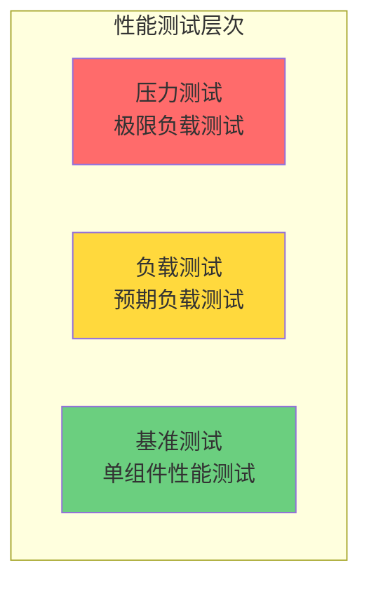

# 性能优化指南

本文档详细介绍了VGO微服务的性能优化策略、技术和最佳实践。

## 🎯 性能目标

### 性能指标

| 指标类型 | 目标值 | 监控方式 |
|----------|--------|----------|
| API响应时间 | P95 < 200ms | Prometheus + Grafana |
| API吞吐量 | > 1000 RPS | 负载测试 |
| 数据库查询 | P95 < 50ms | 慢查询日志 |
| 内存使用 | < 512MB | 内存监控 |
| CPU使用率 | < 70% | 系统监控 |
| 错误率 | < 0.1% | 错误监控 |

### 性能测试金字塔



## 🚀 应用层优化

### 1. Go语言优化

#### 内存管理优化

```go
package optimization

import (
    "context"
    "sync"
    "time"
)

// 对象池优化
type UserPool struct {
    pool sync.Pool
}

func NewUserPool() *UserPool {
    return &UserPool{
        pool: sync.Pool{
            New: func() interface{} {
                return &User{}
            },
        },
    }
}

func (p *UserPool) Get() *User {
    return p.pool.Get().(*User)
}

func (p *UserPool) Put(user *User) {
    // 重置对象状态
    user.Reset()
    p.pool.Put(user)
}

// 使用对象池的服务
type UserService struct {
    repo     UserRepository
    userPool *UserPool
}

func (s *UserService) ProcessUsers(ctx context.Context, userIDs []string) ([]*User, error) {
    users := make([]*User, 0, len(userIDs))
    
    for _, id := range userIDs {
        // 从对象池获取用户对象
        user := s.userPool.Get()
        defer s.userPool.Put(user)
        
        if err := s.repo.LoadUser(ctx, id, user); err != nil {
            return nil, err
        }
        
        // 复制用户数据，避免池对象被修改
        userCopy := *user
        users = append(users, &userCopy)
    }
    
    return users, nil
}

// 字符串构建优化
func BuildQuery(conditions []string) string {
    if len(conditions) == 0 {
        return ""
    }
    
    // 预分配容量，避免多次内存分配
    var builder strings.Builder
    builder.Grow(len(conditions) * 20) // 估算总长度
    
    builder.WriteString("SELECT * FROM users WHERE ")
    
    for i, condition := range conditions {
        if i > 0 {
            builder.WriteString(" AND ")
        }
        builder.WriteString(condition)
    }
    
    return builder.String()
}

// 切片预分配优化
func ProcessLargeDataset(data []DataItem) []ProcessedItem {
    // 预分配切片容量，避免动态扩容
    result := make([]ProcessedItem, 0, len(data))
    
    for _, item := range data {
        processed := ProcessItem(item)
        result = append(result, processed)
    }
    
    return result
}

// 避免不必要的内存分配
func (s *UserService) ValidateUsers(users []*User) []error {
    var errors []error // 延迟分配，只在需要时分配
    
    for _, user := range users {
        if err := s.validateUser(user); err != nil {
            if errors == nil {
                errors = make([]error, 0, len(users)) // 首次分配
            }
            errors = append(errors, err)
        }
    }
    
    return errors
}
```

#### 并发优化

```go
// 工作池模式
type WorkerPool struct {
    workerCount int
    jobQueue    chan Job
    workers     []*Worker
    wg          sync.WaitGroup
}

type Job struct {
    ID   string
    Data interface{}
    Done chan Result
}

type Result struct {
    Data  interface{}
    Error error
}

type Worker struct {
    id       int
    jobQueue chan Job
    quit     chan bool
    handler  JobHandler
}

type JobHandler func(Job) Result

func NewWorkerPool(workerCount int, queueSize int, handler JobHandler) *WorkerPool {
    pool := &WorkerPool{
        workerCount: workerCount,
        jobQueue:    make(chan Job, queueSize),
        workers:     make([]*Worker, workerCount),
    }
    
    // 创建工作者
    for i := 0; i < workerCount; i++ {
        worker := &Worker{
            id:       i,
            jobQueue: pool.jobQueue,
            quit:     make(chan bool),
            handler:  handler,
        }
        pool.workers[i] = worker
    }
    
    return pool
}

func (p *WorkerPool) Start() {
    for _, worker := range p.workers {
        p.wg.Add(1)
        go worker.start(&p.wg)
    }
}

func (p *WorkerPool) Stop() {
    for _, worker := range p.workers {
        worker.quit <- true
    }
    p.wg.Wait()
}

func (p *WorkerPool) Submit(job Job) {
    p.jobQueue <- job
}

func (w *Worker) start(wg *sync.WaitGroup) {
    defer wg.Done()
    
    for {
        select {
        case job := <-w.jobQueue:
            result := w.handler(job)
            job.Done <- result
        case <-w.quit:
            return
        }
    }
}

// 使用工作池处理批量任务
func (s *UserService) ProcessUsersBatch(ctx context.Context, userIDs []string) ([]*User, error) {
    workerPool := NewWorkerPool(10, 100, func(job Job) Result {
        userID := job.Data.(string)
        user, err := s.repo.GetByID(ctx, userID)
        return Result{Data: user, Error: err}
    })
    
    workerPool.Start()
    defer workerPool.Stop()
    
    // 提交任务
    results := make([]chan Result, len(userIDs))
    for i, userID := range userIDs {
        done := make(chan Result, 1)
        results[i] = done
        
        job := Job{
            ID:   userID,
            Data: userID,
            Done: done,
        }
        workerPool.Submit(job)
    }
    
    // 收集结果
    users := make([]*User, 0, len(userIDs))
    for _, resultChan := range results {
        result := <-resultChan
        if result.Error != nil {
            return nil, result.Error
        }
        users = append(users, result.Data.(*User))
    }
    
    return users, nil
}

// 限流器
type RateLimiter struct {
    tokens chan struct{}
    ticker *time.Ticker
}

func NewRateLimiter(rate int) *RateLimiter {
    rl := &RateLimiter{
        tokens: make(chan struct{}, rate),
        ticker: time.NewTicker(time.Second / time.Duration(rate)),
    }
    
    // 初始填充令牌
    for i := 0; i < rate; i++ {
        rl.tokens <- struct{}{}
    }
    
    // 定期添加令牌
    go func() {
        for range rl.ticker.C {
            select {
            case rl.tokens <- struct{}{}:
            default:
                // 令牌桶已满
            }
        }
    }()
    
    return rl
}

func (rl *RateLimiter) Wait(ctx context.Context) error {
    select {
    case <-rl.tokens:
        return nil
    case <-ctx.Done():
        return ctx.Err()
    }
}

func (rl *RateLimiter) Close() {
    rl.ticker.Stop()
}
```

### 2. HTTP服务优化

#### 连接池优化

```go
package http

import (
    "net"
    "net/http"
    "time"
)

// HTTP客户端优化配置
func NewOptimizedHTTPClient() *http.Client {
    transport := &http.Transport{
        // 连接池配置
        MaxIdleConns:        100,              // 最大空闲连接数
        MaxIdleConnsPerHost: 20,               // 每个主机最大空闲连接数
        MaxConnsPerHost:     50,               // 每个主机最大连接数
        IdleConnTimeout:     90 * time.Second, // 空闲连接超时
        
        // TCP配置
        DialContext: (&net.Dialer{
            Timeout:   10 * time.Second, // 连接超时
            KeepAlive: 30 * time.Second, // Keep-Alive间隔
        }).DialContext,
        
        // TLS配置
        TLSHandshakeTimeout:   10 * time.Second,
        ResponseHeaderTimeout: 10 * time.Second,
        ExpectContinueTimeout: 1 * time.Second,
        
        // 禁用HTTP/2（如果需要）
        ForceAttemptHTTP2: false,
    }
    
    return &http.Client{
        Transport: transport,
        Timeout:   30 * time.Second, // 总超时时间
    }
}

// HTTP服务器优化配置
func NewOptimizedHTTPServer(handler http.Handler) *http.Server {
    return &http.Server{
        Handler: handler,
        
        // 超时配置
        ReadTimeout:       10 * time.Second,
        ReadHeaderTimeout: 5 * time.Second,
        WriteTimeout:      10 * time.Second,
        IdleTimeout:       120 * time.Second,
        
        // 缓冲区大小
        MaxHeaderBytes: 1 << 20, // 1MB
    }
}

// 响应压缩中间件
func CompressionMiddleware() func(http.Handler) http.Handler {
    return func(next http.Handler) http.Handler {
        return http.HandlerFunc(func(w http.ResponseWriter, r *http.Request) {
            // 检查客户端是否支持压缩
            if !strings.Contains(r.Header.Get("Accept-Encoding"), "gzip") {
                next.ServeHTTP(w, r)
                return
            }
            
            // 设置压缩响应头
            w.Header().Set("Content-Encoding", "gzip")
            w.Header().Set("Vary", "Accept-Encoding")
            
            // 创建gzip写入器
            gz := gzip.NewWriter(w)
            defer gz.Close()
            
            // 包装响应写入器
            gzw := &gzipResponseWriter{
                ResponseWriter: w,
                Writer:         gz,
            }
            
            next.ServeHTTP(gzw, r)
        })
    }
}

type gzipResponseWriter struct {
    http.ResponseWriter
    io.Writer
}

func (w *gzipResponseWriter) Write(b []byte) (int, error) {
    return w.Writer.Write(b)
}
```

#### 缓存优化

```go
// 多级缓存实现
type MultiLevelCache struct {
    l1 *sync.Map           // 内存缓存
    l2 *redis.Client       // Redis缓存
    l3 Database            // 数据库
    
    l1TTL time.Duration
    l2TTL time.Duration
}

type CacheItem struct {
    Data      interface{}
    ExpiresAt time.Time
}

func NewMultiLevelCache(redisClient *redis.Client, db Database) *MultiLevelCache {
    return &MultiLevelCache{
        l1:    &sync.Map{},
        l2:    redisClient,
        l3:    db,
        l1TTL: 5 * time.Minute,
        l2TTL: 30 * time.Minute,
    }
}

func (c *MultiLevelCache) Get(ctx context.Context, key string) (interface{}, error) {
    // L1缓存查询
    if item, ok := c.l1.Load(key); ok {
        cacheItem := item.(*CacheItem)
        if time.Now().Before(cacheItem.ExpiresAt) {
            return cacheItem.Data, nil
        }
        c.l1.Delete(key) // 删除过期项
    }
    
    // L2缓存查询
    data, err := c.l2.Get(ctx, key).Bytes()
    if err == nil {
        var value interface{}
        if err := json.Unmarshal(data, &value); err == nil {
            // 回填L1缓存
            c.setL1(key, value)
            return value, nil
        }
    }
    
    // L3数据库查询
    value, err := c.l3.Get(ctx, key)
    if err != nil {
        return nil, err
    }
    
    // 回填缓存
    go func() {
        c.setL1(key, value)
        c.setL2(ctx, key, value)
    }()
    
    return value, nil
}

func (c *MultiLevelCache) Set(ctx context.Context, key string, value interface{}) error {
    // 同时设置所有缓存层
    c.setL1(key, value)
    return c.setL2(ctx, key, value)
}

func (c *MultiLevelCache) setL1(key string, value interface{}) {
    item := &CacheItem{
        Data:      value,
        ExpiresAt: time.Now().Add(c.l1TTL),
    }
    c.l1.Store(key, item)
}

func (c *MultiLevelCache) setL2(ctx context.Context, key string, value interface{}) error {
    data, err := json.Marshal(value)
    if err != nil {
        return err
    }
    return c.l2.Set(ctx, key, data, c.l2TTL).Err()
}

// 缓存预热
func (c *MultiLevelCache) Warmup(ctx context.Context, keys []string) error {
    // 并发预热
    sem := make(chan struct{}, 10) // 限制并发数
    var wg sync.WaitGroup
    
    for _, key := range keys {
        wg.Add(1)
        go func(k string) {
            defer wg.Done()
            sem <- struct{}{}
            defer func() { <-sem }()
            
            _, _ = c.Get(ctx, k) // 忽略错误，继续预热其他键
        }(key)
    }
    
    wg.Wait()
    return nil
}
```

## 🗄️ 数据库优化

### 1. PostgreSQL优化

#### 连接池优化

```go
package database

import (
    "database/sql"
    "time"
    
    _ "github.com/lib/pq"
)

// 数据库连接池配置
type DBConfig struct {
    Host            string        `json:"host"`
    Port            int           `json:"port"`
    Database        string        `json:"database"`
    Username        string        `json:"username"`
    Password        string        `json:"password"`
    MaxOpenConns    int           `json:"max_open_conns"`
    MaxIdleConns    int           `json:"max_idle_conns"`
    ConnMaxLifetime time.Duration `json:"conn_max_lifetime"`
    ConnMaxIdleTime time.Duration `json:"conn_max_idle_time"`
}

func NewOptimizedDB(cfg DBConfig) (*sql.DB, error) {
    dsn := fmt.Sprintf(
        "host=%s port=%d dbname=%s user=%s password=%s sslmode=disable",
        cfg.Host, cfg.Port, cfg.Database, cfg.Username, cfg.Password,
    )
    
    db, err := sql.Open("postgres", dsn)
    if err != nil {
        return nil, err
    }
    
    // 连接池配置
    db.SetMaxOpenConns(cfg.MaxOpenConns)       // 最大打开连接数
    db.SetMaxIdleConns(cfg.MaxIdleConns)       // 最大空闲连接数
    db.SetConnMaxLifetime(cfg.ConnMaxLifetime) // 连接最大生存时间
    db.SetConnMaxIdleTime(cfg.ConnMaxIdleTime) // 连接最大空闲时间
    
    // 测试连接
    if err := db.Ping(); err != nil {
        return nil, err
    }
    
    return db, nil
}

// 默认优化配置
func DefaultDBConfig() DBConfig {
    return DBConfig{
        MaxOpenConns:    25,                // 最大打开连接数
        MaxIdleConns:    5,                 // 最大空闲连接数
        ConnMaxLifetime: 30 * time.Minute,  // 连接最大生存时间
        ConnMaxIdleTime: 5 * time.Minute,   // 连接最大空闲时间
    }
}
```

#### 查询优化

```go
// 批量查询优化
func (r *UserRepository) GetUsersByIDs(ctx context.Context, ids []string) ([]*User, error) {
    if len(ids) == 0 {
        return []*User{}, nil
    }
    
    // 使用ANY操作符进行批量查询
    query := `
        SELECT id, username, email, created_at 
        FROM users 
        WHERE id = ANY($1) AND deleted_at IS NULL
        ORDER BY created_at DESC
    `
    
    rows, err := r.db.QueryContext(ctx, query, pq.Array(ids))
    if err != nil {
        return nil, fmt.Errorf("failed to query users: %w", err)
    }
    defer rows.Close()
    
    users := make([]*User, 0, len(ids))
    for rows.Next() {
        var user User
        if err := rows.Scan(&user.ID, &user.Username, &user.Email, &user.CreatedAt); err != nil {
            return nil, fmt.Errorf("failed to scan user: %w", err)
        }
        users = append(users, &user)
    }
    
    return users, rows.Err()
}

// 分页查询优化
func (r *UserRepository) ListUsers(ctx context.Context, opts ListOptions) (*UserList, error) {
    // 使用游标分页而不是OFFSET
    var query string
    var args []interface{}
    
    if opts.Cursor != "" {
        query = `
            SELECT id, username, email, created_at 
            FROM users 
            WHERE created_at < $1 AND deleted_at IS NULL
            ORDER BY created_at DESC 
            LIMIT $2
        `
        
        cursorTime, err := time.Parse(time.RFC3339, opts.Cursor)
        if err != nil {
            return nil, fmt.Errorf("invalid cursor: %w", err)
        }
        
        args = []interface{}{cursorTime, opts.Limit}
    } else {
        query = `
            SELECT id, username, email, created_at 
            FROM users 
            WHERE deleted_at IS NULL
            ORDER BY created_at DESC 
            LIMIT $1
        `
        args = []interface{}{opts.Limit}
    }
    
    rows, err := r.db.QueryContext(ctx, query, args...)
    if err != nil {
        return nil, fmt.Errorf("failed to query users: %w", err)
    }
    defer rows.Close()
    
    users := make([]*User, 0, opts.Limit)
    for rows.Next() {
        var user User
        if err := rows.Scan(&user.ID, &user.Username, &user.Email, &user.CreatedAt); err != nil {
            return nil, fmt.Errorf("failed to scan user: %w", err)
        }
        users = append(users, &user)
    }
    
    // 计算下一页游标
    var nextCursor string
    if len(users) == opts.Limit {
        nextCursor = users[len(users)-1].CreatedAt.Format(time.RFC3339)
    }
    
    return &UserList{
        Users:      users,
        NextCursor: nextCursor,
        HasMore:    nextCursor != "",
    }, rows.Err()
}

// 预编译语句优化
type PreparedStatements struct {
    getUserByID    *sql.Stmt
    createUser     *sql.Stmt
    updateUser     *sql.Stmt
    deleteUser     *sql.Stmt
}

func NewPreparedStatements(db *sql.DB) (*PreparedStatements, error) {
    ps := &PreparedStatements{}
    
    var err error
    
    // 预编译常用查询
    ps.getUserByID, err = db.Prepare(`
        SELECT id, username, email, created_at 
        FROM users 
        WHERE id = $1 AND deleted_at IS NULL
    `)
    if err != nil {
        return nil, err
    }
    
    ps.createUser, err = db.Prepare(`
        INSERT INTO users (id, username, email, created_at) 
        VALUES ($1, $2, $3, $4)
    `)
    if err != nil {
        return nil, err
    }
    
    ps.updateUser, err = db.Prepare(`
        UPDATE users 
        SET username = $2, email = $3, updated_at = $4 
        WHERE id = $1 AND deleted_at IS NULL
    `)
    if err != nil {
        return nil, err
    }
    
    ps.deleteUser, err = db.Prepare(`
        UPDATE users 
        SET deleted_at = $2 
        WHERE id = $1 AND deleted_at IS NULL
    `)
    if err != nil {
        return nil, err
    }
    
    return ps, nil
}

func (ps *PreparedStatements) Close() error {
    var errs []error
    
    if err := ps.getUserByID.Close(); err != nil {
        errs = append(errs, err)
    }
    if err := ps.createUser.Close(); err != nil {
        errs = append(errs, err)
    }
    if err := ps.updateUser.Close(); err != nil {
        errs = append(errs, err)
    }
    if err := ps.deleteUser.Close(); err != nil {
        errs = append(errs, err)
    }
    
    if len(errs) > 0 {
        return fmt.Errorf("failed to close prepared statements: %v", errs)
    }
    
    return nil
}
```

#### 索引优化

```sql
-- 用户表索引优化

-- 主键索引（自动创建）
CREATE UNIQUE INDEX users_pkey ON users (id);

-- 唯一索引
CREATE UNIQUE INDEX users_username_key ON users (username) WHERE deleted_at IS NULL;
CREATE UNIQUE INDEX users_email_key ON users (email) WHERE deleted_at IS NULL;

-- 复合索引
CREATE INDEX users_status_created_at_idx ON users (status, created_at DESC) WHERE deleted_at IS NULL;
CREATE INDEX users_created_at_idx ON users (created_at DESC) WHERE deleted_at IS NULL;

-- 部分索引（只索引活跃用户）
CREATE INDEX users_active_username_idx ON users (username) WHERE status = 'active' AND deleted_at IS NULL;

-- 表达式索引
CREATE INDEX users_email_lower_idx ON users (LOWER(email)) WHERE deleted_at IS NULL;

-- 策略表索引
CREATE INDEX policies_user_id_idx ON policies (user_id) WHERE deleted_at IS NULL;
CREATE INDEX policies_name_idx ON policies (name) WHERE deleted_at IS NULL;
CREATE INDEX policies_status_created_at_idx ON policies (status, created_at DESC) WHERE deleted_at IS NULL;

-- 访问密钥表索引
CREATE UNIQUE INDEX access_keys_access_key_id_key ON access_keys (access_key_id) WHERE deleted_at IS NULL;
CREATE INDEX access_keys_user_id_idx ON access_keys (user_id) WHERE deleted_at IS NULL;
CREATE INDEX access_keys_status_idx ON access_keys (status) WHERE deleted_at IS NULL;

-- 审计日志表索引（时间序列优化）
CREATE INDEX audit_logs_user_id_created_at_idx ON audit_logs (user_id, created_at DESC);
CREATE INDEX audit_logs_action_created_at_idx ON audit_logs (action, created_at DESC);
CREATE INDEX audit_logs_created_at_idx ON audit_logs (created_at DESC);

-- 分区表（按时间分区）
CREATE TABLE audit_logs_2024_01 PARTITION OF audit_logs 
FOR VALUES FROM ('2024-01-01') TO ('2024-02-01');

CREATE TABLE audit_logs_2024_02 PARTITION OF audit_logs 
FOR VALUES FROM ('2024-02-01') TO ('2024-03-01');
```

### 2. Redis优化

#### Redis配置优化

```go
package cache

import (
    "context"
    "time"
    
    "github.com/redis/go-redis/v9"
)

// Redis配置优化
func NewOptimizedRedisClient(addr, password string) *redis.Client {
    return redis.NewClient(&redis.Options{
        Addr:     addr,
        Password: password,
        DB:       0,
        
        // 连接池配置
        PoolSize:        20,               // 连接池大小
        MinIdleConns:    5,                // 最小空闲连接数
        MaxIdleConns:    10,               // 最大空闲连接数
        ConnMaxIdleTime: 5 * time.Minute,  // 连接最大空闲时间
        ConnMaxLifetime: 30 * time.Minute, // 连接最大生存时间
        
        // 超时配置
        DialTimeout:  5 * time.Second,
        ReadTimeout:  3 * time.Second,
        WriteTimeout: 3 * time.Second,
        
        // 重试配置
        MaxRetries:      3,
        MinRetryBackoff: 8 * time.Millisecond,
        MaxRetryBackoff: 512 * time.Millisecond,
    })
}

// Redis集群配置
func NewOptimizedRedisCluster(addrs []string, password string) *redis.ClusterClient {
    return redis.NewClusterClient(&redis.ClusterOptions{
        Addrs:    addrs,
        Password: password,
        
        // 连接池配置
        PoolSize:        20,
        MinIdleConns:    5,
        ConnMaxIdleTime: 5 * time.Minute,
        ConnMaxLifetime: 30 * time.Minute,
        
        // 超时配置
        DialTimeout:  5 * time.Second,
        ReadTimeout:  3 * time.Second,
        WriteTimeout: 3 * time.Second,
        
        // 集群配置
        MaxRedirects:   8,
        ReadOnly:       true,  // 允许从从节点读取
        RouteByLatency: true,  // 按延迟路由
        RouteRandomly:  false, // 不随机路由
    })
}
```

#### 缓存策略优化

```go
// 缓存键管理
type CacheKeyManager struct {
    prefix string
}

func NewCacheKeyManager(prefix string) *CacheKeyManager {
    return &CacheKeyManager{prefix: prefix}
}

func (m *CacheKeyManager) UserKey(userID string) string {
    return fmt.Sprintf("%s:user:%s", m.prefix, userID)
}

func (m *CacheKeyManager) UserListKey(page int, limit int) string {
    return fmt.Sprintf("%s:users:list:%d:%d", m.prefix, page, limit)
}

func (m *CacheKeyManager) PermissionKey(userID, resource, action string) string {
    return fmt.Sprintf("%s:permission:%s:%s:%s", m.prefix, userID, resource, action)
}

// 缓存服务优化
type CacheService struct {
    client    *redis.Client
    keyMgr    *CacheKeyManager
    serializer Serializer
}

type Serializer interface {
    Marshal(v interface{}) ([]byte, error)
    Unmarshal(data []byte, v interface{}) error
}

// JSON序列化器
type JSONSerializer struct{}

func (s *JSONSerializer) Marshal(v interface{}) ([]byte, error) {
    return json.Marshal(v)
}

func (s *JSONSerializer) Unmarshal(data []byte, v interface{}) error {
    return json.Unmarshal(data, v)
}

// MessagePack序列化器（更高效）
type MsgPackSerializer struct{}

func (s *MsgPackSerializer) Marshal(v interface{}) ([]byte, error) {
    return msgpack.Marshal(v)
}

func (s *MsgPackSerializer) Unmarshal(data []byte, v interface{}) error {
    return msgpack.Unmarshal(data, v)
}

func NewCacheService(client *redis.Client, keyMgr *CacheKeyManager) *CacheService {
    return &CacheService{
        client:     client,
        keyMgr:     keyMgr,
        serializer: &MsgPackSerializer{}, // 使用更高效的序列化器
    }
}

// 批量操作优化
func (s *CacheService) GetUsers(ctx context.Context, userIDs []string) (map[string]*User, error) {
    if len(userIDs) == 0 {
        return map[string]*User{}, nil
    }
    
    // 构建缓存键
    keys := make([]string, len(userIDs))
    for i, id := range userIDs {
        keys[i] = s.keyMgr.UserKey(id)
    }
    
    // 批量获取
    values, err := s.client.MGet(ctx, keys...).Result()
    if err != nil {
        return nil, err
    }
    
    // 解析结果
    users := make(map[string]*User)
    for i, value := range values {
        if value == nil {
            continue // 缓存未命中
        }
        
        var user User
        if err := s.serializer.Unmarshal([]byte(value.(string)), &user); err != nil {
            continue // 反序列化失败，跳过
        }
        
        users[userIDs[i]] = &user
    }
    
    return users, nil
}

// 管道操作优化
func (s *CacheService) SetUsers(ctx context.Context, users map[string]*User, ttl time.Duration) error {
    if len(users) == 0 {
        return nil
    }
    
    // 使用管道批量设置
    pipe := s.client.Pipeline()
    
    for userID, user := range users {
        data, err := s.serializer.Marshal(user)
        if err != nil {
            continue // 序列化失败，跳过
        }
        
        key := s.keyMgr.UserKey(userID)
        pipe.Set(ctx, key, data, ttl)
    }
    
    _, err := pipe.Exec(ctx)
    return err
}

// 缓存预热
func (s *CacheService) WarmupUsers(ctx context.Context, userIDs []string, loader func([]string) (map[string]*User, error)) error {
    // 检查哪些用户不在缓存中
    cached, err := s.GetUsers(ctx, userIDs)
    if err != nil {
        return err
    }
    
    var missing []string
    for _, id := range userIDs {
        if _, exists := cached[id]; !exists {
            missing = append(missing, id)
        }
    }
    
    if len(missing) == 0 {
        return nil // 所有数据都已缓存
    }
    
    // 加载缺失的数据
    users, err := loader(missing)
    if err != nil {
        return err
    }
    
    // 缓存新数据
    return s.SetUsers(ctx, users, 30*time.Minute)
}
```

## 🌐 网络优化

### 1. gRPC优化

```go
package grpc

import (
    "context"
    "time"
    
    "google.golang.org/grpc"
    "google.golang.org/grpc/keepalive"
    "google.golang.org/grpc/credentials/insecure"
)

// gRPC客户端优化
func NewOptimizedGRPCClient(target string) (*grpc.ClientConn, error) {
    return grpc.Dial(target,
        grpc.WithTransportCredentials(insecure.NewCredentials()),
        
        // 连接池配置
        grpc.WithDefaultCallOptions(
            grpc.MaxCallRecvMsgSize(4*1024*1024), // 4MB
            grpc.MaxCallSendMsgSize(4*1024*1024), // 4MB
        ),
        
        // Keep-Alive配置
        grpc.WithKeepaliveParams(keepalive.ClientParameters{
            Time:                10 * time.Second, // 发送keepalive ping的间隔
            Timeout:             3 * time.Second,  // 等待keepalive ping响应的超时
            PermitWithoutStream: true,             // 允许在没有活跃流时发送keepalive ping
        }),
        
        // 连接状态监控
        grpc.WithBlock(),
        grpc.WithTimeout(10*time.Second),
    )
}

// gRPC服务器优化
func NewOptimizedGRPCServer() *grpc.Server {
    return grpc.NewServer(
        // 消息大小限制
        grpc.MaxRecvMsgSize(4*1024*1024), // 4MB
        grpc.MaxSendMsgSize(4*1024*1024), // 4MB
        
        // Keep-Alive配置
        grpc.KeepaliveParams(keepalive.ServerParameters{
            Time:    60 * time.Second, // 服务器发送keepalive ping的间隔
            Timeout: 5 * time.Second,  // 等待keepalive ping响应的超时
        }),
        
        grpc.KeepaliveEnforcementPolicy(keepalive.EnforcementPolicy{
            MinTime:             30 * time.Second, // 客户端发送keepalive ping的最小间隔
            PermitWithoutStream: true,             // 允许在没有活跃流时发送keepalive ping
        }),
        
        // 连接超时
        grpc.ConnectionTimeout(10*time.Second),
    )
}

// 连接池管理
type GRPCConnectionPool struct {
    connections []*grpc.ClientConn
    current     int
    mu          sync.RWMutex
}

func NewGRPCConnectionPool(target string, size int) (*GRPCConnectionPool, error) {
    pool := &GRPCConnectionPool{
        connections: make([]*grpc.ClientConn, size),
    }
    
    for i := 0; i < size; i++ {
        conn, err := NewOptimizedGRPCClient(target)
        if err != nil {
            // 关闭已创建的连接
            for j := 0; j < i; j++ {
                pool.connections[j].Close()
            }
            return nil, err
        }
        pool.connections[i] = conn
    }
    
    return pool, nil
}

func (p *GRPCConnectionPool) GetConnection() *grpc.ClientConn {
    p.mu.Lock()
    defer p.mu.Unlock()
    
    conn := p.connections[p.current]
    p.current = (p.current + 1) % len(p.connections)
    
    return conn
}

func (p *GRPCConnectionPool) Close() error {
    p.mu.Lock()
    defer p.mu.Unlock()
    
    var errs []error
    for _, conn := range p.connections {
        if err := conn.Close(); err != nil {
            errs = append(errs, err)
        }
    }
    
    if len(errs) > 0 {
        return fmt.Errorf("failed to close connections: %v", errs)
    }
    
    return nil
}
```

### 2. 负载均衡优化

```go
// 负载均衡器
type LoadBalancer struct {
    servers []Server
    current int
    mu      sync.RWMutex
}

type Server struct {
    Address string
    Weight  int
    Active  bool
}

// 轮询负载均衡
func (lb *LoadBalancer) RoundRobin() *Server {
    lb.mu.Lock()
    defer lb.mu.Unlock()
    
    for i := 0; i < len(lb.servers); i++ {
        server := &lb.servers[lb.current]
        lb.current = (lb.current + 1) % len(lb.servers)
        
        if server.Active {
            return server
        }
    }
    
    return nil // 没有可用服务器
}

// 加权轮询负载均衡
func (lb *LoadBalancer) WeightedRoundRobin() *Server {
    lb.mu.Lock()
    defer lb.mu.Unlock()
    
    totalWeight := 0
    for _, server := range lb.servers {
        if server.Active {
            totalWeight += server.Weight
        }
    }
    
    if totalWeight == 0 {
        return nil
    }
    
    target := rand.Intn(totalWeight)
    current := 0
    
    for _, server := range lb.servers {
        if !server.Active {
            continue
        }
        
        current += server.Weight
        if current > target {
            return &server
        }
    }
    
    return nil
}

// 健康检查
func (lb *LoadBalancer) HealthCheck(ctx context.Context) {
    ticker := time.NewTicker(30 * time.Second)
    defer ticker.Stop()
    
    for {
        select {
        case <-ticker.C:
            lb.checkServers(ctx)
        case <-ctx.Done():
            return
        }
    }
}

func (lb *LoadBalancer) checkServers(ctx context.Context) {
    var wg sync.WaitGroup
    
    for i := range lb.servers {
        wg.Add(1)
        go func(index int) {
            defer wg.Done()
            
            server := &lb.servers[index]
            active := lb.isServerHealthy(ctx, server.Address)
            
            lb.mu.Lock()
            server.Active = active
            lb.mu.Unlock()
        }(i)
    }
    
    wg.Wait()
}

func (lb *LoadBalancer) isServerHealthy(ctx context.Context, address string) bool {
    client := &http.Client{Timeout: 5 * time.Second}
    
    req, err := http.NewRequestWithContext(ctx, "GET", address+"/health", nil)
    if err != nil {
        return false
    }
    
    resp, err := client.Do(req)
    if err != nil {
        return false
    }
    defer resp.Body.Close()
    
    return resp.StatusCode == http.StatusOK
}
```

## 📊 监控和分析

### 1. 性能指标收集

```go
package metrics

import (
    "context"
    "runtime"
    "time"
    
    "github.com/prometheus/client_golang/prometheus"
    "github.com/prometheus/client_golang/prometheus/promauto"
)

// 性能指标定义
var (
    // HTTP指标
    httpRequestsTotal = promauto.NewCounterVec(
        prometheus.CounterOpts{
            Name: "http_requests_total",
            Help: "Total number of HTTP requests",
        },
        []string{"method", "endpoint", "status"},
    )
    
    httpRequestDuration = promauto.NewHistogramVec(
        prometheus.HistogramOpts{
            Name:    "http_request_duration_seconds",
            Help:    "HTTP request duration in seconds",
            Buckets: []float64{.005, .01, .025, .05, .1, .25, .5, 1, 2.5, 5, 10},
        },
        []string{"method", "endpoint"},
    )
    
    // 数据库指标
    dbConnectionsActive = promauto.NewGauge(
        prometheus.GaugeOpts{
            Name: "db_connections_active",
            Help: "Number of active database connections",
        },
    )
    
    dbQueryDuration = promauto.NewHistogramVec(
        prometheus.HistogramOpts{
            Name:    "db_query_duration_seconds",
            Help:    "Database query duration in seconds",
            Buckets: []float64{.001, .005, .01, .025, .05, .1, .25, .5, 1, 2.5, 5},
        },
        []string{"query_type"},
    )
    
    // 缓存指标
    cacheHitsTotal = promauto.NewCounterVec(
        prometheus.CounterOpts{
            Name: "cache_hits_total",
            Help: "Total number of cache hits",
        },
        []string{"cache_type"},
    )
    
    cacheMissesTotal = promauto.NewCounterVec(
        prometheus.CounterOpts{
            Name: "cache_misses_total",
            Help: "Total number of cache misses",
        },
        []string{"cache_type"},
    )
    
    // 系统指标
    memoryUsage = promauto.NewGauge(
        prometheus.GaugeOpts{
            Name: "memory_usage_bytes",
            Help: "Memory usage in bytes",
        },
    )
    
    goroutinesActive = promauto.NewGauge(
        prometheus.GaugeOpts{
            Name: "goroutines_active",
            Help: "Number of active goroutines",
        },
    )
)

// 指标收集器
type MetricsCollector struct {
    db *sql.DB
}

func NewMetricsCollector(db *sql.DB) *MetricsCollector {
    return &MetricsCollector{db: db}
}

// 启动指标收集
func (m *MetricsCollector) Start(ctx context.Context) {
    ticker := time.NewTicker(15 * time.Second)
    defer ticker.Stop()
    
    for {
        select {
        case <-ticker.C:
            m.collectSystemMetrics()
            m.collectDatabaseMetrics()
        case <-ctx.Done():
            return
        }
    }
}

func (m *MetricsCollector) collectSystemMetrics() {
    var memStats runtime.MemStats
    runtime.ReadMemStats(&memStats)
    
    memoryUsage.Set(float64(memStats.Alloc))
    goroutinesActive.Set(float64(runtime.NumGoroutine()))
}

func (m *MetricsCollector) collectDatabaseMetrics() {
    stats := m.db.Stats()
    dbConnectionsActive.Set(float64(stats.OpenConnections))
}

// HTTP指标中间件
func MetricsMiddleware() func(http.Handler) http.Handler {
    return func(next http.Handler) http.Handler {
        return http.HandlerFunc(func(w http.ResponseWriter, r *http.Request) {
            start := time.Now()
            
            // 包装响应写入器以捕获状态码
            rw := &responseWriter{ResponseWriter: w, statusCode: 200}
            
            // 执行请求
            next.ServeHTTP(rw, r)
            
            // 记录指标
            duration := time.Since(start).Seconds()
            
            httpRequestsTotal.WithLabelValues(
                r.Method,
                r.URL.Path,
                fmt.Sprintf("%d", rw.statusCode),
            ).Inc()
            
            httpRequestDuration.WithLabelValues(
                r.Method,
                r.URL.Path,
            ).Observe(duration)
        })
    }
}

// 数据库指标装饰器
func (m *MetricsCollector) WrapDBQuery(queryType string, fn func() error) error {
    start := time.Now()
    err := fn()
    duration := time.Since(start).Seconds()
    
    dbQueryDuration.WithLabelValues(queryType).Observe(duration)
    
    return err
}

// 缓存指标装饰器
func RecordCacheHit(cacheType string) {
    cacheHitsTotal.WithLabelValues(cacheType).Inc()
}

func RecordCacheMiss(cacheType string) {
    cacheMissesTotal.WithLabelValues(cacheType).Inc()
}
```

### 2. 性能分析工具

```bash
#!/bin/bash
# scripts/performance-analysis.sh

SERVICE_URL="http://localhost:8080"
DURATION="60s"
OUTPUT_DIR="./performance-analysis"

mkdir -p $OUTPUT_DIR

echo "Starting performance analysis for $DURATION..."

# 收集CPU profile
echo "Collecting CPU profile..."
curl -s "$SERVICE_URL/debug/pprof/profile?seconds=60" > "$OUTPUT_DIR/cpu.prof" &
CPU_PID=$!

# 收集内存profile
echo "Collecting memory profile..."
curl -s "$SERVICE_URL/debug/pprof/heap" > "$OUTPUT_DIR/heap.prof" &
MEM_PID=$!

# 收集goroutine profile
echo "Collecting goroutine profile..."
curl -s "$SERVICE_URL/debug/pprof/goroutine" > "$OUTPUT_DIR/goroutine.prof" &
GOR_PID=$!

# 运行负载测试
echo "Running load test..."
wrk -t12 -c400 -d60s --latency "$SERVICE_URL/api/v1/users" > "$OUTPUT_DIR/load-test.txt" &
LOAD_PID=$!

# 监控系统资源
echo "Monitoring system resources..."
{
    echo "timestamp,cpu_percent,memory_percent,disk_io,network_io"
    for i in {1..60}; do
        timestamp=$(date +"%Y-%m-%d %H:%M:%S")
        cpu=$(top -l 1 | grep "CPU usage" | awk '{print $3}' | sed 's/%//')
        memory=$(top -l 1 | grep "PhysMem" | awk '{print $2}' | sed 's/M//')
        echo "$timestamp,$cpu,$memory,0,0"
        sleep 1
    done
} > "$OUTPUT_DIR/system-metrics.csv" &
SYS_PID=$!

# 等待所有任务完成
wait $CPU_PID $MEM_PID $GOR_PID $LOAD_PID $SYS_PID

echo "Performance analysis completed. Results saved to $OUTPUT_DIR"

# 生成分析报告
echo "Generating analysis report..."
go tool pprof -top "$OUTPUT_DIR/cpu.prof" > "$OUTPUT_DIR/cpu-analysis.txt"
go tool pprof -top "$OUTPUT_DIR/heap.prof" > "$OUTPUT_DIR/memory-analysis.txt"

echo "Analysis report generated."
echo "View CPU analysis: cat $OUTPUT_DIR/cpu-analysis.txt"
echo "View memory analysis: cat $OUTPUT_DIR/memory-analysis.txt"
echo "View load test results: cat $OUTPUT_DIR/load-test.txt"
```

## 📚 相关文档

- [开发指南](./README.md)
- [架构设计](./architecture.md)
- [测试指南](./testing.md)
- [调试指南](./debugging.md)
- [API文档](../api/README.md)
- [部署指南](../deployment/README.md)